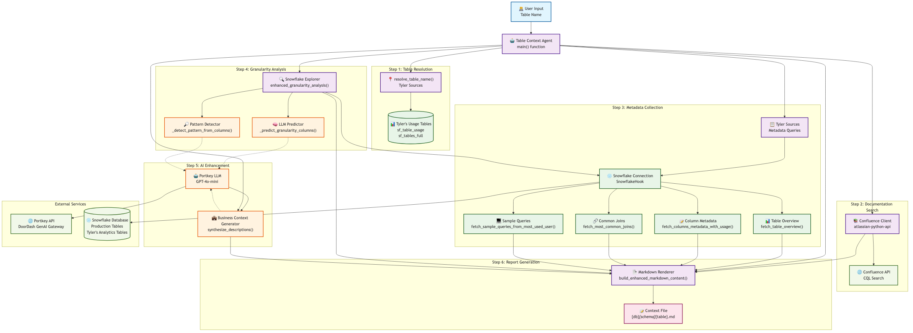
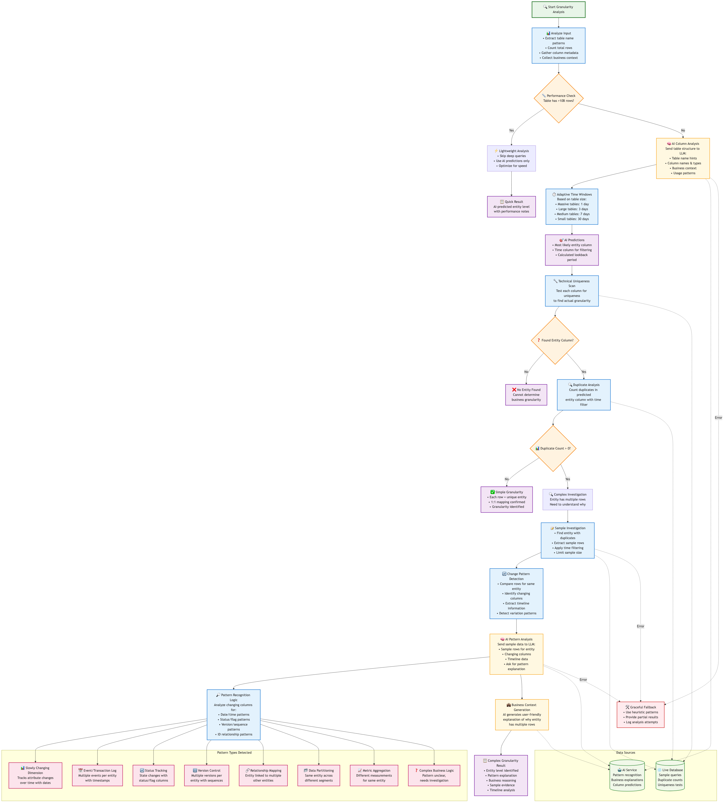

# Cursor Analytics MCP Server 🚀

A comprehensive Model Context Protocol (MCP) server providing analytics tools for Snowflake operations, experiment analysis, document management, and context retrieval.

## Table of Contents

- [Overview](#overview)
- [Setup and Installation](#setup-and-installation)
- [MCP Tools Available](#mcp-tools-available)
- [Context Management System](#context-management-system)
- [Architecture](#architecture)
- [Integrations](#integrations)
- [Configuration](#configuration)
- [Usage Examples](#usage-examples)
- [Troubleshooting](#troubleshooting)

## Overview

The Cursor Analytics MCP Server is a standalone MCP server built with FastMCP that provides:

- **Snowflake Operations**: Execute queries, manage tables, and retrieve data
- **Query Search**: Find historical queries by table name or keywords
- **Curie Experiment Export**: Export experiment results to Google Sheets
- **Google Docs Integration**: Convert and crawl Google Docs to markdown
- **Hybrid Context Search**: AI-powered document search with BM25 + embeddings
- **Table Context Generation**: Automated documentation for Snowflake tables

## 📖 Tool-Specific Documentation

Each major tool has comprehensive documentation with setup, usage, and troubleshooting:

- **[Curie Export](local_tools/curie_export/README.md)** - Export experiment results to Google Sheets
- **[Document Indexer](local_tools/document_indexer/README.md)** - Hybrid search with BM25 + embeddings
- **[Google Doc Crawler](local_tools/google_doc_crawler/README.md)** - Convert Google Docs to markdown
- **[SQL to Sheets](local_tools/sql_to_sheets/README.md)** - Direct SQL query export to Google Sheets
- **[Table Context Agent](local_tools/table_context_agent/README.md)** - AI-powered table documentation

## Setup and Installation

**📋 Complete Setup Guide:** See [SETUP.md](SETUP.md) for detailed installation and configuration instructions.

### Quick Start

1. **Install dependencies:**
   ```bash
   git clone <repository-url>
   cd cursor-analytics-mcp
   ./install.sh
   ```

2. **Configure credentials:**
   ```bash
   cp .env.template config/.env
   nano config/.env  # Add your Snowflake and other credentials
   ```

3. **Test the server:**
   ```bash
   source venv/bin/activate
   cursor-analytics-mcp
   ```

4. **Add to Cursor configuration** (see [SETUP.md](SETUP.md) for details)

### Required Configuration

- **Snowflake**: Database access credentials
- **Document Tables**: `DOCUMENT_INDEX_TABLE` and `CHUNK_INDEX_TABLE`
- **GitHub**: Repository info for document linking

### Optional Integrations

- **AI/LLM**: Portkey + OpenAI for table documentation
- **Confluence**: Documentation search and lookup
- **Google Sheets**: Curie experiment exports, SQL-to-Sheets
- **Google Docs**: Document crawling and markdown conversion

> 📖 **Full setup instructions, Google API setup, troubleshooting, and configuration examples:** [SETUP.md](SETUP.md)

## MCP Tools Available

### Snowflake Operations

#### `execute_snowflake_query(query, method="pandas", database=None, schema=None, warehouse=None)`
Execute SQL queries on Snowflake with multiple processing backends.

**Parameters:**
- `query`: SQL query to execute
- `method`: Processing method (`"pandas"`, `"spark"`, `"polars"`)
- `database`, `schema`, `warehouse`: Optional overrides

**Example:**
```sql
SELECT * FROM dimension_users LIMIT 10
```

### Query Discovery

#### `search_queries_by_table_name(table_name, limit=5)`
Find the most frequently used queries for a specific table.

**Example:**
```python
search_queries_by_table_name("dimension_deliveries", limit=3)
```

#### `search_queries_by_keyword(keywords, limit=5)`
Find queries containing all specified keywords.

**Example:**
```python
search_queries_by_keyword(["conversion", "funnel"], limit=5)
```

### Data Export

#### `execute_sql_and_upload_to_google_sheet(query, tab_name, spreadsheet_id=None, max_rows=20000, spreadsheet_title=None)`
Execute a SQL query and upload results directly to Google Sheets.

> 📖 **See detailed documentation:** [`local_tools/sql_to_sheets/README.md`](local_tools/sql_to_sheets/README.md)

### Experiment Analysis (Curie)

#### `export_curie_experiment_to_sheet(experiment_name, primary_metrics=None, secondary_metrics=None, ...)`
Export Curie experiment results to Google Sheets with formatting.

#### `curie_get_metadata(experiment_name)`
Get comprehensive metadata about a Curie experiment including variants, metrics, and dimensions.

> 📖 **See detailed documentation:** [`local_tools/curie_export/README.md`](local_tools/curie_export/README.md)

### Google Docs Integration

#### `crawl_and_convert_google_docs(master_doc_url, output_path="context/experiment-readouts")`
Crawl all Google Docs links from a master document and convert them to markdown.

#### `convert_single_google_doc_to_markdown(doc_url, output_path="context/experiment-readouts")`
Convert a single Google Doc to markdown with team-based organization.

#### `convert_google_doc_to_markdown(doc_url, write_file=False, output_path="context/experiment-readouts")`
Convert a Google Doc to markdown content (returns as string).

> 📖 **See detailed documentation:** [`local_tools/google_doc_crawler/README.md`](local_tools/google_doc_crawler/README.md)

### Context Search & Management

#### `fetch_table_context(query, top_k=5, team=None, write_to_local=False)`
Search Snowflake table documentation using hybrid search.

**Example queries:**
- `"user dimensions table"`
- `"delivery facts and metrics"`
- `"consumer device settings"`

#### `fetch_pod_queries(query, top_k=3, team=None)`
Search validated master SQL queries.

**Example queries:**
- `"pricing analysis"`
- `"affordability metrics"`

#### `fetch_user_context(query, top_k=5, team=None, write_to_local=False)`
Search user-specific context documents.

#### `fetch_experiment_readouts(query, top_k=5, team=None, write_to_local=False)`
Search experiment readout documents.

#### `fetch_deep_dives(query, top_k=5, team=None, write_to_local=False)`
Search deep dive analysis documents.

#### `fetch_cursor_rules(rule_name)`
Fetch Cursor rules from `.cursor/rules/` directory. Use `rule_name="list"` to see available rules.

> 📖 **See detailed documentation:** [`local_tools/document_indexer/README.md`](local_tools/document_indexer/README.md)

### Table Documentation

#### `describe_table(table_name, output_format="markdown", sample_row_limit=10, verbose=False)`
Generate comprehensive documentation for a Snowflake table including business context, metadata analysis, and granularity detection.

#### Table Context Agent Architecture

The Table Context Agent uses a sophisticated 6-step process to generate comprehensive table documentation:



**Process Overview:**
1. **Table Resolution** - Resolves partial names using Tyler's usage analytics
2. **Documentation Search** - Searches Confluence for existing documentation  
3. **Metadata Collection** - Gathers comprehensive table and column metadata
4. **Granularity Analysis** - AI-powered detection of data granularity and patterns
5. **AI Enhancement** - Generates business context using GPT-4o-mini
6. **Report Generation** - Renders structured markdown documentation

#### Granularity Analysis Engine

The system includes an intelligent granularity analysis engine that determines what each row represents:



**Key Features:**
- **Performance-Aware Processing** - Lightweight analysis for massive tables (>10B rows)
- **AI-Powered Predictions** - Uses LLM to predict entity and time columns
- **Pattern Recognition** - Detects SCDs, event logs, status tracking, and more
- **Business Context Generation** - Explains complex patterns in user-friendly language

> 📖 **See detailed documentation:** [`local_tools/table_context_agent/README.md`](local_tools/table_context_agent/README.md)

## Context Management System

The system uses a sophisticated **dual-table hybrid search** approach combining:

### 1. Document Categories

Documents are automatically categorized based on location:

- **`table_context`** - Snowflake table documentation (`context/snowflake-table-context/`)
- **`pod_queries`** - Validated master SQL queries (`context/pod-level-validated-master-queries/`)
- **`user_context`** - User-specific context documents (`context/user-context/`)
- **`experiment_readouts`** - Experiment analysis documents (`context/experiment-readouts/`)
- **`deep_dives`** - Deep dive analysis documents (`context/deep-dives/`)

### 2. Hybrid Search Algorithm

The search combines two approaches:

1. **BM25 (Keyword Search)**: Fast text matching using Snowflake's `CONTAINS` function
2. **Semantic Search**: Cosine similarity between query and document embeddings using BGE-small-en-v1.5

**Final score** = `(0.3 × BM25_score) + (0.7 × Embedding_score)`

### 3. Document Processing Pipeline

Documents are processed through:
1. **Document Processor** - Scans context folder, extracts metadata, chunks large documents
2. **BGE Embeddings** - Generates 384-dimensional embeddings using BGE-small-en-v1.5 model
3. **BM25 Preprocessing** - Tokenizes and preprocesses text for keyword search
4. **Snowflake Storage** - Uploads to dual tables (`document_index_community` and `chunk_index_community`)

### 4. Snowflake Storage Schema

The document indexing system uses **two tables** for optimal storage and retrieval:

#### Document Index Table (document_index_community)
```sql
CREATE TABLE document_index_community (
    -- Document Identity & Metadata
    document_id VARCHAR(64) PRIMARY KEY,
    document_hash VARCHAR(64) NOT NULL,
    relative_path TEXT NOT NULL,
    file_path TEXT,
    file_name VARCHAR(255),
    file_stem VARCHAR(255),
    file_extension VARCHAR(10),
    category VARCHAR(50),
    subcategory VARCHAR(200),
    document_title VARCHAR(500),
    content_type VARCHAR(50),
    
    -- GitHub Integration
    github_repo VARCHAR(200),
    github_branch VARCHAR(100) DEFAULT 'main',
    github_commit_sha VARCHAR(40),
    github_pr_number INTEGER,
    github_file_url TEXT,
    github_author VARCHAR(100),
    github_commit_message TEXT,
    
    -- Document Versioning & Lifecycle
    document_version INTEGER DEFAULT 1,
    is_latest_version BOOLEAN DEFAULT TRUE,
    superseded_at TIMESTAMP,
    change_type VARCHAR(20) DEFAULT 'created',
    
    -- Document Content & Summary
    full_content TEXT,
    chunk_count INTEGER DEFAULT 1,
    file_size INTEGER,
    last_modified TIMESTAMP,
    processed_at TIMESTAMP DEFAULT CURRENT_TIMESTAMP,
    indexed_by VARCHAR(50) DEFAULT 'local',
    
    -- Legacy Schema Support (Document-level)
    database_name VARCHAR(100),
    schema_name VARCHAR(100),
    table_name VARCHAR(100),
    query_name VARCHAR(200),
    query_type VARCHAR(50),
    referenced_tables ARRAY
)
```

#### Chunk Index Table (chunk_index_community)
```sql
CREATE TABLE chunk_index_community (
    -- Chunk Identity
    chunk_id VARCHAR(64) PRIMARY KEY,
    document_id VARCHAR(64) NOT NULL,
    chunk_hash VARCHAR(64) NOT NULL,
    
    -- Chunk Content & Position
    content TEXT NOT NULL,
    content_length INTEGER,
    chunk_start INTEGER,
    chunk_end INTEGER,
    
    -- Search & ML Features
    bm25_text TEXT,
    bm25_tokens ARRAY,
    embedding ARRAY,           -- 384-dim BGE vectors for chunk-level search
    embedding_dim INTEGER,
    
    -- Foreign Key to document_index table
    FOREIGN KEY (document_id) REFERENCES document_index_community(document_id)
)
```

**Table Configuration:**
- `DOCUMENT_INDEX_TABLE`: Set to `document_index_community` in `.env.template`
- `CHUNK_INDEX_TABLE`: Set to `chunk_index_community` in `.env.template`

The dual-table approach enables:
- **Document-level metadata**: Rich document information including GitHub integration, versioning, and categorization
- **Chunk-level search**: Granular search within large documents with position tracking
- **Optimized performance**: Separate indexing strategies for document vs. content search
- **Flexible content organization**: Documents can be chunked dynamically while preserving document structure
- **Advanced search features**: Both keyword (BM25) and semantic (embedding) search at chunk level
- **Context windows**: Ability to retrieve chunks with surrounding context for better results

**Key Features:**
- **GitHub Integration**: Track source repository, commits, branches, and authors
- **Document Versioning**: Support for document evolution with version tracking
- **Content Positioning**: Precise chunk boundaries (`chunk_start`, `chunk_end`) for accurate retrieval
- **Legacy Compatibility**: Support for Snowflake table context and SQL query metadata

### 5. Setting Up Document Indexing

```bash
# Index all documents for hybrid search
python local_tools/document_indexer/index_documents_dual.py

# Clear and reindex
python local_tools/document_indexer/index_documents_dual.py --clear-table
```

> 📖 **See detailed documentation:** [`local_tools/document_indexer/README.md`](local_tools/document_indexer/README.md)

## Architecture

The system is organized into several key layers:

```
┌─────────────────────┐
│   MCP Client        │  ← Cursor IDE
│   (Cursor)          │
└─────────┬───────────┘
          │ MCP Protocol
┌─────────▼───────────┐
│   FastMCP Server    │  ← src/cursor_analytics_mcp/server.py
│   (Tool Registry)   │
└─────────┬───────────┘
          │
┌─────────▼───────────┐
│   Core Tools        │  ← local_tools/ modules
│   - Snowflake Ops   │
│   - Query Search    │
│   - Curie Export    │
│   - Google Docs     │
│   - Context Search  │
└─────────┬───────────┘
          │
┌─────────▼───────────┐
│   Data Sources      │
│   - Snowflake DW    │
│   - Indexed Documents │
└─────────────────────┘
```

### Key Components

- **MCP Server** (`src/cursor_analytics_mcp/server.py`): FastMCP-based server with tool registry
- **Snowflake Integration** (`utils/snowflake_connection.py`): Multi-backend query execution
- **Document Indexing** (`local_tools/document_indexer/`): BGE embeddings + BM25 hybrid search
- **Context Management** (`context/`): Organized document repositories
- **Tool Modules** (`local_tools/`): Specialized functionality modules


### File Structure

```
cursor-analytics-mcp/
├── src/cursor_analytics_mcp/    # MCP server implementation
├── local_tools/                 # Tool implementations (each has README.md)
│   ├── curie_export/           # Curie experiment analysis
│   ├── document_indexer/       # Hybrid search system
│   ├── google_doc_crawler/     # Google Docs integration
│   ├── sql_to_sheets/          # Direct SQL→Sheets export
│   └── table_context_agent/    # Table documentation
├── utils/                      # Core utilities
│   ├── snowflake_connection.py # Snowflake integration
│   └── logger.py               # Logging setup
├── context/                    # Document repositories
│   ├── snowflake-table-context/
│   ├── user-context/
│   ├── experiment-readouts/
│   ├── deep-dives/
│   └── pod-level-validated-master-queries/
├── config/                     # Configuration files
└── user-analysis/             # Analysis outputs
```

> 📋 **Note:** Each tool in `local_tools/` has its own comprehensive `README.md` with detailed setup, usage, and troubleshooting instructions.

## Usage Examples

### Basic Snowflake Query

```python
# Execute a simple query
result = execute_snowflake_query(
    "SELECT COUNT(*) as user_count FROM dimension_users WHERE active = true"
)
```

### Find Table Usage Patterns

```python
# Find how a table is commonly used
queries = search_queries_by_table_name("fact_deliveries", limit=5)
```

### Export Analysis to Google Sheets

```python
# Create analysis and export to sheets
export_url = execute_sql_and_upload_to_google_sheet(
    query="""
    SELECT 
        date_trunc('month', delivery_date) as month,
        COUNT(*) as delivery_count,
        AVG(delivery_time_minutes) as avg_delivery_time
    FROM fact_deliveries 
    WHERE delivery_date >= '2024-01-01'
    GROUP BY 1
    ORDER BY 1
    """,
    tab_name="Monthly_Delivery_Metrics",
    spreadsheet_title="Q1 2024 Delivery Analysis"
)
```

### Smart Context Search

```python
# Find relevant table documentation
tables = fetch_table_context("user engagement metrics", top_k=3)

# Find validated queries
queries = fetch_pod_queries("conversion funnel analysis", top_k=2)

# Search experiment results
experiments = fetch_experiment_readouts("iOS conversion test", top_k=5)
```

### Curie Experiment Analysis

```python
# Get experiment metadata first
metadata = curie_get_metadata("ios_checkout_experiment_2024")

# Export results to sheets
export_url = export_curie_experiment_to_sheet(
    experiment_name="ios_checkout_experiment_2024",
    primary_metrics=["conversion_rate", "revenue_per_user"],
    secondary_metrics=["session_duration", "cart_abandonment"],
    share_email="team@company.com"
)
```

## Troubleshooting

### Snowflake Connection Issues

```bash
# Test connection
python -c "from utils.snowflake_connection import SnowflakeHook; hook = SnowflakeHook(); hook.connect(); print('Success!')"

# Check credentials
env | grep SNOWFLAKE
```

### Google API Issues

```bash
# Verify credentials file
cat $GOOGLE_SHEET_CREDENTIALS_FILE | jq .type  # Should show "service_account"

# Test permissions
python -c "from local_tools.curie_export.config import get_service_account_file; print(get_service_account_file())"
```

### Document Indexing Issues

```bash
# Rebuild document index
python local_tools/document_indexer/index_documents_dual.py --clear-table

# Test BGE model
python -c "from local_tools.document_indexer.embedding_generator import BGEEmbeddingGenerator; gen = BGEEmbeddingGenerator(); print('Model loaded:', gen.load_model())"
```

### Performance Optimization

- **Spark**: For large datasets, use `method="spark"` in queries
- **Batch Processing**: Use batch operations for multiple document conversions
- **Connection Pooling**: Reuse Snowflake connections with context managers
- **Model Caching**: BGE embeddings are cached locally to avoid reprocessing

---

**Built with ❤️ for data-driven analytics at scale**
