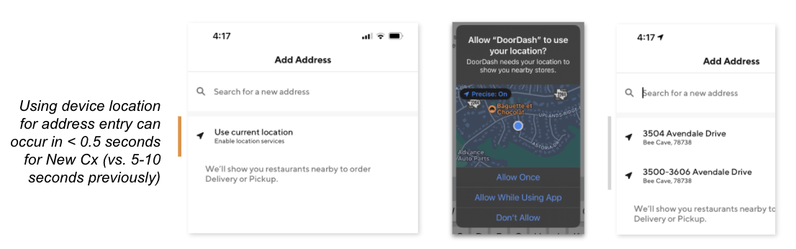

# Experiment Readout: Address flow improvement V2 (iOS)

Analytics DRI: @Heming.Chen

Working team: Manolo Sañudo (iOS), Amit Handa (BE), Ishaan Kansal (Design), Varun Kerof (PM) , Zohaib Hassan(EM)

Last updated: 11/02/2021

### TL;DR:

*Recall:* In our v1 experiment, we enabled iOS Cx to use their device location to help in their address entry. This will deliver $3.5M GMV annually based on a +1.29% CVR lift for existing Cx who invoked an address change. However, this experiment unexpectedly showed that New Cx CVR remained flat. We observed that the iOS GPS loading speed for New Cx ranged from 5-10 seconds in our V1 implementation. This was not the case for existing Cx leading to a potential improvement opportunity.

**In V2, we significantly reduced the iOS location detection time for New Cx down to < 0.5s**. This made the location detection feature more seamless for them and successfully delivered a strong improvement in New Cx CVR with results as follows:

- GMV: **$94M** per year ($3.4M in Q4 with 14 weeks effect)

- New Cx:

  - **+1.51% rel. New Cx lift:** -**+195k new Cx per year**(+**53k** in Q4 with 14 weeks effect)

  - **3.1M incremental orders:** annually on a rolling basis

- Check metrics:

  - MTO: **flat**- Never delivered:**flat****Next:**-**Ramp to 100%**(timeline: ASAP)

- **V3 experiment:** to focus from the lens of a New Cx (Timeline: 2022 MAU candidate)

- UI will be enhanced to give a more welcoming tone, clear explanation of what is needed, the purpose and a more prominent CTA to the feature

**Appendix**

[Tracking report](https://app.mode.com/doordash/reports/7b33d9501df5)

[Impact Sizing](https://docs.google.com/spreadsheets/d/1QM40Mk1PFw0bjDkqvCcxDzNdckx6crzqXL3-_XjeWnY/edit?usp=sharing)
