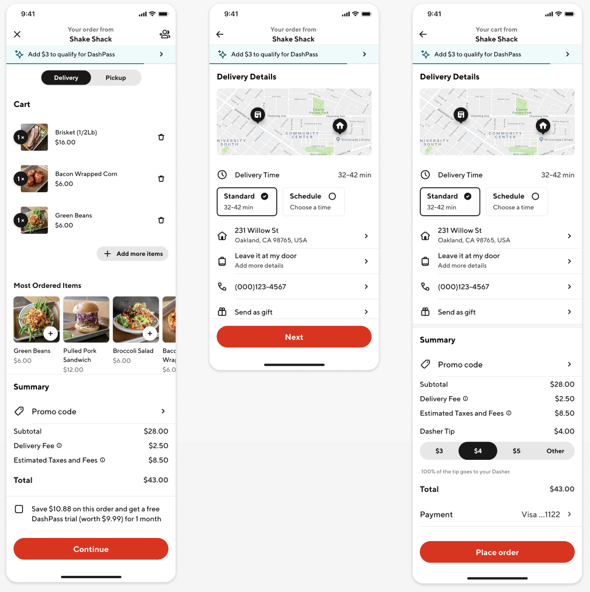
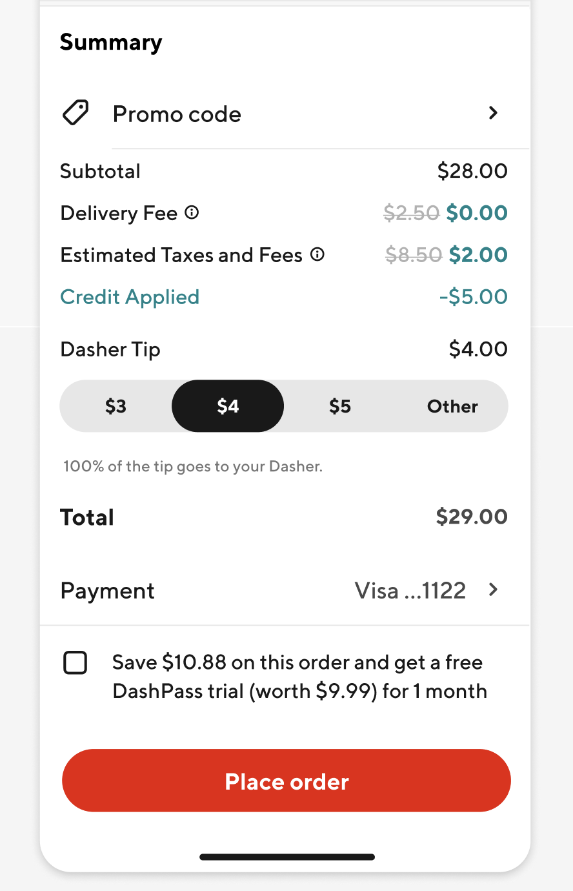
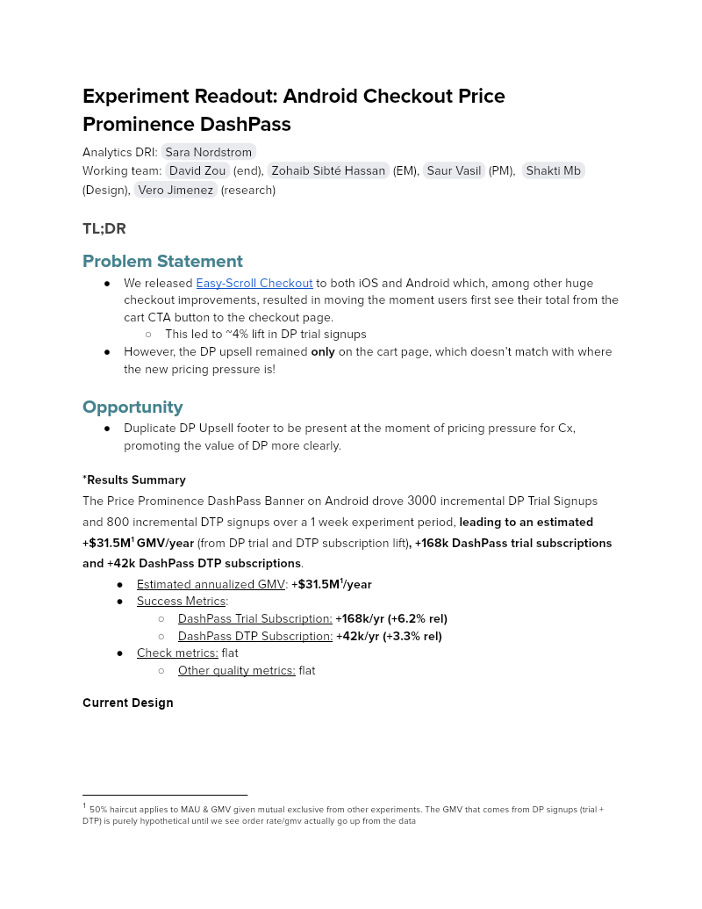

# Experiment Readout: Android Checkout Price Prominence DashPass

Analytics DRI: [Sara Nordstrom](mailto:sara.nordstrom@doordash.com)

Working team: [David Zou](mailto:david.zou@doordash.com) (end), [Zohaib Sibté Hassan](mailto:zohaib.hassan@doordash.com) (EM), [Saur Vasil](mailto:saur.vasil@doordash.com) (PM), [Shakti Mb](mailto:shakti.m@doordash.com)(Design), [Vero Jimenez](mailto:veronica.jimenez@doordash.com) (research)

### TL;DR

# Problem Statement

- We released [Easy-Scroll Checkout](https://docs.google.com/document/u/0/d/1WN2YDSzsbMIQg8R_-pRelKcsqc-oHzLTswA_UWLrlFM/edit) to both iOS and Android which, among other huge checkout improvements, resulted in moving the moment users first see their total from the cart CTA button to the checkout page.

  - This led to ~4% lift in DP trial signups

- However, the DP upsell remained **only**on the cart page, which doesn’t match with where the new pricing pressure is!

# Opportunity

- Duplicate DP Upsell footer to be present at the moment of pricing pressure for Cx, promoting the value of DP more clearly.**Results Summary**The Price Prominence DashPass Banner on Android drove <mark>3000 </mark>incremental DP Trial Signups and 800 incremental DTP signups over a 1 week experiment period,**leading to an estimated****+$31.5M**[^1]**GMV/year**(from DP trial and DTP subscription lift)**, +168k DashPass trial subscriptions and +42k DashPass DTP subscriptions**.

- Estimated annualized GMV: **+$31.5M**1**/year**

- Success Metrics:

  - DashPass Trial Subscription: **+168k/yr (+6.2% rel)**- DashPass DTP Subscription:**+42k/yr (+3.3% rel)**

- Check metrics: flat

  - Other quality metrics: flat

**Current Design****New Design:****Result Details**[Mode Dashboard](https://app.mode.com/doordash/reports/0c0eeb4834e4) (The migration from Mode to Curie still in progress, we are working on Curie metrics pack and aim for completion in Q1)

[Curie Dashboard](https://admin-gateway.doordash.com/decision-systems/experiments/bd93685f-0188-44eb-8698-bdeeb2c7c608?analysisId=f5e9550a-bd1f-41ea-96e1-18bf1df0902a) for quality metrics

[Product Doc](https://docs.google.com/document/d/1_0ys3hBS73rzp_MmD-b7w8fkzSkJV1m5WMVBsmV8XQ8/edit#heading=h.kbfu7owxuatb)

### Experiment Timeline

### Methodology

#### Overview**Test mechanism:**A/B test**Test platform:**Android only**Country:**US only**Experience:**DoorDash only**Target Population:**Every Android user who is eligible for the DP Upsell**Test duration:**1 week**Control/Treatment Split:**50/50

### Result Details

Impacts breakdown:

- **GMV lift of +$31.5M/yr:** , driven by a DP Trial and DTP lift

- The DP trial and DTP lift is driving a GMV lift

***DP trial lift of +6.2% and DP DTP lift of +3.3%**

  - Duplicating the DP footer to be present at the moment of pricing pressure for Cx is incentivizing more Cx to sign up for a DP trial

#### Success Metrics (Treatment vs Control)

| **Metrics**|**Treatment**|**Control**|**% Change**|**Significance**|
| --- | --- | --- | --- | --- |
| DP trial subscription rate | 2.75% | 2.59% | +6.2% | YES |
| DP DTP subscription rate | 1.25% | 1.21% | +3.3% | YES |

#### Check Metrics

|**Metrics**|**Treatment**|**Control**|**% Change**|**Significance**|
| --- | --- | --- | --- | --- |
| GoV | <mark>35.9772</mark> | <mark>35.9586</mark> | +.05% | NO |
| Subtotal | <mark>25.7252</mark> | <mark>25.7003</mark> | +.09% | NO |
| Tip | <mark>3.9860</mark> | <mark>3.9832</mark> | +.07% | NO |
| Order Rate | <mark>2.521</mark> | <mark>2.521</mark> | 0.0% | NO |
| New Cx CVR | 3.822% | <mark>3.816</mark>% | +.16% | NO |**Next steps:**

- <mark>Ramp-up plan: Ramping up to 90% treatment + 10% long term holdout to monitor DashPass impact on MAU</mark>
---
## Footnotes

\[^1\]: 50% haircut applies to MAU & GMV given mutual exclusive from other experiments. The GMV that comes from DP signups (trial + DTP) is purely hypothetical until we see order rate/gmv actually go up from the data
