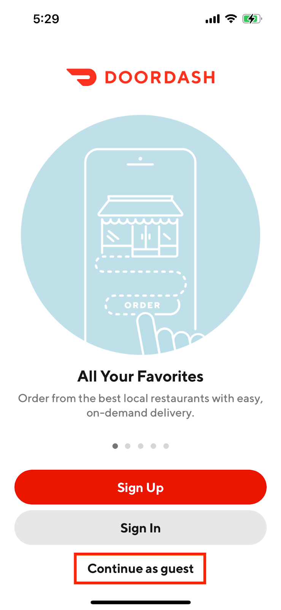
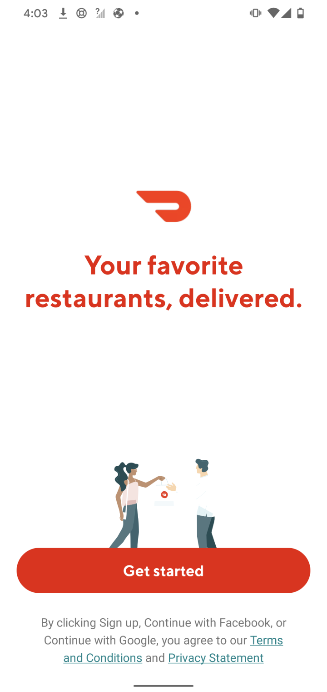
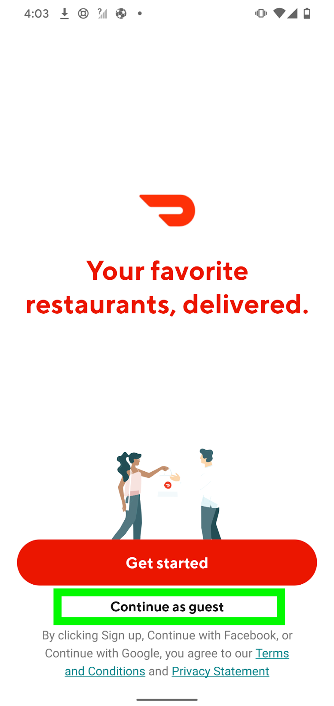

# Experiment Readout: Android Guest browsing will drive +$26M GMV/year, +39k MAU & +124K New Cx/year

Analytics DRI: Heming.Chen

Working team: Jayesh Elamgodil (Android), David Zou (Android), Saur Vasil (product), Zohaib Sibte Hassan (EM), Ishaan Kansal (Design)

Last updated: 05/03/2022

### TL;DR

**Context:**<mark> Currently, Android users are required to sign in/up before they can explore DoorDash, while </mark><mark>iOS app has a guest mode (by clicking “continue as a guest” button) where users can skip authentication flow and browse stores without friction. In 03/2022, 22% of iOS landing page visitors chose guest browsing instead of sign in/up, which significantly decreased the bouncing rate on the landing page.Therefore, We believe bringing guest experience to Android will benefit users who wants to explore food as soon as possible!
</mark>

  

*Landing page of iOS, Android control group, Android treatment group*

**Results Summary**- Estimated annualized GMV:**+$26M**- Estimated MAU:**+39k at 12 month exit**(+31k at the exit of 2022)

- Bouncing rate upon landing page:**-23.71% lower**

- New Cx:

  - **+4.31% rel. new Cx lift:** -**+124k new Cx per year**

- Guardian metrics

  - Overall Sign up rate: -12.62% lower. This is expected; new visitors choose to guest browse instead of being forced to sign up upon the landing page. Because the personalization between guests and new Cx is equivalent, we are not concerned about this decrease. iOS experiment long term hold out proves that the reduced friction is beneficial!

  - Overall Sign in rate: -8.10% lower. This is also expected; existing Cx may choose to guest browse instead of login with the new change. iOS experiment long term hold out proves that the reduced friction is beneficial!

- International impact summary:

  - **CAN:** <mark>: +17k New Cx per year, translating to +5k MAU & +$4M GMV per year
    </mark>

  - **AUS:** <mark>: +17k New Cx per year, translating to +5k MAU & +$4M GMV per year
    </mark>

  - **US:** <mark>: +91k New Cx per year, translating to +29k MAU & +$19M GMV per year
    </mark>

  - <mark>**JPN:**</mark><mark>too small to estimate impact</mark>* 50% haircut applied: (1) mutual exclusive from other experiments (2) 25% long term benefits added (observed from iOS experiment holdout)

**Next steps:**

- Roll out plans: Already ramped to 95% since 05/03.

- Long term tracking of guardian metrics

  - Overall sign-up rate

  - Overall sign-in rate

  - Overall order rate

- Follow on features: Guest experience improvements to further push conversion, signup, delight!

For the full readout, please check out the [experiment result doc](https://docs.google.com/document/d/1L0b8PG4M4CouhNgl3Qlkpz64juT19IDHypsnSNFGhmQ/edit?usp=sharing)

### Experiment Timeline

### Methodology

#### Overview

**Test mechanism:**A/B test**Test platform:**Android**Country:**Global**Experience:**DoorDash only**Target Population:**Non-logged in Cx**Test duration:**1 weeks experiment**Control/Treatment Split:**50/50

#### Testing Group & Bucketing

- Treatment (50%): New design of onboarding page

- Control (50%): Existing design of onboarding page

- **Test Launch date:** 04/21/2022

### Result Details

#### Success Metrics (Treatment vs Control)

|**Metrics**|**Treatment**|**Control**|**% Change**|**Significance**|
| --- | --- | --- | --- | --- |
| Onboarding page Bouncing Rate | 40.45% | 53.02% | -23.71% | Yes |
| Order Rate | 0.6168 | 0.6145 | +0.38% | No |
| New Cx Conversion rate | 10.34% | 9.91% | +4.31% | Yes |

#### Check Metrics

|**Metrics**|**Treatment**|**Control**|**% Change**|**Significance**|
| --- | --- | --- | --- | --- |
| Overall signup rate | 9.03% | 10.34% | -12.62% | Yes |
| Overall Sign in rate | 32.91% | 35.81% | -8.10 | Yes |

#### Success Metrics by country

|**Country**|**Metrics**|**Treatment**|**Control**|**% Change** |
| --- | --- | --- | --- | --- |
| US | Onboarding page Bouncing Rate | 40.62% | 52.96% | -23.31% |
| US | Order Rate | 0.6358 | 0.6342 | +0.26% |
| US | New Cx Conversion rate | 9.90% | 9.54% | +3.74% |
| CAN | Onboarding page Bouncing Rate | 41.10% | 53.08% | -23.60% |
| CAN | Order Rate | 0.4817 | 0.4816 | +0.01% |
| CAN | New Cx Conversion rate | 11.43% | 10.42% | +9.72% |
| AUS | Onboarding page Bouncing Rate | 36.02% | 50.02% | -27.98% |
| AUS | Order Rate | 0.5639 | 0.5193 | +8.60% |
| AUS | New Cx Conversion rate | 16.82% | 15.42% | +9.02% |

### Next Steps

- Roll out plans: Already ramped to 95% since 05/03.

- Long term tracking of guardian metrics

  - Overall sign-up rate

  - Overall sign-in rate

  - Overall order rate

- Follow on features: Guest experience improvements to further push conversion, signup, delight!

### Appendix

[Tracking Dashboard](https://app.mode.com/doordash/reports/903a02b4de14)
