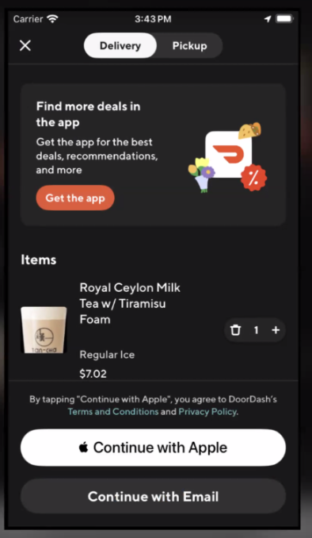
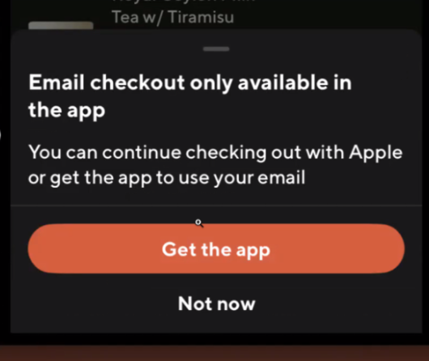
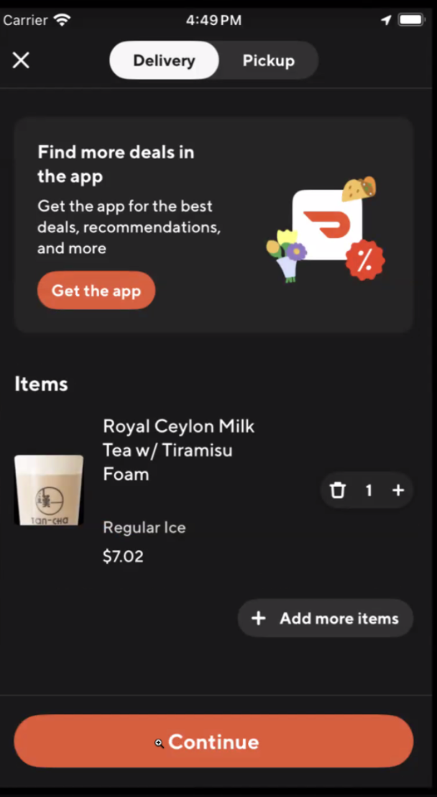
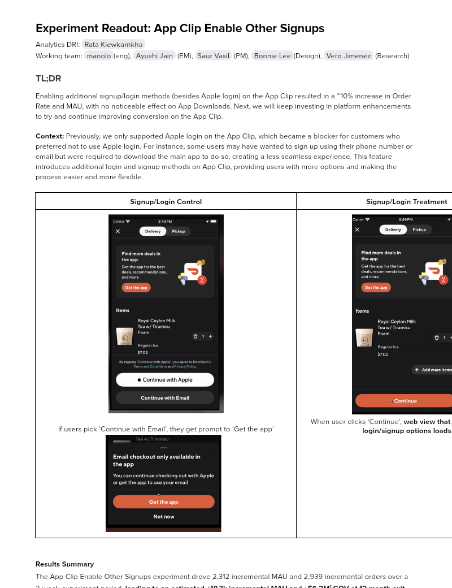

# Experiment Readout: App Clip Enable Other Signups

Analytics DRI: [Rata Kiewkarnkha](mailto:rata.kiewkarnkha@doordash.com)

Working team: [manolo](mailto:manolo@doordash.com)(eng), [Ayushi Jain](mailto:ayushi.jain@doordash.com) (EM), [Saur Vasil](mailto:saur.vasil@doordash.com) (PM), [Bonnie Lee](mailto:bonnie.lee@doordash.com)(Design), [Vero Jimenez](mailto:veronica.jimenez@doordash.com) (Research)

### TL;DR

Enabling additional signup/login methods (besides Apple login) on the App Clip resulted in a ~10% increase in Order Rate and MAU, with no noticeable effect on App Downloads. Next, we will keep investing in platform enhancements to try and continue improving conversion on the App Clip.

**Context:**Previously, we only supported Apple login on the App Clip, which became a blocker for customers who preferred not to use Apple login. For instance, some users may have wanted to sign up using their phone number or email but were required to download the main app to do so, creating a less seamless experience. This feature introduces additional login and signup methods on App Clip, providing users with more options and making the process easier and more flexible.

|**Signup/Login Control**|**Signup/Login Treatment**|
| --- | --- |
|  If users pick ‘Continue with Email’, they get prompt to ‘Get the app’  |  When user clicks ‘Continue’,**web view that allows multiple login/signup options****loads**|**Results Summary**The App Clip Enable Other Signups experiment drove 2,312 incremental MAU and 2,939 incremental orders over a 2-week experiment period,**leading to an estimated +10.7k incremental MAU and +$6.2M**[^1]**GOV at 12 month exit**and**+3.3k MAU and**+**$430.7k GOV at 2025 Q1 exit;**

- <u>Success Metrics
  </u>

  - Estimated annualized incremental GOV: +$6.2M

  - Estimated annualized incremental MAU: +10.7k

  - Estimated annualized Incremental Orders: +35.3k

- Check metrics:

  - App downloads: Flat

- Additional metrics:

  - App Clip Signups/Logins: +21.33%

  - App Clip + App Order Rate: +10.67%

  - 12 month US MAU: +10.4k

**Learnings**

- App Clip improvements ≠ App Download Decline

  - In the past, as we’ve made platform improvements to the app clip that drove app clip cvr, we in turn saw a decrease in app downloads. The hypothesis as to why this happened was if a Cx had trouble converting on the app clip, they would download the app to convert but if they were seamlessly able to convert on the app clip, they wouldn’t need to download the app. Given our ultimate goal is to drive app downloads, this posed a question of how much we should really be trying to drive app clip cvr. But this experiment proved we can improve app clip cvr without driving a decrease in downloads in certain areas on the app clip.

  - Our hypothesis is that users who have high enough intent to sign in, may also be high enough intent to continue to use DD and may still want the broader capabilities and convenience of having the full app. Or perhaps allowing them to signin through any method is a better experience that makes them want to continue using DoorDash after they convert on the app clip.

- An increase in signups/logins doesn't necessarily translate to the same percentage increase in Order Rate. In other words, not everyone who signs up or logs in will convert immediately – some may engage with the app, while others might drop off. However, getting users further down the funnel makes them more likely to eventually convert.

[Mode Dashboard](https://app.mode.com/doordash/reports/09a56173d2f3)

### Experiment Timeline

### Methodology

#### Overview

**Test mechanism:**A/B test**Test platform:**App Clip**Country:**Global**Experience:**DoorDash only**Target Population:**App Clip User on Cart Page**Bucket Key:**device_id**Test Duration:**2 weeks at 50/50**Control/Treatment Split:**50/50

### Result Details

#### Success Metrics

|**Metrics** (Include orders on both App Clip and App since expectation is that users download app after using App Clip) |**Control**|**Treatment**|**% Change**|**Significance**|
| --- | --- | --- | --- | --- |
|**Order Rate**| 44.51% | 49.26% | +10.67% | YES |
|**MAU**| 36.20% | 39.92% | +10.28% | YES |

#### Check Metrics

|**Metrics**|**Control**|**Treatment**|**% Change**|**Significance**|
| --- | --- | --- | --- | --- |
| App Downloads | 13.85% | 13.86% | +0.10% | NO |
| Funnel: Checkout Page / Cart Page | 48.2% | 59.95% | +24.38% | YES |
| Funnel: Checkout Success / Checkout Page | 57.94% (4,384 / 7,567) | 50.78% (4,697 / 9,250) | -12.36% | YES |

#### Additional Metrics

|**Metrics**|**Control**|**Treatment**|**% Change**|**Significance**|
| --- | --- | --- | --- | --- |
| App Clip Signups/Logins | 50.71% | 61.52% | +21.33% | YES |**Next steps:**- Keep investing in platform enhancements to try and continue improving conversion on the App Clip
---
## Footnotes

\[^1\]: This is with a 50% haircut**Appendix** [Mode Dashboard](https://app.mode.com/doordash/reports/09a56173d2f3) [Curie: cx_ios_app_clip_enable_email_signup](https://admin-gateway.doordash.com/decision-systems/dynamic-values-v2/experiments/1e325412-5e10-4a67-9f83-c44182d6c80a)
