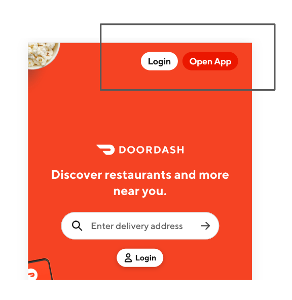
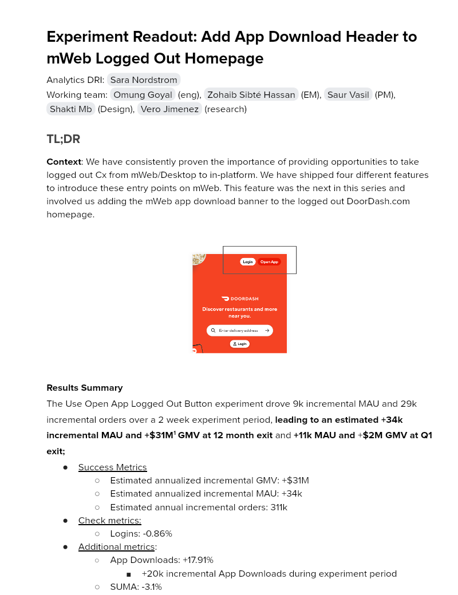

# Experiment Readout: Add App Download Header to mWeb Logged Out Homepage

Analytics DRI: [Sara Nordstrom](mailto:sara.nordstrom@doordash.com)

Working team: [Omung Goyal](mailto:omung.goyal@doordash.com) (eng), [Zohaib Sibté Hassan](mailto:zohaib.hassan@doordash.com) (EM), [Saur Vasil](mailto:saur.vasil@doordash.com) (PM), [Shakti Mb](mailto:shakti.m@doordash.com) (Design), [Vero Jimenez](mailto:veronica.jimenez@doordash.com) (research)

### TL;DR

**Context**: We have consistently proven the importance of providing opportunities to take logged out Cx from mWeb/Desktop to in-platform. We have shipped four different features to introduce these entry points on mWeb. This feature was the next in this series and involved us adding the mWeb app download banner to the logged out DoorDash.com homepage.

**Results Summary**The Use Open App Logged Out Button experiment drove 9k incremental MAU and 29k incremental orders over a 2 week experiment period,**leading to an estimated +34k incremental MAU and +$31M**[^1]**GMV at 12 month exit**and**+11k MAU and**+**$2M GMV at Q1 exit;**

- <u>Success Metrics
  </u>

  - Estimated annualized incremental GMV: +$31M

  - Estimated annualized incremental MAU: +34k

  - Estimated annual incremental orders: 311k

- Check metrics:

  - Logins: -0.86%

- Additional metrics:

  - App Downloads: +17.91%

    - +20k incremental App Downloads during experiment period

  - SUMA: -3.1%

[Mode Dashboard](https://app.mode.com/doordash/reports/ee1f2033fc5c)

### Experiment Timeline

### Methodology

#### Overview

**Test mechanism:**A/B test**Test platform:**mWeb**Country:**Global**Experience:**DoorDash only**Target Population:**Logged out users on mobile web homepage**Test duration:**6 weeks at 50/50**Control/Treatment Split:**50/50

### Result Details

#### Success Metrics

|**Metrics**|**Control**|**Treatment**|**% Change**|**Significance**|
| --- | --- | --- | --- | --- |
| Order Rate | <mark>1.76%</mark> | <mark>1.82%</mark> | +<mark>3.29%</mark> | YES |
| MAU | <mark>1.26%</mark> | <mark>1.28%</mark> | <mark>+1.47%</mark> | YES |

#### Check Metrics

|**Metrics**|**Control**|**Treatment**|**% Change**|**Significance**|
| --- | --- | --- | --- | --- |
| Signups | <mark>0.64%</mark> | <mark>0.61%</mark> | <mark>-3.68%</mark> | YES |
| Logins | <mark>2.96%</mark> | <mark>2.94%</mark> | <mark>-.86%</mark> | YES |
| New Cx Rate | <mark>0.36%</mark> | <mark>0.37%</mark> | <mark>+.69%</mark> | NO |
| GoV | $39.50 | $39.35 | -0.37% | YES |

#### Additional Metrics

|**Metrics**|**Control**|**Treatment**|**% Change**|**Significance**|
| --- | --- | --- | --- | --- |
| SUMA | <mark>0.0863%</mark> | <mark>0.0836%</mark> | -3.1<mark>%</mark> | YES |
| App Downloads | 0.55% | 0.47% | +17.91% | YES |

Impacts breakdown:**Experiment Context**: This experiment implemented adjust links to take users from mweb to the app, which capture both the mweb device id (the experiment bucket key) and the app device id. Through these links we are able to attribute user behavior in the app to the devices in the treatment group in the experiment. There are 2 shortcomings with this experiment design. First, we only have tracking for treatment devices who go to the app but inevitably some control devices will also go to the app through other methods besides this button and we won’t have any tracking on that. Second, we only ran this experiment for around 2 weeks and during that period drove many incremental users to the app, but due to the short experiment period, we aren’t capturing the long term benefits to a user of the app over mweb. To account for this, we came up with the following methodology:**Method**: After investigating we found that 53% of users who sign up on mweb eventually make their way to the app, so we took a 50% haircut on our results to account for the control users that converted on the app that we have no way of tracking. We also found that New Cx on the App vs. mWeb have significantly higher 12 month order rate and 12 month retention, so we added multipliers to our annualized numbers to account for the long term benefits of the app.

Original numbers:

- Annualized

  - Incremental MAU: 40k

    - Incremental GMV from MAU: $36.5M

App vs. Web multipliers:

| | **App New Cx**|**Web New Cx**|**Increase**|
| --- | --- | --- | --- |
|**12 month order rate**| 12.0 | 6.6 | +82% |
|**12 month retention**| 16.9% | 9.8% | +72% |

53% of web signups that go on to place orders on the app. We will therefore take an additional 50% haircut.

Updated Numbers:

- Annualized:**+31.4M GMV and +34k MAU**- Incremental MAU: 40k*1.72*.5=34k

  - Incremental GMV from MAU: $36.5M*1.72*.5= $31.4M

**Next steps:**

- Ramp-up plan: Rollout to 100% and pursue other areas where we can drive mobile web users to the app

- Continue to measure the long term effects of sending New Cx to the App to place their first order on the App rather than on mWeb.

- Work to identify additional opportunities to double down on app downloads as a growth channel.
---
## Footnotes

\[^1\]: This is with a 50% haircut
