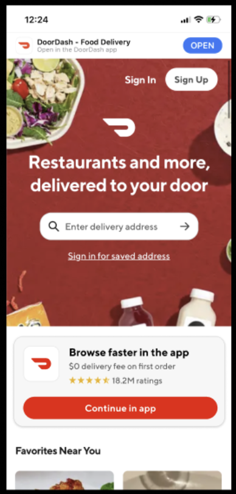
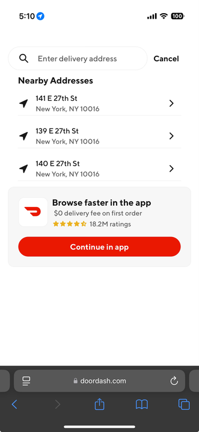
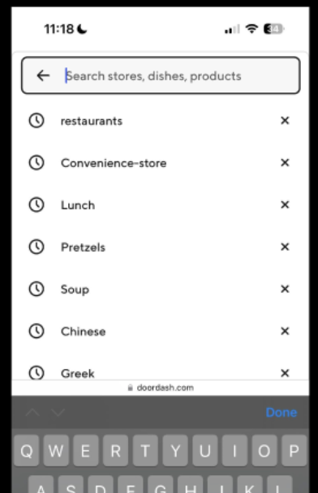

# Experiment Readout: App Download Prompt V2

Analytics DRI: [Sara Nordstrom](mailto:sara.nordstrom@doordash.com)

Working team: [Omung Goyal](mailto:omung.goyal@doordash.com) (eng), [Ayushi Jain](mailto:ayushi.jain@doordash.com) (EM), [Zohaib Sibté Hassan](mailto:zohaib.hassan@doordash.com) (EM), [Saur Vasil](mailto:saur.vasil@doordash.com) (PM), [Ishaan Kansal](mailto:ishaan.kansal@doordash.com) (Design), [Vero Jimenez](mailto:veronica.jimenez@doordash.com) (research)

### TL;DR

**Context:**We have proven the importance of taking Cx from mWeb/Desktop to in-platform. We have focused on this foundationally in H1 and are continuing this work in H2 ‘24. The next feature in this workstream is the App Download Prompt V2, introducing the App Download prompts in 2 additional entry points, address and search:

|**Address Control**|**Address Treatment**|
| --- | --- |
|  |  |

|**Search Control**|**Search Treatment**|
| --- | --- |
|  |  |**Results Summary**The App Download Prompt V2 experiment drove 4k incremental MAU and 50k incremental orders over a 4 month experiment period,**leading to an estimated +9.9k incremental MAU and +$17.4M**[^1]**GMV at 12 month exit**and**+1.9k MAU and**+**$2.2M GMV at Q4 exit;**

- <u>Success Metrics
  </u>

  - Estimated annualized incremental GMV: +$17.4M

  - Estimated annualized incremental MAU: +9.9k

- Check metrics:

  - Logins: -.32%

  - Signups: +.56%

- Additional metrics:

  - App Downloads: +7.41%

    - +24k incremental App Downloads during experiment period

  - SUMA: +.05%

[Mode Dashboard](https://app.mode.com/doordash/reports/49f9b1931651)

### Experiment Timeline

### Methodology

#### Overview

**Test mechanism:**A/B test**Test platform:**mWeb**Country:**Global**Experience:**DoorDash only**Target Population:**Logged out Users on mWeb on the Address and Search pages**Test duration:**4 months at 50/50**Control/Treatment Split:**50/50

### Result Details

#### Success Metrics

|**Metrics**|**Control**|**Treatment**|**% Change**|**Significance**|
| --- | --- | --- | --- | --- |
| Order Rate | 59.56% | 60.14% | +0.98% | YES |
| MAU | 7.10% | 7.15% | +0.66% | YES |

#### Check Metrics

|**Metrics**|**Control**|**Treatment**|**% Change**|**Significance**|
| --- | --- | --- | --- | --- |
| Signups | 5.20% | 5.23% | +0.56% | NO |
| Logins | 30.75% | 30.66% | -0.32% | NO |
| New Cx Rate | 3.59% | 3.59% | -0.03% | NO |
| GoV | $37.27 | $37.30 | +0.07% | NO |

#### Additional Metrics

|**Metrics**|**Control**|**Treatment**|**% Change**|**Significance**|
| --- | --- | --- | --- | --- |
| SUMA | 2.58% | 2.58% | +.05% | NO |
| App Downloads | 4.10% | 4.40% | +7.41% | YES |
| NV MAU | <mark>1.33%</mark> | <mark>1.36%</mark> | +<mark>1.36%</mark> | YES |
| 28 Day OF | <mark>40.49% </mark> | <mark>40.89%</mark> | +1.0% | YES |**Next steps:**

- Ramp-up plan: Rollout to 100% and continue to pursue other areas where we can drive mobile web users to the app
---
## Footnotes

\[^1\]: This is with a 50% haircut
