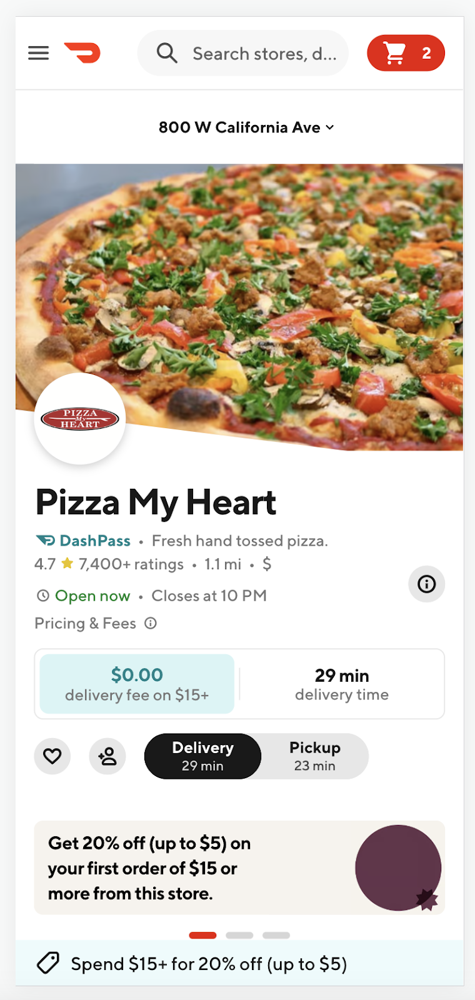

# Experiment Readout: Cx Store Promo Sticky Footer

Analytics DRI: [Sara Nordstrom](mailto:sara.nordstrom@doordash.com)

Working team: [Omung Goyal](mailto:omung.goyal@doordash.com)(eng),[Takman (Michelle) Lee](mailto:takman.lee@doordash.com)(eng), [Shuang Wang](mailto:shuang.wang@doordash.com)(eng), [Zohaib Sibté Hassan](mailto:zohaib.hassan@doordash.com) (EM), [Saur Vasil](mailto:saur.vasil@doordash.com) (PM), [Tina Rong](mailto:tina.rong@doordash.com) (PM), [Shakti Mb](mailto:shakti.m@doordash.com) (Design), [Vero Jimenez](mailto:veronica.jimenez@doordash.com) (research)

### TL;DR

**Problem:**Cx lack promotion awareness on the store page to improve conversion and cart subtotal:

- Cx needs to scroll back up to the top of the store page and scan through banners for applicable promos or go to the checkout page to see the promos in the wallet. There is a sticky placement to help customers find the most applicable promo when they are browsing the items.

- Cx cannot see their progress towards promotion minimum subtotal without going to cart.

- Cx need to search for items to hit promotion subtotal.**Solution:**We introduced a new placement on the store page to surface applicable promotions customers are eligible for in a persistent, in-context manner.

| mWeb | Desktop |
| --- | --- |
|  |  |**Results Summary**The Cx Store Promo Footer Experiment drove $<mark>460k</mark> incremental GMV over a 2 week experiment period,**leading to an estimated +$6M**[^1]**GMV/year**and**$1.7M Q3 exit GMV**- Estimated annualized GMV:**$6M/year**- Estimated Q2 exit GMV:**$1.7M**

- Check metrics: flat

  - Other quality metrics:

    - flat

[Mode Dashboard](https://app.mode.com/doordash/reports/e6b08b19d7be)

[Curie Dashboard](https://admin-gateway.doordash.com/decision-systems/experiments/6d811d48-1520-4eb9-9ae1-037b2852c6fa?analysisId=a628d223-626c-46ec-b798-19696d15be68)

### Experiment Timeline

### Methodology

#### Overview

**Test mechanism:**A/B test**Test platform:**mWeb**Country:**Global**Experience:**DoorDash only**Target Population:**mWeb users**Test duration:**2 weeks at 50/50**Control/Treatment Split:**50/50

### Result Details

Impacts breakdown:

- **GMV lift of +6M/yr:** ,

- An increase in cart size drove an increase in avg. subtotal per order which drove an increase in avg. gov per order

#### Success Metrics (Treatment vs Control)

| **Metrics**|**Treatment**|**Control**|**% Change**|**Significance**|
| --- | --- | --- | --- | --- |
| GoV | $39.73 | $39.64 | +0.26% | YES |
| VP | $<mark>3.06</mark> | <mark>$3.03</mark> | <mark>+1.09%</mark> | YES |
| MAU | <mark>0.75</mark> | <mark>0.75</mark> | +0.01% | NO |

#### Check Metrics

|**Metrics**|**Treatment**|**Control**|**% Change**|**Significance**|
| --- | --- | --- | --- | --- |
| New Cx CVR | $26.58 | $26.49 | +0.36% | NO |
| Order Rate | <mark>1.845</mark> | <mark>1.847</mark> | -0.16% | NO |**Next steps:**

- Ramp-up plan: Rollout to 100% and monitor through device global LTH
---
## Footnotes

\[^1\]: This is with a 50% haircut
