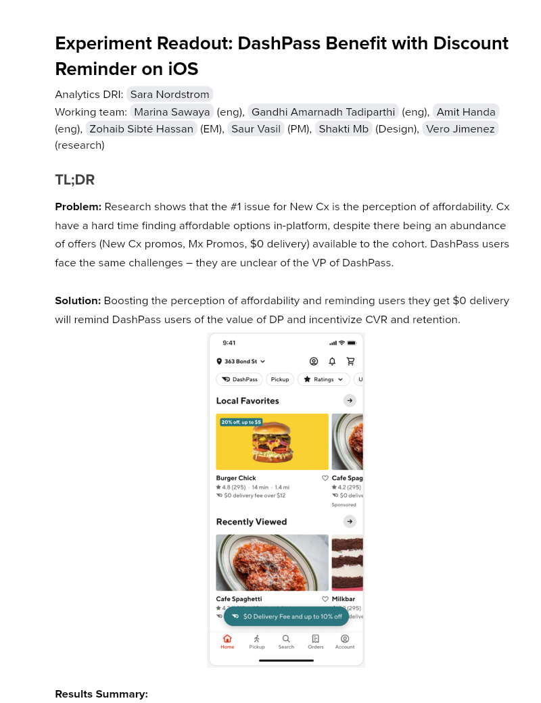

# Experiment Readout: DashPass Benefit with Discount Reminder on iOS

Analytics DRI: [Sara Nordstrom](mailto:sara.nordstrom@doordash.com)

Working team: [Marina Sawaya](mailto:marina.mukhina@doordash.com) (eng), [Gandhi Amarnadh Tadiparthi](mailto:gandhi.tadiparthi@doordash.com) (eng), [Amit Handa](mailto:amit.handa@doordash.com) (eng), [Zohaib Sibté Hassan](mailto:zohaib.hassan@doordash.com) (EM), [Saur Vasil](mailto:saur.vasil@doordash.com) (PM), [Shakti Mb](mailto:shakti.m@doordash.com) (Design), [Vero Jimenez](mailto:veronica.jimenez@doordash.com) (research)

### TL;DR

**Problem:**Research shows that the #1 issue for New Cx is the perception of affordability. Cx have a hard time finding affordable options in-platform, despite there being an abundance of offers (New Cx promos, Mx Promos, $0 delivery) available to the cohort. DashPass users face the same challenges – they are unclear of the VP of DashPass.**Solution:**Boosting the perception of affordability and reminding users they get $0 delivery will remind DashPass users of the value of DP and incentivize CVR and retention.

**Results Summary:**The DashPass Benefit with Discount Reminder Experiment drove 5k incremental MAU over a 1 month experiment period,**leading to an estimated +19.3k incremental MAU/year and +$22.9M**[^1]**GMV/year and +5k exit Q3 MAU and +$875k exit Q3 GMV**- Estimated annualized GMV:**$22.9M/year**- Estimated annualized MAU:**$19.3k/year**- Estimated Q3 exit GMV:**+$875k**- Estimated Q3 exit MAU:**+$5k**

- Check metrics: flat

  - Other quality metrics:

    - flat

[Curie Dashboard](https://admin-gateway.doordash.com/decision-systems/experiments/2097dbdb-4e48-4cb4-99ee-a4afba712022?analysisId=90dff15a-ca3e-4f21-a090-3064df2bbf05)

### Experiment Timeline

### Methodology

#### Overview

**Test mechanism:**A/B test**Test platform:**iOS**Country:**US Only**Experience:**DoorDash only**Target Population:**iOS DP users**Test duration:**1 month at 50/50**Control/Treatment Split:**50/50

### Result Details

Impacts breakdown:

- **MAU lift of +19.3k incremental MAU/year and GMV lift of +$22.9M GMV/year:** - An increased MAU rate of +0.069% led to an overall MAU increase. DP users were more aware of their benefit which led to more DP users placing orders.

#### Success Metrics (Treatment vs Control)

| **Metrics**|**Treatment**|**Control**|**% Change**|**Significance**|
| --- | --- | --- | --- | --- |
| Order Rate | 2.348 | 2.346 | +0.119% | YES |
| MAU | <mark>72.18%</mark> | <mark>72.14%</mark> | +0.068% | YES |

#### Check Metrics

|**Metrics**|**Treatment**|**Control**|**% Change**|**Significance**|
| --- | --- | --- | --- | --- |
| VP | $3.06 | $3.06 | +.12% | NO |
| GoV | <mark>$35.00</mark> | <mark>$35.01</mark> | +0.02% | NO |
| Cx App Latency PLP iOS Screen | 0.059 | 0.059 | -0.1948% | YES |
| Cx App Latency PLP iOS Action | <mark>0.248339 </mark> | <mark>0.248828 </mark> | -0.1965% | YES |
| DP Paid Balance | <mark>0.322649 </mark> | <mark>0.322516 </mark> | +0.0768% | NO |
| DP Paid Active Cancel | <mark>0.002564 </mark> | <mark>0.002573 </mark> | -0.3384% | NO |
| DP Paid Cancellation Requests | <mark>0.070949 </mark> | <mark>0.070826 </mark> | +0.1737% | NO |
| DP Total Balance | <mark>0.380391 </mark> | <mark>0.380034 </mark> | +0.1234% | YES |**Next steps:**

- Ramp-up plan: keep 5% feature level holdout to monitor long term DP retention
---
## Footnotes

\[^1\]: This is with a 50% haircut
