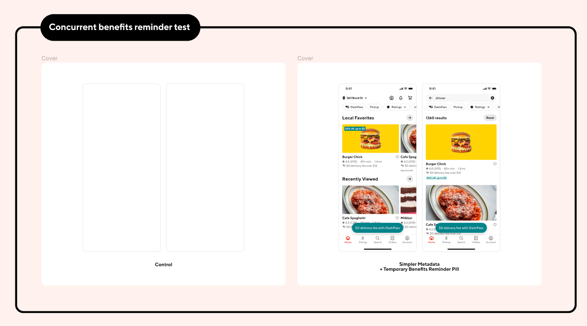
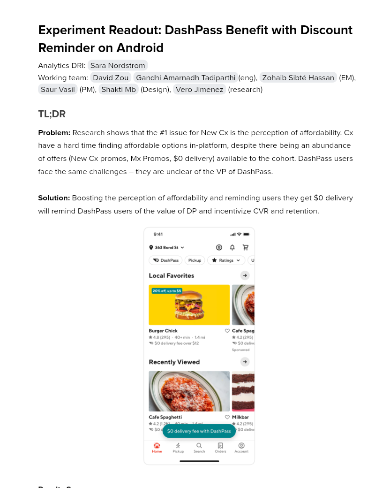

# Experiment Readout: DashPass Benefit with Discount Reminder on Android

Analytics DRI: [Sara Nordstrom](mailto:sara.nordstrom@doordash.com)

Working team: [David Zou](mailto:david.zou@doordash.com) [Gandhi Amarnadh Tadiparthi](mailto:gandhi.tadiparthi@doordash.com)(eng), [Zohaib Sibté Hassan](mailto:zohaib.hassan@doordash.com) (EM), [Saur Vasil](mailto:saur.vasil@doordash.com) (PM), [Shakti Mb](mailto:shakti.m@doordash.com) (Design), [Vero Jimenez](mailto:veronica.jimenez@doordash.com) (research)

### TL;DR

**Problem:**Research shows that the #1 issue for New Cx is the perception of affordability. Cx have a hard time finding affordable options in-platform, despite there being an abundance of offers (New Cx promos, Mx Promos, $0 delivery) available to the cohort. DashPass users face the same challenges – they are unclear of the VP of DashPass.**Solution:**Boosting the perception of affordability and reminding users they get $0 delivery will remind DashPass users of the value of DP and incentivize CVR and retention.

**Results Summary:**The DashPass Benefit with Discount Reminder Experiment drove 28k incremental orders over a 3 week experiment period,**leading to an estimated +$7.3M**[^1]**GMV/year**- Estimated annualized GMV:**$7.3M/year**- Estimated Q3 exit GMV:**$1.8M**

- Check metrics: flat

  - Other quality metrics:

    - flat

[Mode Dashboard](https://app.mode.com/doordash/reports/1c68fe66b396)

[Curie Dashboard](https://admin-gateway.doordash.com/decision-systems/experiments/2097dbdb-4e48-4cb4-99ee-a4afba712022?analysisId=faff9f5b-ec10-48f1-9677-defd7e851e67)

### Experiment Timeline

### Methodology

#### Overview

**Test mechanism:**A/B test**Test platform:**Android**Country:**Global**Experience:**DoorDash only**Target Population:**Android DP users**Test duration:**3 weeks at 50/50**Control/Treatment Split:**50/50

### Result Details

Impacts breakdown:

- **GMV lift of +7.3M/yr:** ,

- An increase order rate of +.2% led to an overall GMV increase. DP users were more aware of their benefit which led to DP users placing more orders.

#### Success Metrics (Treatment vs Control)

| **Metrics**|**Treatment**|**Control**|**% Change**|**Significance**|
| --- | --- | --- | --- | --- |
| Order Rate | 2.527 | 2.523 | +0.2% | YES |
| MAU | <mark>73.72%</mark> | <mark>73.70%</mark> | +0.04% | NO |

#### Check Metrics

|**Metrics**|**Treatment**|**Control**|**% Change**|**Significance**|
| --- | --- | --- | --- | --- |
| VP | $2.60 | $2.60 | +.21% | NO |
| GoV | <mark>$36.02</mark> | <mark>$36.02</mark> | +0.0% | NO |
| Cx App Latency PLP Android Screen | <mark>0.0786</mark> | <mark>0.0785</mark> | +0.1001% | NO |**Next steps:**

- Ramp-up plan: Rollout to 100% and monitor through device global LTH

- Rollout on iOS and Web
---
## Footnotes

\[^1\]: This is with a 50% haircut
