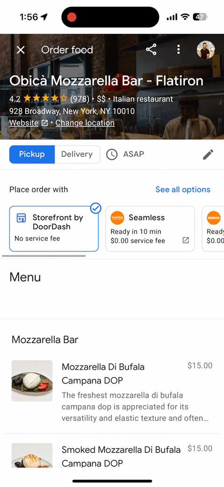
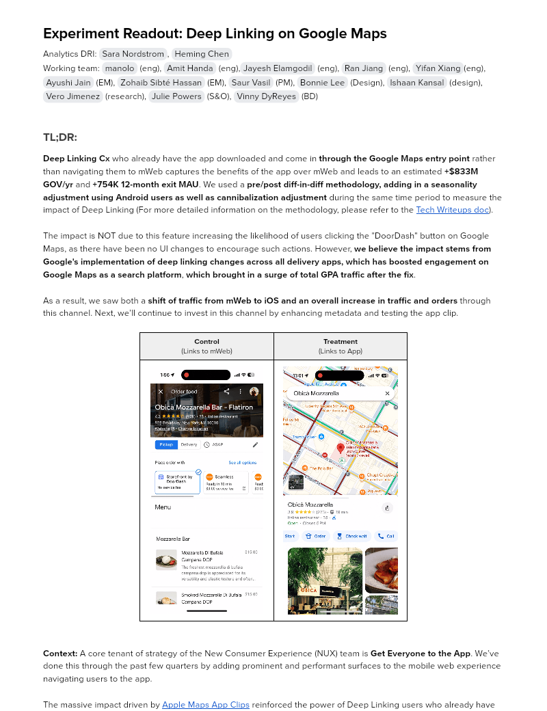
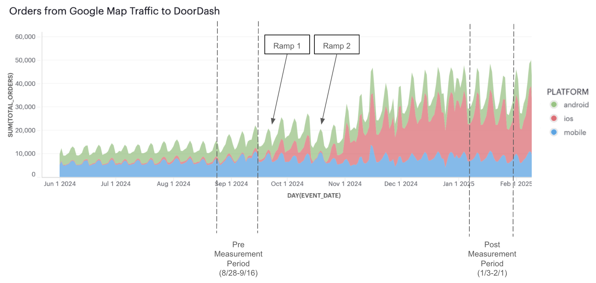
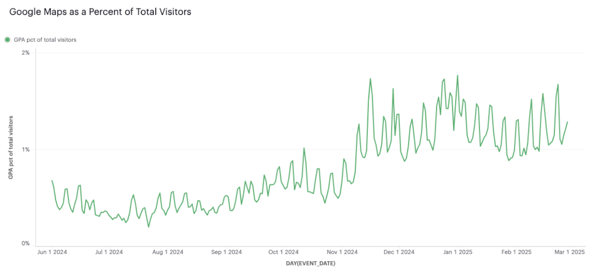
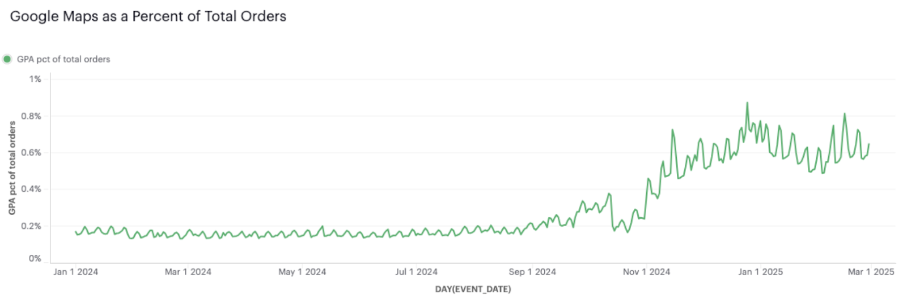
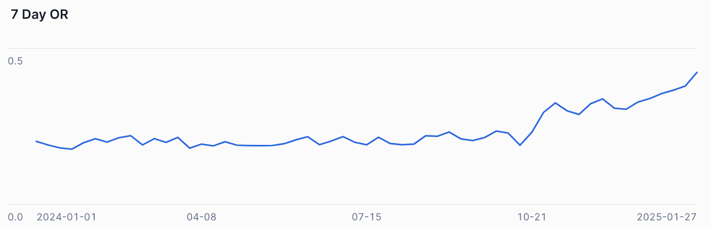
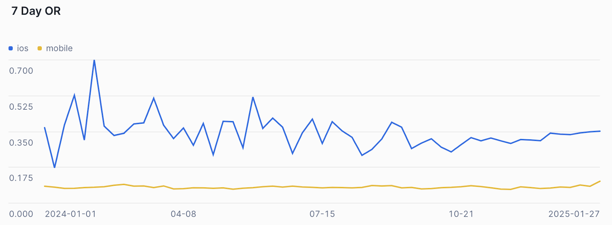
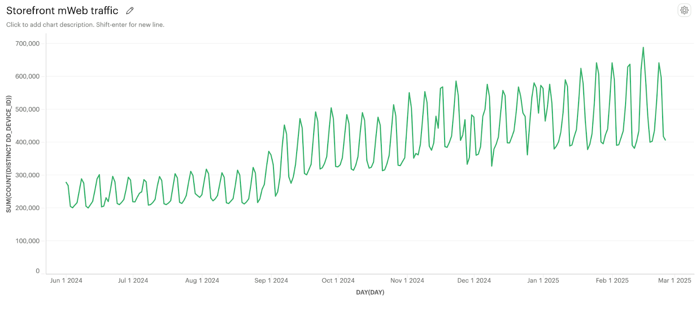

# Experiment Readout: Deep Linking on Google Maps

Analytics DRI: [Sara Nordstrom](mailto:sara.nordstrom@doordash.com), [Heming Chen](mailto:heming.chen@doordash.com)

Working team: [manolo](mailto:manolo@doordash.com) (eng), [Amit Handa](mailto:amit.handa@doordash.com) (eng),[Jayesh Elamgodil](mailto:jayesh.elamgodil@doordash.com) (eng), [Ran Jiang](mailto:ran.jiang@doordash.com) (eng), [Yifan Xiang](mailto:yifan.xiang@doordash.com)(eng), [Ayushi Jain](mailto:ayushi.jain@doordash.com) (EM), [Zohaib Sibté Hassan](mailto:zohaib.hassan@doordash.com) (EM), [Saur Vasil](mailto:saur.vasil@doordash.com) (PM), [Bonnie Lee](mailto:bonnie.lee@doordash.com) (Design), [Ishaan Kansal](mailto:ishaan.kansal@doordash.com) (design), [Vero Jimenez](mailto:veronica.jimenez@doordash.com) (research), [Julie Powers](mailto:julie.powers@doordash.com) (S&O), [Vinny DyReyes](mailto:vinny.dyreyes@doordash.com) (BD)

### TL;DR:

**Deep Linking Cx**who already have the app downloaded and come in**through the Google Maps entry point**rather than navigating them to mWeb captures the benefits of the app over mWeb and leads to an estimated**+$833M GOV/yr**and**+754K 12-month exit MAU**. We used a**pre/post diff-in-diff methodology, adding in a seasonality adjustment using Android users as well as cannibalization adjustment**during the same time period to measure the impact of Deep Linking (For more detailed information on the methodology, please refer to the [Tech Writeups doc](https://docs.google.com/document/d/1VLtXqhvw7Vo2ZGfPwf6ExxKh5cGe9v3V4BcWFMqDKTc/edit?tab=t.0)).

The impact is NOT due to this feature increasing the likelihood of users clicking the "DoorDash" button on Google Maps, as there have been no UI changes to encourage such actions. However,**we believe the impact stems from Google's implementation of deep linking changes across all delivery apps, which has boosted engagement on Google Maps as a search platform**,**which brought in a surge of total GPA traffic after the fix**.

As a result, we saw both a **shift of traffic from mWeb to iOS and an overall increase in traffic and orders**through this channel. Next, we’ll continue to invest in this channel by enhancing metadata and testing the app clip.

|**Control** (Links to mWeb) |**Treatment** (Links to App) |
| --- | --- |
|  |  |

**Context:**A core tenant of strategy of the New Consumer Experience (NUX) team is**Get Everyone to the App**. We’ve done this through the past few quarters by adding prominent and performant surfaces to the mobile web experience navigating users to the app.

The massive impact driven by [Apple Maps App Clips](https://docs.google.com/document/d/1GyOn6n4e2x1wylbmcUk19uOX0-lfF3UNrh5gICAVRdM/edit?tab=t.0#heading=h.wa7bm2c0ccta) reinforced the power of Deep Linking users who already have the app downloaded straight to the app to drive new and resurrected customers.

**Summary:**Building on this learning,**Google Maps Deep Linking**showed a similar opportunity to enhance the user experience and drive engagement directly to the DoorDash app (instead of mobile web). We worked closely with Google Maps by collaboratively evolving UX, recommending changes to improve Google Map surfaces. This feature is one of the many coming out of the collaboration.**Results Summary:**- Deep Linking Google Maps users directly to the App is estimated to drive**+**$833M GOV/yr and +754K 12-month exit MAU**, driven by:

- **Better Cx DoorDash experience:** , i.e., higher DD conversion with more users on app, and

- **More traffic:** / more Cx are clicking out to DoorDash from Google Maps, and higher retention for Google Maps (per Google)

### Experiment Timeline

#### Next Steps:

|**Action**|**Goals**|
| --- | --- |
| Improve the Google Maps GPA Surface and Mx Coverage | Reach 100% coverage on Mx stores on Google Maps GPA (including through grassroots efforts) Position DoorDash (or Storefront & Caviar) as the de-facto option on GPA through defaulting or ranking Add in NV Deep Links |
| Expand Google Maps Partnership | Enable App Clips on Google Maps for those who don’t have the DD app installed. Use Google Maps data (like saved stores, saved addresses) to bolster DoorDash discovery Enable Google Maps to show DashPass benefits (along with upranked DoorDash) for DP Cx Consider wider cross-vertical BD partnerships with Google |

#### FAQs

- **Are we seeing Cx return to DoorDash directly after using the Maps entrypoint?:** **–**<mark>**YES!**</mark>

- Notably, we also know that **Cx are more likely to return to DoorDash to place subsequent orders**following the deep link change.**86% of users who order via the Google Maps deeplink on iOS place subsequent orders on DoorDash**(and not through Google Maps).

|**In other words, Cx are****not****currently replacing DoorDash with Google Maps as their primary means of placing orders, even if they initially use Google Maps for some level of discovery.**|
| --- |

- **Ranking:** **is not random**, despite what was originally communicated from Google. Google bases rank on**quantity of data shared**, as well as Mx preference.

- **Next Steps:** -**Audit** current ranked position through scraping Google Places websites and determine optimal ranking

  - Position DoorDash (or Storefront & Caviar) as the **de-facto option**on GPA through defaulting or ranking

    - Encourage Mx to rank us as "Preferred" to boost to top spot

    - Reach parity with Storefront Data Sharing to boost ranking

    - Work with Google to default Cx to DoorDash/uprank through partnerships.

- **User Cohort:** What type of user is coming in through this channel?

- Our hypothesis is these are primarily 'on the go' users who browse through Google Maps to get restaurants nearest to them.

  - 65% of Cx who place an order through Google Maps (and have placed at least 5 DD orders before), place their Google Maps order in the same district where they have ordered at least 5 times before.

- We see primarily Active Cx coming in through this channel:

| **MAU Type**|**% of Total Cx** |
| --- | --- |
| New | 6.84% |
| Active | 61.62% |
| Churned Resurrected | 15.37% |
| Dormant Resurrected | 16.17% |

- The AOV of orders through the Google Maps entry point is ~$42.

- 41.4% of orders through the Google Maps entry point are pickup orders.

***How is this different than GFO?**- This is foundationally different than GFO — rather than paying for ranking a subpar Cx experience that disintermediates DoorDash, our approach is to ensure Google (and other partners) optimize their surfaces to send traffic to DoorDash. We will not allow ordering to occur on external platforms — this will enable our strong retention advantage.* **This Deep Linking fix includes going to the order menu from google search as well.**

### Methodology

For more detailed information on the methodology, please refer to the [Tech Writeups](https://docs.google.com/document/d/1VLtXqhvw7Vo2ZGfPwf6ExxKh5cGe9v3V4BcWFMqDKTc/edit?tab=t.0).

#### Overview**Test mechanism:**Pre/Post with seasonality adjustment**Test platform:**Google Maps on iOS**Test Duration:**4.5 months**Target Population:**Google Maps users who have the DoorDash iOS app downloaded**Bucket Key:**device_id

#### Diff-in-Diff Pre-post methodology

Google ramped up this feature twice, allowing us to compare the performance between pre-period (one month before Ramp 1 ) with the post-period (one month after Ramp 2). We've taken a conservative approach by implementing the following actions:

- **MAU Lift (Actual MAU from Google Maps):** For all traffic (Web & iOS) coming from Google Maps, analyze the number of users who became MAU <mark>during the pre-period (08/27/2024 - 09/24/2024) and the post-period (01/03/2025 - 02/01/2025),</mark> Calculate the MAU lift by comparing the differences in user numbers between these two periods.

- **Seasonality Adjustment:** <mark>Adjust for seasonality using Google Maps Android data from the same time periods, as there were no changes made to the Android links during our experiment timeline.</mark>

- **Cannibalization Adjustment:** : <mark>During the pre-period, although most Google Maps users were directed to DD mWeb, we believe some may have closed mWeb and navigated to the DD App independently: </mark>(For more detailed information on the cannibalization adjustment, please refer to the [Tech Writeups doc](https://docs.google.com/document/d/1VLtXqhvw7Vo2ZGfPwf6ExxKh5cGe9v3V4BcWFMqDKTc/edit?tab=t.0))

- For users directed to DD mWeb and were logged in, we can track all subsequent order behaviors (both Web and App) based on their consumer_ID, resulting in no cannibalization effect.

- For users directed to DD mWeb and were logged out, we estimated their MAU impact using the behavior of logged-in users

***Haircut:**Applied a 75% haircut on final result

### Result Details

We observe both a shift from mWeb to iOS traffic through this entry point but also an increase in overall combined traffic through the entry point. This is due to Google Maps becoming an overall more performant and retentive surface.

We also observe an uptick in orders driven by iOS users but also overall, due to the higher conversion rate of iOS as compared to mWeb.

**Traffic + Order Shifts:**Traffic from Google Maps has grown as a result of this Deep Linking change, with Google Maps % of DD's overall traffic growing from .5% to ~1.5%. Total orders through Google maps is also growing, from .2% to .6%.

**No concern on shifting discovery platform:**We are not worried about the risk of losing customers to relying on Google Maps as an entry point. Analysis of the repeat data shows that**80.6%**of people who ordered via this Google Maps Deep Link on iOS**place subsequent orders on DoorDash (**not****through Google Maps)**. We will continue to monitor this going forward. We are seeing both acquisition of New and Resurrected Cx and reengagement of Active Cx through the Google Maps entry point, with 38% of MAU being New and Resurrected.

- The pre/post results show that Cx who place an order through Google Maps are 50% more likely to reorder after we enabled Deep Linking (54.10% vs. 36.24%), and that we observe a shift to Cx reordering via DoorDash directly instead of going through Google Maps again when they do reorder.

| **Pre/Post**|**% of Cx who reorder on DoorDash (regardless of entry point) post acquisition/reengagement through Google Maps**|**Of the Cx who reorder (column 1), what % reorder****not****through Google Maps?**|
| --- | --- | --- |
| Pre Change (all traffic through Google Maps) | 36.24% | 69.97% |
| Post Change (all traffic through Google Maps) | 54.10% | 78.39% |

^ This chart is an apples-to-apples comparison of traffic before and after the change and also shows a shift to more cx reordering without going back through the Google Maps entry point.

- This is because Cx who are Deep Linked (and use the app) inherently reorder more. This aligns with previous analysis that Cx who download and use the DoorDash app are higher intent and retain better than Cx who use mWeb.

|**Platform**\*|**% of Cx who reorder on DoorDash (regardless of entry point) post acquisition/reengagement through Google Maps**|**Of the Cx who reorder (column 1), what % reorder****not****through Google Maps?** |
| --- | --- | --- |
| mWeb (Not Deep Linked- users who do not have the app) | 17.37% | 43.07% |
| iOS (Deep Linked - users who have the app) | 68.08% | 80.60% |

*this chart has some inherent selection bias (users with the app downloaded are more likely to be higher intent/retain better)**Quality of these Deep Linked users:**- We see an overall increase in the 7 Day Order Rate of New Cx through this chanel:

- When we break it out by platform, we see this is because iOS has a higher 7 day OR and this Deep Linking change is driving more traffic to iOS:

#### Check Metrics

|**Metrics**|**Pre**|**Post**|**% Change** |
| --- | --- | --- | --- |
| Signups | 0.0240 | 0.0151 | -37.1% |
| SUMA | 0.0158 | 0.0098 | -37.9% |

#### Methodology FAQ:

Due to experimental limitations imposed by Google, we were unable to conduct an A/B test or a switchback test. As a result, our team performed a pre/post diff-in-diff analysis. To build confidence in the impact numbers, we have also invested in identifying and ruling out other potential influencing factors:

##### Why didn’t we run an AB test or Switch back Test?

- Google was unwilling to run this test as an AB test for this feature. They launched it for every partner all together. We have also been trying to keep them in the dark about how big this has been for us because they would’ve asked for revenue sharing but currently this channel is free. For testing replacing the mweb with the app clip we are currently running user level randomized AB testing with google. They were willing to AB test with us on this because we are the only partner testing the app clip through apple maps and neither us nor them knew if this would be a win.

- We discussed switchback testing with both Apple and Google and they wouldn't support it unfortunately as it would require enabling and disabling links on their end.

##### As Deep Linking now automatically redirects users from mobile web to iOS, Why are we observing an overall increase in traffic instead of just seeing iOS traffic cannibalize mobile web traffic?

- Tracking reliability: To address this, we've ruled out any tracking issues. After consulting with engineers from both the NUX and MarTech teams, we are confident on our tracking reliability, and ensure there was no change on the tracking events before and after the launch, i.e. this traffic shift should not coming from tracking issue or attribution issue

- Hypothesis: Our hypothesis is that Google's implementation of the Deep Linking change across all delivery apps has boosted engagement on Google Maps Rx Pages, which may be the primary driver of the surge in total GPA traffic. Google has indicated that this change has generally increased retention on their Google Maps Rx Page surface, which aligns with our hypothesis

##### Could the impact observed in the diff-in-diff analysis be partially driven by the deprecation of GFO (Google Food Ordering), given that it occurred during a similar time period?

- Context: GFO is a Google service that allows users to place orders with DD without leaving the Google platform. With Google's deprecation of this service, users are now redirected to DD's USMP, potentially increasing traffic to both the storefront and GPA.

- <u>Reasons We Believe GFO Deprecation Won't Affect Our Readout:
  </u>

  - **Timeline Alignment:** The deprecation of GFO began on July 1st and was fully phased out by August 28th. While our analysis compares the pre-period (08/28/2024 - 09/24/2024) with the post-period (01/03/2025 - 02/01/2025). Both periods fall after the GFO shutdown, therefore, the pre-post impact should solely capture the change from the Deep Link fix.

  +**Storefront Traffic comparison:** GFO deprecation should have increased both storefront and GPA traffic. By comparing traffic charts, we observed a bump in both storefront and GPA traffic around 08/28, likely correlated with the GFO shutdown. After that date, storefront traffic remained slightly increased due to seasonality, suggesting no further impact from GFO deprecation. However, GPA deep link traffic surged again in late October, coinciding with Google's V2 fix of the deep link. This implies that our pre-post difference-in-differences sizing does not include the impact of GFO.

##### Considering the significant impact size of this launch, which was exclusively on iOS, do we observe a corresponding effect on the overall iOS MAU trend during the same period?

- MAU Performance across platform: To measure this, we defined iOS MAU as those who placed at least one order on iOS in the past 28 days. Comparing the pre-period (08/28/2024 - 09/24/2024) with the post-period (01/03/2025 - 02/01/2025), we saw an +8.17% increase in iOS MAU. While mWeb MAU rose by +7.03%, Android MAU by +5.91%, and desktop MAU by just +0.04%. Overall, using the traditional MAU definition that aggregates all platforms, we observed a +7.56% increase.

- Conclusion: This data suggests that the iOS MAU increase is the primary driver of our overall MAU growth. Part of this success could be attributed to the recent fix in Google's deep linking.
