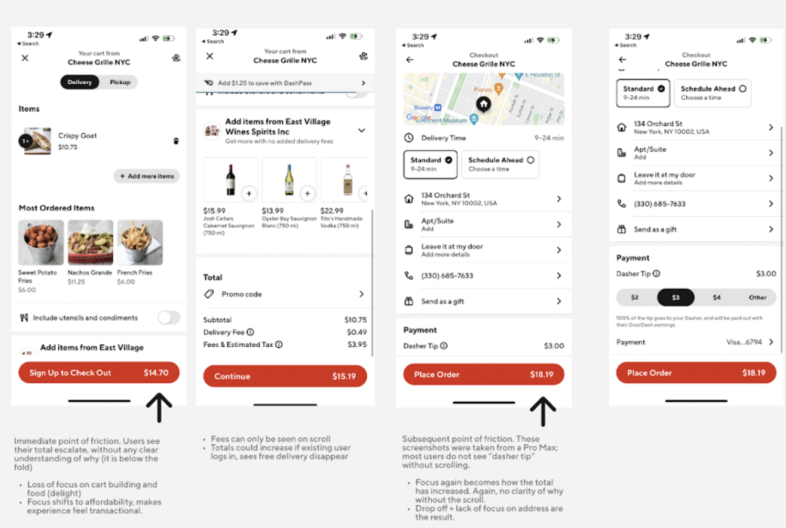
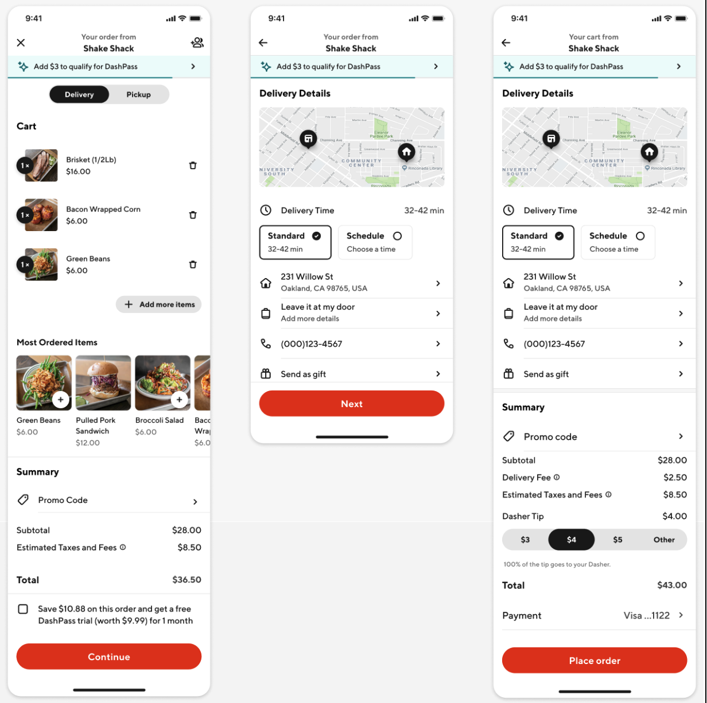
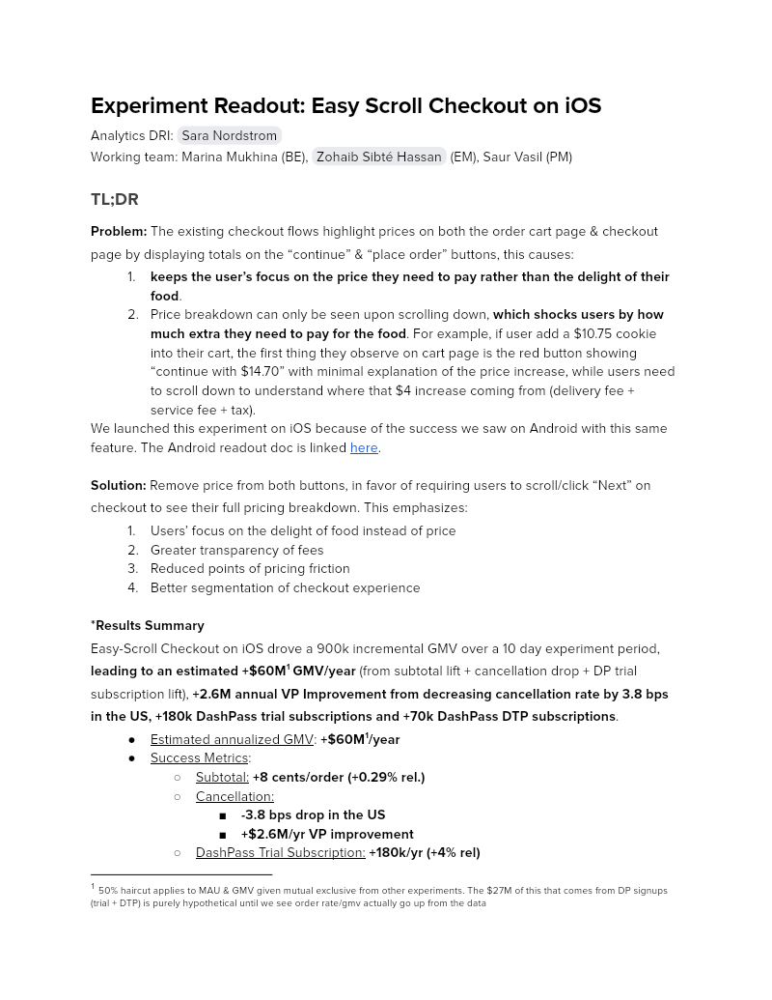

# Experiment Readout: Easy Scroll Checkout on iOS

Analytics DRI: [Sara Nordstrom](mailto:sara.nordstrom@doordash.com)

Working team: Marina Mukhina (BE), [Zohaib Sibté Hassan](mailto:zohaib.hassan@doordash.com) (EM), Saur Vasil (PM)

### TL;DR

**Problem:**The existing checkout flows highlight prices on both the order cart page & checkout page by displaying totals on the “continue” & “place order” buttons, this causes:

- **keeps the user’s focus on the price they need to pay rather than the delight of their food:** .

- Price breakdown can only be seen upon scrolling down, **which shocks users by how much extra they need to pay for the food**. For example, if user add a $10.75 cookie into their cart, the first thing they observe on cart page is the red button showing “continue with $14.70” with minimal explanation of the price increase, while users need to scroll down to understand where that $4 increase coming from (delivery fee + service fee + tax).

We launched this experiment on iOS because of the success we saw on Android with this same feature. The Android readout doc is linked [here](https://docs.google.com/document/d/1aoU0D7IjkhBGm2S4zrrwB9BNwYjmjV1NmOCcdh3pkRM/edit#).

**Solution:**Remove price from both buttons, in favor of requiring users to scroll/click “Next” on checkout to see their full pricing breakdown. This emphasizes:

- Users’ focus on the delight of food instead of price

- Greater transparency of fees

- Reduced points of pricing friction

- Better segmentation of checkout experience**Results Summary**Easy-Scroll Checkout on iOS drove a 900k incremental GMV over a 10 day experiment period,**leading to an estimated****+$60M**[^1]**GMV/year**(from subtotal lift + cancellation drop + DP trial subscription lift),**+2.6M annual VP Improvement from decreasing cancellation rate by 3.8 bps in the US, +180k DashPass trial subscriptions and +70k DashPass DTP subscriptions**.

- Estimated annualized GMV: **+$60M**1**/year**

- Success Metrics:

  - Subtotal: **+8 cents/order (+0.29% rel.)**

  - Cancellation:

    - **-3.8 bps drop in the US:** +**+$2.6M/yr VP improvement**- DashPass Trial Subscription:**+180k/yr (+4% rel)**- DashPass DTP Subscription:**+70k/yr (+4% rel)**

- Check metrics:

  - Tips: -2 cents/order (-0.53% rel.) due to cannibalization

  - Other quality metrics: flat

| **Before**|  |
| --- | --- |
|**After**|  |**Result Details**[Mode Dashboard](https://app.mode.com/doordash/reports/6c710c7eb9c2) (The migration from Mode to Curie still in progress, we are working on Curie metrics pack and aim for completion in Q4)

[Curie Dashboard](https://admin-gateway.doordash.com/decision-systems/experiments/f183d39f-812f-4c1f-8452-57209b1ae1be?analysisId=44b486be-e72d-4b38-8ff3-b21f9090cec3) for quality metrics

[Product Doc](https://docs.google.com/document/d/1WN2YDSzsbMIQg8R_-pRelKcsqc-oHzLTswA_UWLrlFM/edit#heading=h.etaqjr1ijy0o)

### Experiment Timeline

### Methodology

#### Overview**Test mechanism:**A/B test**Test platform:**iOS only**Country:**US only**Experience:**DoorDash only**Target Population:**Every iOS user**Test duration:**2 weeks**Control/Treatment Split:**50/50

#### Testing Group & Bucketing

- Treatment (50%): New design of order cart page & checkout page

- Control (50%): Existing design

- **Test Launch date:** 10/21/2022

### Result Details

Impacts breakdown:

- **Cx_Cancellation drop of -1.99%:** - Majority coming from who canceled*within 5 mins* after placing orders

- Hypothesis:

  - Increased transparency in checkout -> less likely to regret order after placing

  - Additional tap to checkout -> less likely to accidentally place order and regret tip/total

  - **This change dramatically improved these pain points.:** -**GMV lift of +$36M/yr**, driven by subtotal lift of +0.29%, +0.16% in GoV

- Moving full pricing information to checkout (industry standard) encourages Cx to be more focused on cart-building in the cart, rather than a focus on pricing.

- Aligns with the industry standard of showing pricing in checkout

- Average cart size -> treatment saw +0.41% lift

*NSS Impact overall Checkout rate (directionally negative at -.08% lift)* Directionally positive (NSS) New Cx CVR (~1% lift, we expect this would go stat sig if we let the experiment run longer but we want to launch now to drive growth given current conditions

***DP trial lift of +4.37% and DP DTP lift of 4.02%**

  - Increased transparency of fees -> Cx find ways to reduce fees

  - Increased clarity of DP cart upsell (less competing information on cart page)

*Lowers average Tip/order by $0.02 (-0.53% lift)* **Stronger legal footing from consumer transparency pricing breakdown (fees, tip, totals)**#### Success Metrics (Treatment vs Control)

|**Metrics**|**Treatment**|**Control**|**% Change**|**Significance**|
| --- | --- | --- | --- | --- |
| GoV | $35.04 | $34.98 | 0.16% | YES |
| Subtotal | $25.05 | $24.49 | 0.29% | YES |
| Tip | $3.61 | $3.63 | -0.53% | YES |
| Order Rate | 1.908 | 1.910 | -.08% | NO |
| New Cx CVR | 3.59% | 3.58% | .23% | NO |

#### Check Metrics

|**Metrics**|**Treatment**|**Control**|**% Change**|**Significance**|
| --- | --- | --- | --- | --- |
| DP trial subscription rate | 2.17% | 2.09% | 4.37% | YES |
| DP DTP subscription rate | .95% | .97% | 4.02% | YES |
| Cancellation rate | 2.54% | 2.49% | -1.99% | YES |
| HQDR | 90.83% | 90.88% | 0.05% | YES |**Next steps:**

- <mark>Ramp-up plan: Ramping up to 90% treatment + 10% long term holdout.
  </mark>

- <mark>Follow-up experiment:
  </mark>

  - <mark>Expand to international markets
    </mark>

  - <mark>Highlighting DP trial subscription on checkout page</mark>
---
## Footnotes

\[^1\]: 50% haircut applies to MAU & GMV given mutual exclusive from other experiments. The $27M of this that comes from DP signups (trial + DTP) is purely hypothetical until we see order rate/gmv actually go up from the data
