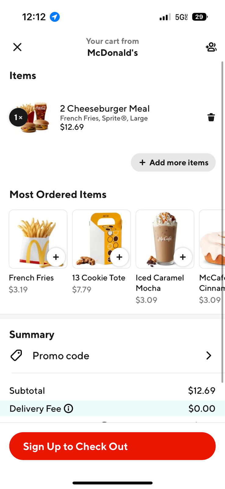
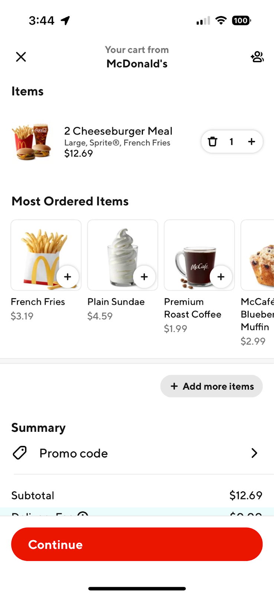
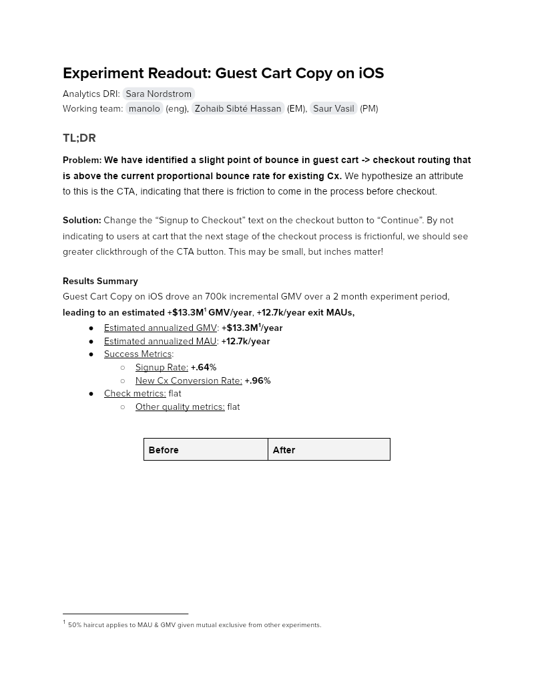

# Experiment Readout: Guest Cart Copy on iOS

Analytics DRI: [Sara Nordstrom](mailto:sara.nordstrom@doordash.com)

Working team: [manolo](mailto:manolo@doordash.com) (eng), [Zohaib Sibté Hassan](mailto:zohaib.hassan@doordash.com) (EM), [Saur Vasil](mailto:saur.vasil@doordash.com) (PM)

### TL;DR

**Problem:****We have identified a slight point of bounce in guest cart -> checkout routing that is above the current proportional bounce rate for existing Cx.**We hypothesize an attribute to this is the CTA, indicating that there is friction to come in the process before checkout.**Solution:**Change the “Signup to Checkout” text on the checkout button to “Continue”. By not indicating to users at cart that the next stage of the checkout process is frictionful, we should see greater clickthrough of the CTA button. This may be small, but inches matter!**Results Summary**Guest Cart Copy on iOS drove an 700k incremental GMV over a 2 month experiment period,**leading to an estimated****+$13.3M**[^1]**GMV/year**,**+12.7k/year exit MAUs,**- Estimated annualized GMV:**+$13.3M**1**/year**- Estimated annualized MAU:**+12.7k/year**

- Success Metrics:

  - Signup Rate: **+.64%**- New Cx Conversion Rate:**+.96%**

- Check metrics: flat

  - Other quality metrics: flat

| **Before**|**After**|
| --- | --- |
|  |  |**Result Details**[Mode Dashboard](https://app.mode.com/doordash/reports/37547742546e) (The migration from Mode to Curie still in progress, we are working on Curie metrics pack and aim for completion in Q1)

[Curie Dashboard](https://admin-gateway.doordash.com/decision-systems/experiments/95bf5898-e97b-44c1-972a-741b123ba4cc) for quality metrics

[Product Doc](https://docs.google.com/document/d/1h-qqbS3oa8cWFBu94zgefBKJ5J1ei4xl79Rg4L9N9gY/edit#heading=h.9agdtzbbifjw)

### Experiment Timeline

### Methodology

#### Overview**Test mechanism:**A/B test**Test platform:**iOS only**Country:**Global**Experience:**DoorDash only**Target Population:**iOS guest users that see the cart**Test duration:**2 months**Control/Treatment Split:**50/50

#### Testing Group & Bucketing

- Treatment (50%): New design of order cart page

- Control (50%): Existing design

- **Test Launch date:** 11/11/2022

### Result Details

Impacts breakdown:

- **Signup lift of .64%:** - Getting more guests to click the checkout button and removing friction on this button is leading more guests to signup.

  - This feature improved the click through rate of the checkout button which got more guests to the signup screen and increased signup rate.

***GMV lift of +$13.3M/yr**,

  - Increasing MAU and New Cx Conversion has led to an increase in GMV.

***MAU lift of .61%**driven by a**New Cx Conversion lift of .96%**

  - Getting more guests to the checkout screen has led to more guests signing up and placing their first order which has increased MAU rate.

#### Success Metrics (Treatment vs Control)

| **Metrics**|**Treatment**|**Control**|**% Change**|**Significance**|
| --- | --- | --- | --- | --- |
| Login Rate | 52.76% | 52.76% | 0% | NO |
| Signup Rate | 34.34% | 34.12% | .64% | YES |
| MAU | 43.83% | 43.56% | .61% | YES |
| Order Rate | 2.05 | 2.06 | -.24% | NO |
| New Cx Conversion | <mark>31.53%</mark> | <mark>31.23%</mark> | .96% | YES |

#### Check Metrics

|**Metrics**|**Treatment**|**Control**|**% Change**|**Significance**|
| --- | --- | --- | --- | --- |
| GoV | $34.18 | $34.15 | -.08% | NO |
| Subtotal | $24.14 | $24.12 | .1% | NO |
| Tip | $3.11 | $3.11 | -.01% | NO |**Next steps:**

- <mark>Ramp-up plan: Ramping up to 90% treatment + 10% long term holdout.
  </mark>

- <mark>Launch on Android</mark>
---
## Footnotes

\[^1\]: 50% haircut applies to MAU & GMV given mutual exclusive from other experiments.
