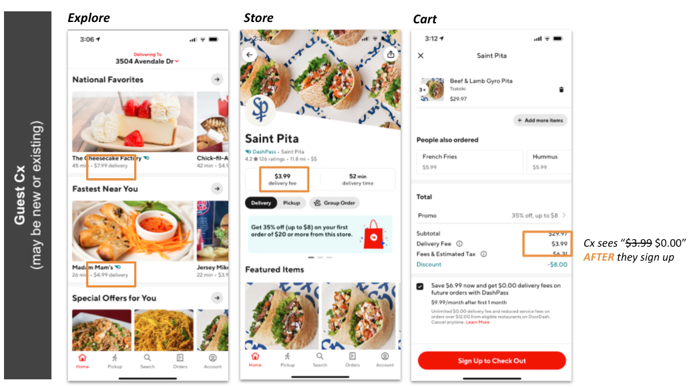
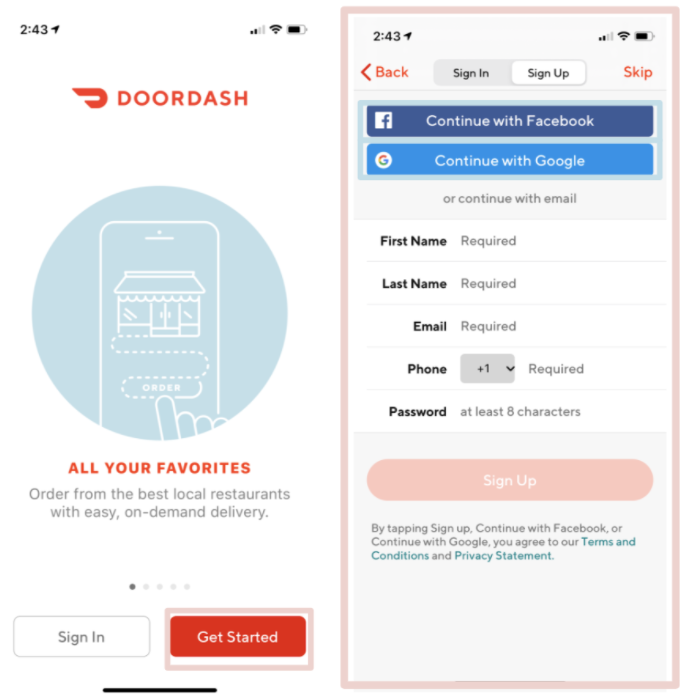
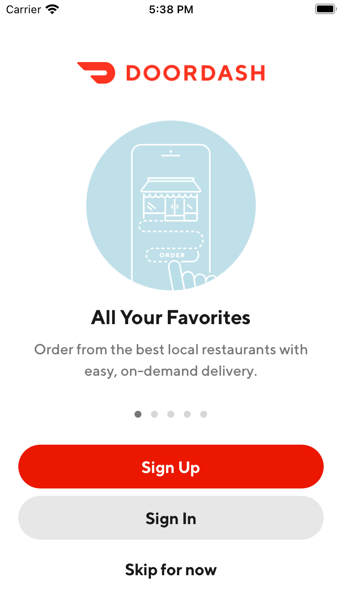

# Experiment Readout: Improving the New Cx path to Explore (iOS)

Analytics DRI: @Heming.Chen

Working team: Varun Kerof (PM) , Zohaib Hassan(EM), Manolo Sañudo (iOS), Amit Handa (BE), Ishaan Kansal (Design), Yingying Chen (Analytics).

Last updated: 05/21/2021

### TL;DR

- **Context:** -**The NUX team is on a mission to build the most seamless 1st order experience in the industry.**

  - <mark>Our strategy is to
    </mark>

    - <mark>Help 100% Cx get to the Explore Page as quickly as possible
      </mark>

    - <mark>Ensure New Cx have clarity on key benefits and actions to order
      </mark>

    - <mark>Allow for a seamless first checkout experience</mark>

  - The goal of our first test (V0) is making it easier to skip identity flow and reach the Explore page quickly. We wanted to validate three things at a low cost before investing further on the Guest path

    - Could we reduce the high bounce rate seen at onboarding?

    - What would be the net effect on conversion (Orders and New Cx)?

    - Would there be a material mix-shift from Cx choosing Sign-in / Sign-up to choosing “Skip” (guest browsing).

- **Key result:** - Bounce Rate: With the new design of the onboarding page,**we’ve saved relative 25% visitors (annual 6.2M visitors) who would have bounced upon the onboarding page decided to guest browse now.**- Conversion rate: Relative**3.81% lower conversion rate and a relative 6.11% lower new Cx conversion rate.**- Mix-shift from Sign-in / Sign-up:**26% of Cx who would have signed-in/up decided to “Skip”.***Note: we knew a mix-shift would occur but did not know what to expect here. The magnitude of this shift was a surprise.*-**Experiment insights:**-**Based on a UX audit, w**e believe that the main reason for the negative conversion lift is due to affordability. Guest browsers do not see “free delivery” for Mx on Explore, Store and Cart (see below images).**

  - Another observation is that non-logged in users could be subject to a higher percentage of bugs (e.g. payment entry issue) and a poorer UX (e.g non-optimized banner and announcement targeting) as this is a lesser known and underinvested path.

- **Next step:** Overall we believe that Skip addresses a “help wanted sign for” visitors and we need to explore further how we can keep prominent to them while not impairing conversion.

  - **As the very next step, we believe it is most important to prove by experiment that affordability is the cause of the negative conversion. We need to move our guest CVR from 20% to 24% to breakeven.:** - Our future experiments include:

    - improving address entry by allowing use of location

    - Improving the sign-up and sign-in UX

    - And building a more personalized landing and shopping experience for guest and new users

  - Note, our current focus is on iOS. As we prove impact, we will bring to Android. We plan to also explore web opportunities in H2.

For the full readout, please check out the [experiment result doc](https://docs.google.com/document/d/1X_vHoepLdl_dHvO-uNzph4X-gMlmaGKGaLTN2gua42o/edit#)

**Goals and Hypothesis**

**Problems & hypothesis:**A New Cx will have to step through up to 11-14 pages before seeing the Explore Page. 25% of onboarding page visitors each month on iOS never proceed. 5% of those that sign-up or skip proceed through the address entry flow. We believe (1)**The****sign up wall adds friction**and is discouraging Cx from continuing, (2)**Address entry is not easy**and does not give the Cx context on why we want the address, (3) Onboarding page is outdated and**does not provide a compelling DoorDash value proposition.**

**Goal:**Our goal is to build the most seamless 1st order experience in the industry and get New Cx directly into the Explore page immediately upon app launch, similar to existing logged in DoorDash Cx or as companies such as Amazon do today for non-logged in Cx.**The goal of this test (V0) is making it easier to skip identity flow and reach the Explore page quickly.** Next step, we are going to test more designs that could smooth the process of new user experience, e.g. address entry flow/sign up flow/ payment added flow and etc

*Existing design:*

*To skip signup, Cx need to tap “Get Started” on onboarding page and “Skip” button on the top right corner of identity page, 25% traffic never proceed from this page*

*New design:*

*Cx can choose guest browsing by tapping “skip for now” upon launch the app*

### Experiment Timeline

**Test mechanism:**A/B test**Test platform:**iOS**Country:**US, CAN & AUS**Experience:**DoorDash only**Target Population:**Non-logged in Cx**Test duration:**1 weeks experiment**Control/Treatment Split:**90/10

### Result Details

#### Success Metrics (Treatment vs Control)

|**Metrics**|**Treatment**|**Control**|**Abs Change**|**% Change**|**Significance**|
| --- | --- | --- | --- | --- | --- |
| Onboarding page Bouncing Rate | 26.08% | 34.73% | -8.65% | -24.90% | Yes |
| Ratio of onboarding page -> explore page | 71.46% | 67.72% | 3.74% | 5.51% | Yes |
| Conversion rate: onboarding page -> checkout | 29.25% | 30.40% | -1.15% | -3.81% | Yes |
| New Cx Conversion rate: onboarding page -> New Cx checkout | 11.20% | 11.92% | -0.72% | -6.11% | Yes |

#### Check Metrics

|**Metrics**|**Treatment**|**Control**|**Abs Change**|**% Change**|**Significance**|
| --- | --- | --- | --- | --- | --- |
| Overall signup rate | 18.42% | 20.80% | -2.38% | -11.44% | Yes |
| DashPass Trial subscription rate | 0.38% | 0.41% | -0.03 | -7.31% | Yes |
| Onboarding Sign up rate | 11.74% | 17.22% | -5.48% | -31.82% | Yes |
| Onboarding Sign in rate | 28.47% | 37.39% | -8.92% | -23.86% | Yes |
| Onboarding Guest browsing rate | 33.71% | 10.66% | 23.05% | 216.23% | Yes |
| CTR of “Get Started” button | 21.45% | 39.59% | -18.14% | -45.82% | Yes |
| CTR of “Sign in” button | 44.96% | 49.62% | -4.66% | -9.39% | Yes |
| CTR of “Skip for now” button | 32.36% | NA | NA | NA | NA |
| MTO | 0.112 | 0.114 | -0.002 | -1.65% | NO |
| D7 Order Rate | Not baked yet | Not baked yet | NA | NA | NA |

### Methodology

#### Overview**Test mechanism:**A/B test**Test platform:**iOS**Country:**US, CAN & AUS**Experience:**DoorDash only**Target Population:**Non-logged in Cx**Test duration:**1 weeks experiment**Control/Treatment Split:**90/10

#### Testing Group & Bucketing

- Treatment (10%): New design of onboarding page

- Control (90%): Existing design of onboarding page

- **Test Launch date:** 05/07/2021

### Next Steps

- We’ve received the approval from the legal team to enhance the experience for guest browsing users, the goal is to keep consistent pricing information between sign up vs guest browsing.

- Given more visitors (~33%) choose to guest browse in the future with our new design, we believe it’s important to enhance their experience, e.g. highlight benefits of signing up/ preserve last state of guest/ clear benefits communications/ fix bugs for payment process.

### Appendix

[Launch Plan](https://docs.google.com/document/d/1lRwjmWl4yybzfb9zLHgYhRSFW4LX74fGaQ_Aix2iRsQ/edit?ts=60649fa8#)

[Experiment Launch doc](https://docs.google.com/document/d/1u7r9qCxYFFCLKLPgv_v1zTJHrML0eeILnJAq5pOiUwg/edit?usp=sharing)
