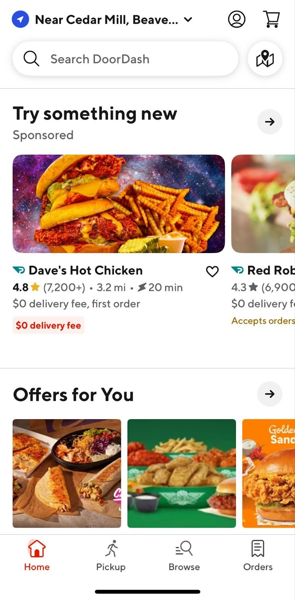
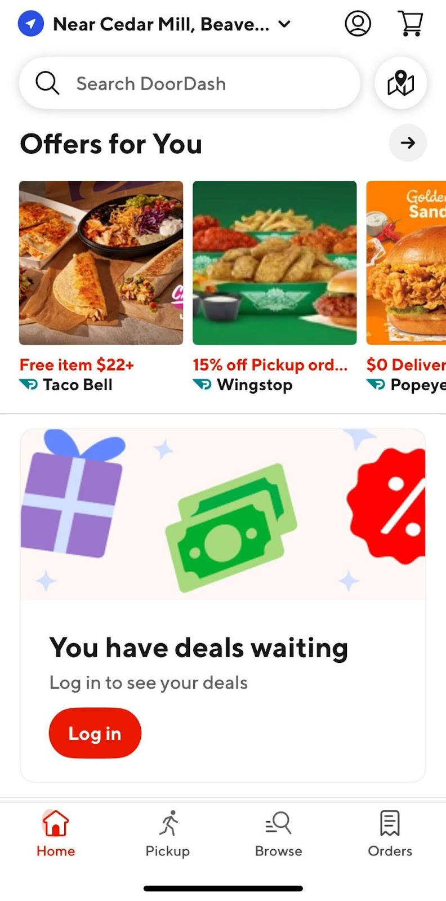

# Experiment Readout: In-feed Banner Guest Login

Analytics DRI: [Wenjing Yang](mailto:wenjing.yang@doordash.com)

Working team: [Yifan Xiang](mailto:yifan.xiang@doordash.com)(ENG) [Zohaib Sibté Hassan](mailto:zohaib.hassan@doordash.com)(EM) [Saur Vasil](mailto:saur.vasil@doordash.com)(PM) [Jim Kim](mailto:james.kim@doordash.com)(Design)

Last updated: 6/4/2024

### TL;DR

**Problem**:**Every month, we have around 900,000 Cx who land on the DoorDash app using Guest Mode. The DoorDash app's guest mode on mobile devices lacks sufficient entry points for users to log in, limiting opportunities for engagement and personalization. This deficiency in login entry points hinders DoorDash's ability to convert casual users into active, registered customers, potentially resulting in lost opportunities for repeat business and increased customer loyalty.**Solution:*\*By adding entry points at key touchpoints in the browsing funnel, we aim to empower customers to better understand their browsing mode and the benefits of accessing their account. We have proved positive impacts on Monthly Active Users (MAU) by adding guest login entry on the top of the funnel for Guest browsers ([readout](https://docs.google.com/document/d/19tBWhf5Bv1onu3IBy63zkk--_wa-tqbWJvUGO-w66cc/edit?usp=sharing)), and we are strategically expanding login entry points throughout the user journey within the DoorDash app's guest mode on mobile devices (full plan can be found [here](https://docs.google.com/document/d/1zTq5DSq2Q0smV9ybFiTpO7FeoXlZ5SAZrSclBvPpj5Y/edit?usp=sharing)).

This readout focuses on guest login entry on the home page through the In-feed banner.

|**Control (no in-feed guest login entry)**|**Treatment (in-feed guest login entry enabled)**|
| --- | --- |
|  |  |**Results Summary**In-feed banner guest login drove 900 incremental logins over a 2-week experiment period,**leading to an estimated 23.4k incremental logins per year, which translates to $1.4M GMV/year and 2.7k MAU at 12-month exit**.

- Estimated annualized GMV: **+$1.4M GMV/year**- Estimated MAU:**+2.7k at 12-month exit**(**488**at the exit of Q2)

- Incremental login:**+1.4% rel. Login rate lift**

- SUMA impact (duplicate consumer signup rate): Flat

- Quality metrics: Flat ATO(Account takeover ratio)/Chargeback/Credits & refund ratio

- Latency metrics: Flat

*50% haircut applies to MAU & GMV given mutual exclusive from other experiments**Dashboards:**- [CURIE dashboard](https://admin-gateway.doordash.com/decision-systems/experiments/aa199d03-89a8-40cd-a227-938917e92199?analysisId=48ed44db-aa6a-4587-b0ab-39b73ec540ca)

- [Mode dashboard](https://app.mode.com/doordash/reports/b82495b9f483) (SUMA & fraud metrics only)**Next steps:**- Already fully rolled out this feature on iOS and Android platforms, and added to LTH

- Keep developing login entry points throughout the user journey within the DoorDash app's guest mode following the [plan](https://docs.google.com/document/d/1zTq5DSq2Q0smV9ybFiTpO7FeoXlZ5SAZrSclBvPpj5Y/edit?usp=sharing)

For the full readout, please check out the [experiment result doc](https://docs.google.com/document/d/1T9FnFibXOt9NWIJsxMi0JLUEGrFNSuttWi0aWyd99S8/edit?usp=sharing)**Result Details**[CURIE dashboard](https://admin-gateway.doordash.com/decision-systems/experiments/aa199d03-89a8-40cd-a227-938917e92199?analysisId=48ed44db-aa6a-4587-b0ab-39b73ec540ca)

[Mode dashboard](https://app.mode.com/doordash/reports/b82495b9f483) (SUMA & fraud metrics only)

### Experiment Timeline

### Methodology

#### Overview**Test mechanism:**A/B test**Test platform:**iOS & Android**Country:**Global**Experience:**DoorDash only**Target Population:**Non-logged Guest Cx**Test duration:**2 week experiment**Control/Treatment Split:**50/50

#### Testing Group & Bucketing

- Treatment (50%): In-feed banner guest login entry enabled

- Control (50%): No In-feed banner guest login entry

- **Test Launch date:** 5/17/2024

### Metric Details

#### Success Metrics

|**Metrics**|**Treatment**|**Control**|**% Change**|**Significance**|
| --- | --- | --- | --- | --- |
| Login Rate | 23.63% | 23.31% | +1.37% | YES |
| Order Rate | 42.21% | 41.86% | +0.84% | NO |

#### Check Metrics

|**Metrics**|**Treatment**|**Control**|**% Change**|**Significance** |
| --- | --- | --- | --- | --- |
| Signup Rate | 17.44% | 17.57% | -0.73% | NO |
| SUMA Rate | 10.97% | 11.01% | -0.32% | NO |
