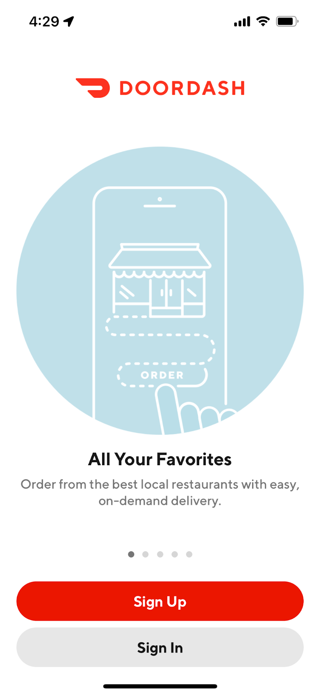
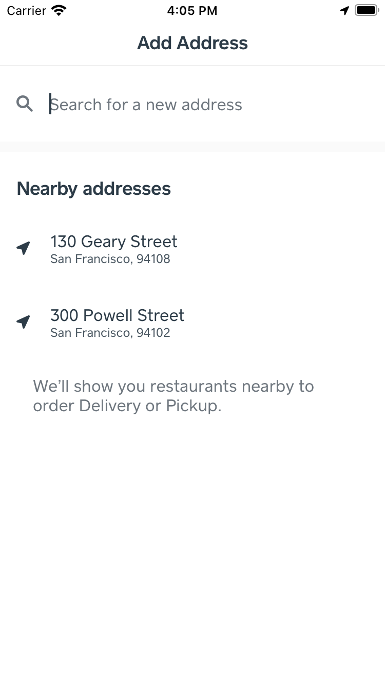
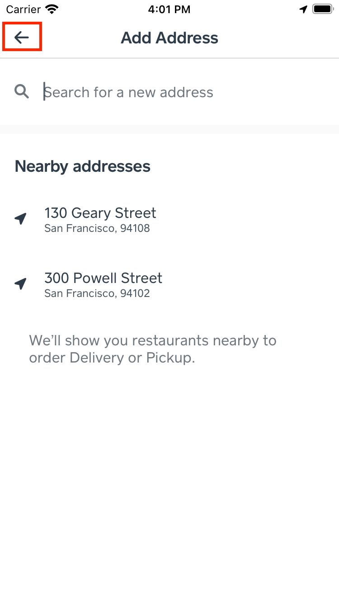

# Experiment Readout: Improving the New Cx path to Explore V2 (iOS) will drive +$117M GMV/year, +180k MAU & +572K New Cx/year

Analytics DRI: Heming.Chen

Working team: Manolo Sañudo (iOS), Amit Handa (BE), Ishaan Kansal (Design), Saur Vasil (PM), Zohaib Hassan (EM)

Last updated: 03/16/2022

### TL;DR

A New Cx will have to step through up to 11-14 pages from app launching before seeing the Explore Page. 25% of onboarding page visitors each month on iOS never proceed. We believe **The sign up wall adds friction**and is discouraging Cx from continuing.**The goal is making it easier to skip identity flow and reach the Explore page quickly.**

**Results Summary**- Estimated annualized GMV:**+$117M**- Estimated MAU:**+180k at 12 month exit**(+153k at the exit of 2022)

- Bouncing rate upon landing page:**-27.87% lower** (28.30% in control vs 20.42% Cx in treatment bounced upon landing page)

- New Cx:

  - **+3.29% rel. new Cx lift:** -**+572k new Cx per year**-**+6.86M incremental orders** annually on a rolling basis

- Guardian metrics

  - Overall Sign up rate: -8.97% lower. This is expected; new visitors choose to guest browse instead of being forced to sign up upon the landing page. Because the personalization between guests and new Cx is equivalent, we are not concerned about this decrease. The increase in conversion among this cohort proves that the reduced friction is beneficial!

  - Overall Sign in rate: -9.87% lower. This is also expected; existing Cx may choose to guest browse instead of login with the new change. Long term tracking is needed to determine impact, given sign in experience is more tailored to Cx than guest browsing. We have a hold-out group established to measure this impact, and have follow-up features to further diminish this.

- International impact summary:

  - **CAN:** <mark>: +39k New Cx per year, translating to +12k MAU & +$8M GMV per year
    </mark>

  - **AUS:** <mark>: +14k New Cx per year, translating to +4k MAU & +$3M GMV per year
    </mark>

  - **US:** <mark>: +510k New Cx per year, translating to +160k MAU & +$104M GMV per year
    </mark>

  - <mark>**JPN:** </mark><mark>too small to estimate impact</mark>

#### 

*Control Group*

*Treatment Group*

**Next steps:**

- Roll out plans: Already ramped to 95% since 03/10.

- Long term tracking of guardian metrics

  - Overall sign-up rate

  - Overall sign-in rate

  - Overall order rate

- Follow on features:

  - SSO Improvements to aid social sign on friction

  - Guest experience improvements to further push conversion, signup, delight!

For the full readout, please check out the [experiment result doc](https://docs.google.com/document/d/1Y7FlqtoCJZIbDbAiyPWQSf7eI8_eu78UbDaq_d5RIrE/edit#)

### Experiment Timeline

### Methodology

#### Overview

**Test mechanism:**A/B test**Test platform:**iOS**Country:**Global**Experience:**DoorDash only**Target Population:**Non-logged in Cx**Test duration:**1 weeks experiment**Control/Treatment Split:**50/50

#### Testing Group & Bucketing

- Treatment (50%): New design of onboarding page

- Control (50%): Existing design of onboarding page

- **Test Launch date:** 03/03/2022

### Result Details

#### Success Metrics (Treatment vs Control)

|**Metrics**|**Treatment**|**Control**|**Abs Change**|**% Change**|**Significance**|
| --- | --- | --- | --- | --- | --- |
| Onboarding page Bouncing Rate | 21.48% | 30.08% | -8.6% | -28.59% | Yes |
| Conversion rate: onboarding page -> checkout | 30.77% | 30.60% | +0.17% | +0.56% | Yes |
| New Cx Conversion rate: onboarding page -> New Cx checkout | 13.41% | 12.98% | +0.43% | +3.29% | Yes |

#### Check Metrics

|**Metrics**|**Treatment**|**Control**|**Abs Change**|**% Change**|**Significance**|
| --- | --- | --- | --- | --- | --- |
| Overall signup rate | 20.61% | 18.76% | -1.85% | -8.97% | Yes |
| Overall Sign in rate | 42.64% | 47.31% | 4.67% | -9.87% | Yes |

#### Success Metrics by country

|**Country**|**Metrics**|**Treatment**|**Control**|**% Change** |
| --- | --- | --- | --- | --- |
| US | Onboarding page Bouncing Rate | 21.37% | 29.87% | -28.46% |
| US | Conversion rate: onboarding page -> checkout | 31.43% | 31.26% | +0.55% |
| US | New Cx Conversion rate: onboarding page -> New Cx checkout | 13.21% | 12.79% | +3.30% |
| CAN | Onboarding page Bouncing Rate | 23.37% | 32.67% | -28.47% |
| CAN | Conversion rate: onboarding page -> checkout | 26.34% | 26.24% | +0.40% |
| CAN | New Cx Conversion rate: onboarding page -> New Cx checkout | 14.46% | 14.06% | +2.80% |
| AUS | Onboarding page Bouncing Rate | 20.40% | 29.40% | -30.61% |
| AUS | Conversion rate: onboarding page -> checkout | 25.45% | 25.38% | +0.40% |
| AUS | New Cx Conversion rate: onboarding page -> New Cx checkout | 17.08% | 16.66% | +2.53% |

### Next Steps

- Roll out plans: Ramp to 95% since 03/10.

- Long term tracking of guardian metrics

  - Overall sign-up rate

  - Overall sign-in rate

- Follow on features:

  - SSO Improvements to aid social sign on friction

  - Guest experience improvements to further push conversion, signup, delight!

### Appendix

[Tracking Dashboard](https://app.mode.com/doordash/reports/a1138e9eb3f5)

[Experiment Launch doc](https://docs.google.com/document/d/15zc5HVoDMobKi15zZyAw-1m88yRXNduZvvccvVsZtDE/edit#)
