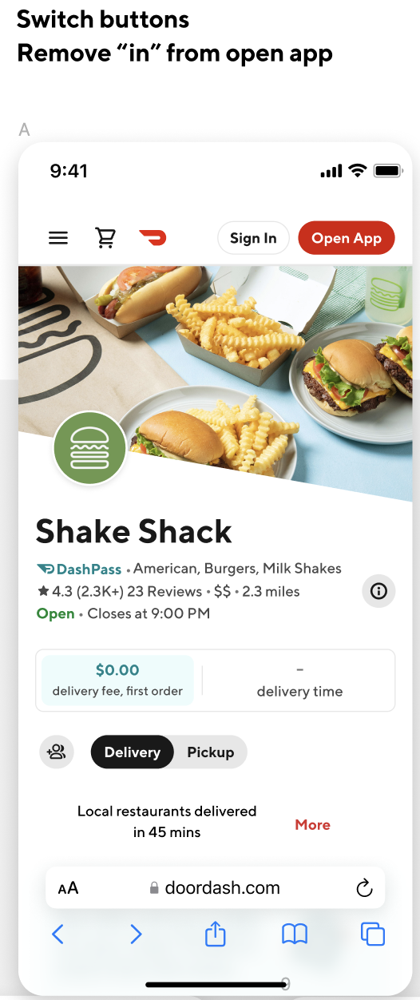

# Experiment Readout: Redesign mWeb Header Login Buttons

Analytics DRI: [Sara Nordstrom](mailto:sara.nordstrom@doordash.com)

Working team: [Omung Goyal](mailto:omung.goyal@doordash.com) (eng), [Helena Huang](mailto:helena.huang@doordash.com) (eng), [Zohaib Sibté Hassan](mailto:zohaib.hassan@doordash.com) (EM), [Saur Vasil](mailto:saur.vasil@doordash.com) (PM), [Shakti Mb](mailto:shakti.m@doordash.com) (Design), [Vero Jimenez](mailto:veronica.jimenez@doordash.com) (research)

### TL;DR

- **Problem:** - We have concluded [the existing header project](https://docs.google.com/document/d/1NTYrJk-MkIIOeCRsGAt-_-OEoMOFUwxKFZuEQ-5NpK0/edit) for logged out Cx, but still have optimizations on copy and level of prominence to further our strategy of placing the highest prominence on the Open App CTA.

  - Specifically, we need our header to place prominence on the action we actually want Cx to take (Open App) over the secondary action (Sign in).

- **Solution:** |**Control**|**Treatment A (Switch Buttons)**|**Treatment B* (Switch Buttons + Copy Change)** |
  | --- | --- | --- |
  |  |  |  |

*Treatment B is the winning treatment**Results Summary**The Redesign mWeb Header Login Buttons experiment drove 3k incremental MAU and 4.7k incremental orders over a 2 week experiment period,**leading to an estimated +36k incremental MAU and +$21M**[^1]**GMV at 12 month exit**and**+14k MAU and**+**$1.8M GMV at Q3 exit;**

- <u>Success Metrics
  </u>

  - Estimated annualized incremental GMV: +$21.2M

  - Estimated annualized incremental MAU: +36.2k

- Check metrics:

  - Logins: -1.13%

  - Signups: -0.73%

- Additional metrics:

  - App Downloads: +42.46%

    - +15k incremental App Downloads during experiment period

**Next Steps**:

- Align on updated “Login” copy across our platforms

- Continue to place prominence on Open App messaging through our mWeb App Download Strategy.

[Mode Dashboard](https://app.mode.com/doordash/reports/060b058b482f)

### Experiment Timeline

### Methodology

#### Overview

**Test mechanism:**A/B test**Test platform:**mWeb**Country:**Global**Experience:**DoorDash only**Target Population:**Guest users on mobile web**Test duration:**1 week at 50/50**Control/Treatment Split:**50/50

### Result Details

#### Success Metrics

|**Metrics**|**Control**|**Treatment A**|**% Change**|**Significance**|**Treatment B**|**% Change**|**Significance**|
| --- | --- | --- | --- | --- | --- | --- | --- |
| Order Rate | <mark>7.65%</mark> | <mark>7.91%</mark> | +<mark>3.45%</mark> | YES | <mark>7.93%</mark> | +<mark>3.79%</mark> | YES |
| MAU | <mark>6.75%</mark> | <mark>6.91%</mark> | <mark>+2.39%</mark> | YES | <mark>6.94%</mark> | +<mark>2.86%</mark> | YES |

#### Check Metrics

|**Metrics**|**Control**|**Treatment A**|**% Change**|**Significance**|**Treatment B**|**% Change**|**Significance**|
| --- | --- | --- | --- | --- | --- | --- | --- |
| Signups | <mark>4.11%</mark> | <mark>4.09%</mark> | <mark>-0.63%</mark> | NO | <mark>4.08%</mark> | <mark>-0.73%</mark> | NO |
| Logins | <mark>10.52%</mark> | <mark>10.38%</mark> | <mark>-1.37%</mark> | NO | <mark>10.40%</mark> | <mark>-1.13%</mark> | NO |
| New Cx Rate | <mark>2.55%</mark> | <mark>2.52%</mark> | <mark>-1.27%</mark> | NO | <mark>2.54%</mark> | <mark>-0.55%</mark> | NO |
| GoV | <mark>$41.34</mark> | <mark>$41.47</mark> | +<mark>0.32%</mark> | NO | <mark>$41.35</mark> | +<mark>0.03%</mark> | NO |

#### Additional Metrics

|**Metrics**|**Control**|**Treatment A**|**% Change**|**Significance**|**Treatment B**|**% Change**|**Significance**|
| --- | --- | --- | --- | --- | --- | --- | --- |
| SUMA | <mark>0.5070%</mark> | <mark>0.5141%</mark> | +<mark>1.40%</mark> | NO | <mark>0.5154%</mark> | +<mark>1.66%</mark> | NO |
| App Downloads | 2.20% | 3.12% | +41.94% | YES | 3.13% | +42.46% | YES |

Impacts breakdown:**Experiment Context**: This experiment implemented adjust links to take users from mweb to the app, which capture both the mweb device id (the experiment bucket key) and the app device id. Through these links we are able to attribute user behavior in the app to the devices in the treatment group in the experiment. There are 2 shortcomings with this experiment design. First, we only have tracking for treatment devices who go to the app but inevitably some control devices will also go to the app through other methods besides this button and we won’t have any tracking on that. Second, we only ran this experiment for around 2 weeks and during that period drove many incremental users to the app, but due to the short experiment period, we aren’t capturing the long term benefits to a user of the app over mweb. To account for this, we came up with the following methodology:**Method**: After investigating we found that 53% of users who sign up on mweb eventually make their way to the app, so we took a 50% haircut on our results to account for the control users that converted on the app that we have no way of tracking. We also found that New Cx on the App vs. mWeb have significantly higher 12 month order rate and 12 month retention, so we added multipliers to our annualized numbers to account for the long term benefits of the app.

Original numbers:

- Q2 exit

  - Incremental MAU: 14k

    - Incremental GMV from MAU: $1.8M

- Annualized

  - Incremental MAU: 42.1k

    - Incremental GMV from MAU: $24.7M

App vs. Web multipliers:

| | **App New Cx**|**Web New Cx**|**Increase**|
| --- | --- | --- | --- |
|**12 month order rate**| 12.0 | 6.6 | +82% |
|**12 month retention**| 16.9% | 9.8% | +72% |

53% of web signups that go on to place orders on the app. We will therefore take an additional 50% haircut.

Updated Numbers:

- Annualized:**+21.2M GMV and +36.2k MAU**- Incremental MAU: 42.1k*1.72*.5=36.2k

  - Incremental GMV from MAU: $24.7M*1.72*.5= $21.2M

**Next steps:**

- Ramp-up plan: Rollout to 100% and pursue other areas where we can drive mobile web users to the app

- Run future “App Downloads and Redirection” experiments as switchback tests to avoid the need to make the assumptions made above
---
## Footnotes

\[^1\]: This is with a 50% haircut
