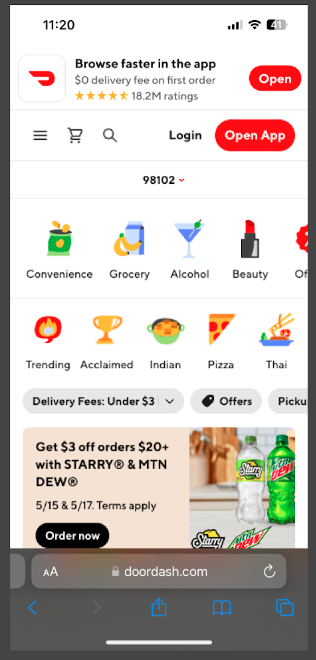
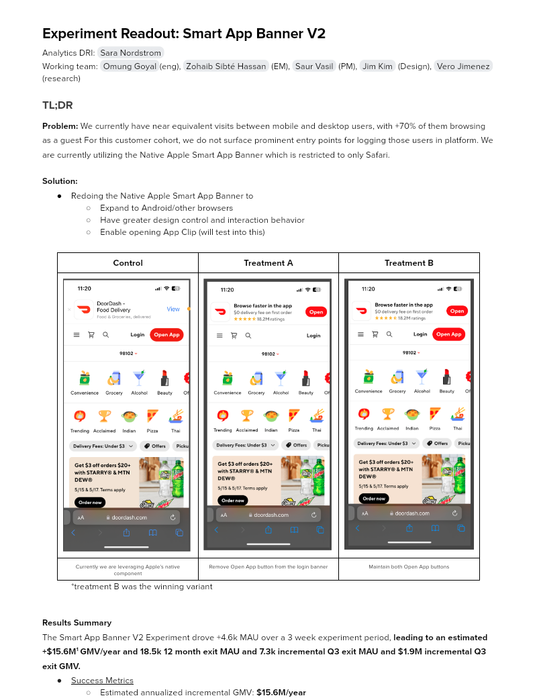

# Experiment Readout: Smart App Banner V2

Analytics DRI: [Sara Nordstrom](mailto:sara.nordstrom@doordash.com)

Working team: [Omung Goyal](mailto:omung.goyal@doordash.com)(eng), [Zohaib Sibté Hassan](mailto:zohaib.hassan@doordash.com) (EM), [Saur Vasil](mailto:saur.vasil@doordash.com) (PM), [Jim Kim](mailto:james.kim@doordash.com) (Design), [Vero Jimenez](mailto:veronica.jimenez@doordash.com) (research)

### TL;DR

**Problem:**We currently have near equivalent visits between mobile and desktop users, with +70% of them browsing as a guest For this customer cohort, we do not surface prominent entry points for logging those users in platform. We are currently utilizing the Native Apple Smart App Banner which is restricted to only Safari.**Solution:**

- Redoing the Native Apple Smart App Banner to

  - Expand to Android/other browsers

  - Have greater design control and interaction behavior

  - Enable opening App Clip (will test into this)

| **Control**|**Treatment A**|**Treatment B** |
| --- | --- | --- |
|  |  |  |
| Currently we are leveraging Apple’s native component | Remove Open App button from the login banner | Maintain both Open App buttons |

*treatment B was the winning variant**Results Summary**The Smart App Banner V2 Experiment drove +4.6k MAU over a 3 week experiment period,**leading to an estimated +$15.6M**[^1]**GMV/year and 18.5k 12 month exit MAU and 7.3k incremental Q3 exit MAU and $1.9M incremental Q3 exit GMV.**

- <u>Success Metrics
  </u>

  - Estimated annualized incremental GMV: **$15.6M/year**- Estimated annualized incremental MAU:**18.5k/year**

- Check metrics:

  - SUMA: +2.31%

- Additional metrics:

  - App Downloads: +16.16%

[Mode Dashboard](https://app.mode.com/doordash/reports/36793413b0b6)

### Experiment Timeline

### Methodology

#### Overview

**Test mechanism:**A/B test**Test platform:**mWeb**Country:**Global**Experience:**DoorDash only**Target Population:**Any cx who visits a logged out page on DoorDash.com on mobile web**Test duration:**3 weeks at 33/33/34**Control/Treatment Split:**33/33/34

### Result Details

#### Success Metrics (Treatment vs Control)

|**Metrics**|**Treatment B**|**Control**|**% Change**|**Significance**|
| --- | --- | --- | --- | --- |
| MAU | 1.23% | 1.21% | +1.41% | YES |
| Order Rate | 2.54% | 2.50% | +1.34% | YES |
| New Cx Rate | .239% | .245% | +2.17% | YES |

#### Check Metrics

|**Metrics**|**Treatment B**|**Control**|**% Change**|**Significance**|
| --- | --- | --- | --- | --- |
| Signups | 0.387% | 0.393% | +1.58% | YES |
| Login | 2.16% | 2.16% | -.22% | NO |

#### Additional Metrics

|**Metrics**|**Treatment B**|**Control**|**% Change**|**Significance**|
| --- | --- | --- | --- | --- |
| SUMA | .18% | .17% | +2.31% | YES |
| App Downloads | .54% | .46% | +16.33% | YES |**Next steps:**- Ramp-up plan: Rollout to 100% and pursue other areas where we can drive mobile web users to the app

- Test enabling opening the App Clip from the Smart App Banner
---
## Footnotes

\[^1\]: This is with a 50% haircut**Appendix**Results Broken Out by Country: Note: this is a logged out device_id experiment. We are gathering the country info from the locale on the attributes captured during the device exposure event. This has some data loss but is the best way for us to get the country of the device at exposure. US Estimated annualized incremental GMV:**$14.23M/year**Estimated annualized incremental MAU:**16.8k/year**Success Metrics MAU Lift:**+1.31%**OR Lift:**+1.31%**New Cx Lift:**+2.42%**Canada Estimated annualized incremental GMV:**$403k/year**Estimated annualized incremental MAU:**477/year**Success Metrics MAU Lift:**+1.73%**OR Lift:**+0.60%**New Cx Lift:**+0.07%**New Zealand Estimated annualized incremental GMV:**$556.8k/year**Estimated annualized incremental MAU:**659/year**Success Metrics MAU Lift:**+2.92%**OR Lift:**+13.90%**New Cx Lift:**+7.35%**Australia Estimated annualized incremental GMV:**$456k/year**Estimated annualized incremental MAU:**540/year**Success Metrics MAU Lift:**+2.76%**OR Lift:**+0.42%**New Cx Lift:**+1.40%**
