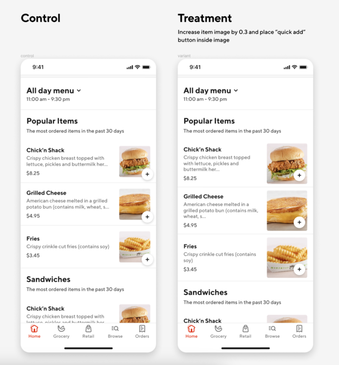
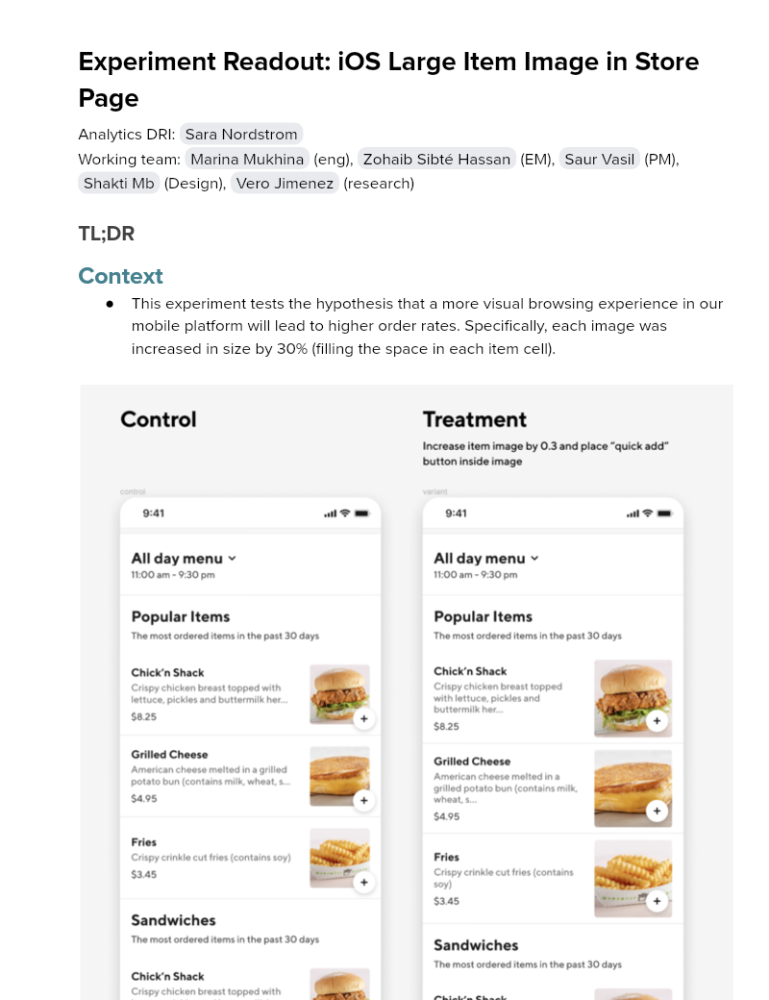

# Experiment Readout: iOS Large Item Image in Store Page

Analytics DRI: [Sara Nordstrom](mailto:sara.nordstrom@doordash.com)

Working team: [Marina Mukhina](mailto:marina.mukhina@doordash.com) (eng), [Zohaib Sibté Hassan](mailto:zohaib.hassan@doordash.com) (EM), [Saur Vasil](mailto:saur.vasil@doordash.com) (PM), [Shakti Mb](mailto:shakti.m@doordash.com) (Design), [Vero Jimenez](mailto:veronica.jimenez@doordash.com) (research)

### TL;DR

# Context

- This experiment tests the hypothesis that a more visual browsing experience in our mobile platform will lead to higher order rates. Specifically, each image was increased in size by 30% (filling the space in each item cell).

**Results Summary**The iOS Large Item in Store Page Experiment drove <mark>53k</mark> incremental orders over a 2 week experiment period,**leading to an estimated +$24M**[^1]**GMV/year**(from 1.4M annualized incremental orders)

- Estimated annualized GMV:**$24M/year**

- Check metrics: flat

  - Other quality metrics:

    - -.295% drop in ios App Latency plp action

    - +.21% lift in ios App Latency plp screen

[Mode Dashboard](https://app.mode.com/doordash/reports/98d6d83c52b2) (The migration from Mode to Curie still in progress, we are working on Curie metrics pack and aim for completion in Q2)

[Curie Dashboard](https://admin-gateway.doordash.com/decision-systems/experiments/9e25f143-4873-4044-b95f-645eee884e76?analysisId=d4bfa436-3abe-401b-92ed-6ac915c00f2a)

### Experiment Timeline

### Methodology

#### Overview

**Test mechanism:**A/B test**Test platform:**iOS only**Country:**Global**Experience:**DoorDash only**Target Population:**iOS users**Test duration:**2 weeks at 50/50**Control/Treatment Split:**50/50

### Result Details

Impacts breakdown:

- **GMV lift of +24M/yr:** ,

- Increasing Orders has led to an increase in GMV

#### Success Metrics (Treatment vs Control)

| **Metrics**|**Treatment**|**Control**|**% Change**|**Significance**|
| --- | --- | --- | --- | --- |
| Order Rate | <mark>2.09</mark> | <mark>2.08</mark> | +18% | YES |
| New Cx CVR | 2.637% | <mark>2.640%</mark> | -.1% | NO |

#### Check Metrics

|**Metrics**|**Treatment**|**Control**|**% Change**|**Significance**|
| --- | --- | --- | --- | --- |
| GoV | <mark>$</mark><mark>34.72</mark> | <mark>$</mark><mark>34.71</mark> | +.02% | NO |
| Subtotal | <mark>$</mark><mark>25.00</mark> | <mark>$</mark><mark>25.50</mark> | +.00% | NO |
| Tip | <mark>$</mark><mark>3.50</mark> | <mark>$</mark><mark>3.50</mark> | +0% | NO |
| VP | <mark>$</mark><mark>2.92</mark> | <mark>$</mark><mark>2.91</mark> | +.22% | YES |**Next steps:**

- Ramp-up plan: Left in a 90% treatment + 10% long term feature holdout to measure potential MAU impact for 4 weeks -> none shown
---
## Footnotes

\[^1\]: This is with a 50% haircuts
