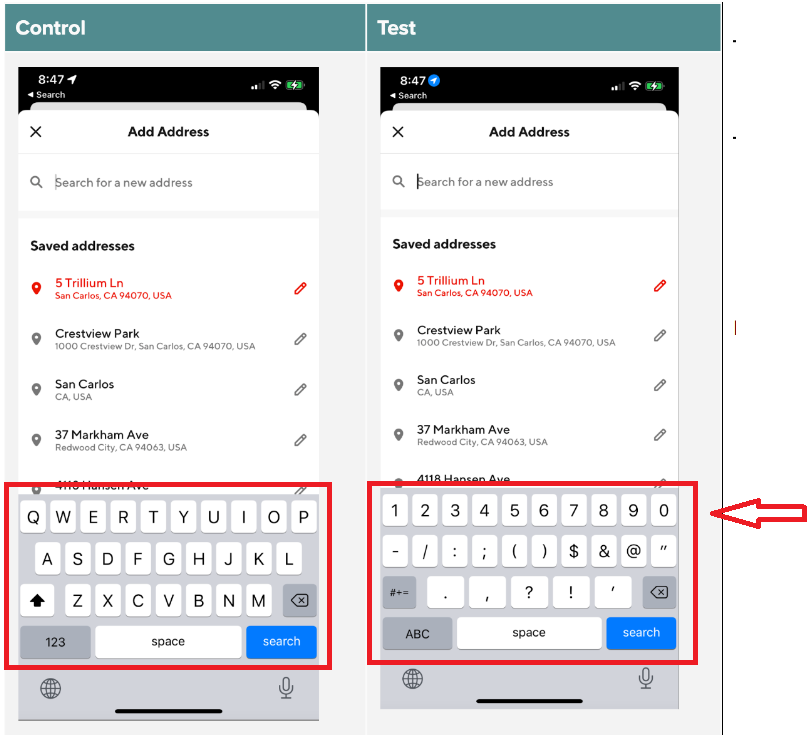

## Positioned Elements

---
# Experiment Readout: iOS digital keyboard on address page

Analytics DRI: Heming Chen

Working team: Manolo.Sanudo (eng), Zohaib.Hassan (eng), Saur.Vasil (Product)

Last updated: 06/22/2022

### TL;DR

**Problem:**Addresses in US/AU/CAN start with digits (e.g. 303 2nd St), yet our address flow pops out a character keyboard to Cx when inputting address. This character keyboard encourages vague address input like ‘San Francisco’ instead of detailed input like ‘303 2nd St’.**This has detrimental downstream effects:**Cx could (1) not be able to find Mx near them or (2) spend time building a cart, inputting a subsequent correct address, and have that cart cleared when realized Mx is out of delivery range.**Solution:**Popping out a digital keyboard when address input is selected, encouraging Cx to input detailed addresses and have a better ordering experience.**Results Summary**iOS digital keyboard on address page drove +24k incremental active users & 7.2k New Cx over a 2-week experiment period,**leading to an estimated 624k incremental active users/year and 187k incremental new Cx/year, annualized $347M GMV/year and +244k 12-month exit MAU:**- Estimated annualized GMV:**+$347M**- Estimated MAU:**+244k at 12-month exit** (+78k at the exit of 2022)

- Success metrics:

  - **+0.35% rel. (stats sig) order rate lift:** - +0.58% rel. (not stats sig) New Cx CVR

- Check metrics:

  - % of detailed address input (started with digits): +0.4% rel (stats sig) detailed address input

  - Never delivery ratio: flat

- International impact summary:

  - **CAN:** <mark>: Leading to an estimated 30k 12-month exit MAU & $42M GMV
    </mark>

  - **AUS:** <mark>: Leading to an estimated 7k 12-month exit MAU & $9M GMV</mark>*50% haircut applies to MAU & GMV given mutual exclusive from other experiments

**Next steps:**- <mark>Roll out plan: Already ramped to 95% since 06/08.
</mark>

- <mark>Fast follow on mWeb (for iOS devices browsing)
  </mark>

- <mark>Explore additional initiatives that address the same painpoint (like more sensible ghost text in the address bar)</mark>

For the full readout, please check out the [experiment result doc](https://docs.google.com/document/d/1-qXotFP-schGar5-CqNLj7bTEk5Nt2HIsG_RaE3fYP0/edit?usp=sharing)**Result Details**[Mode Dashboard](https://app.mode.com/doordash/reports/08d879ac3d7e) (The migration from Mode to Curie still in progress, we are working on Curie metrics pack and aim for completion in Q3)

### Experiment Timeline

### Methodology

#### Overview**Test mechanism:**A/B test**Test platform:**iOS**Country:**Global**Experience:**DoorDash only**Target Population:**Cx who landed on Address page**Test duration:**2 weeks experiment**Control/Treatment Split:**50/50

#### Testing Group & Bucketing

- Treatment (50%): Digital keyboard on address page

- Control (50%): Character keyboard on address page

- **Test Launch date:** 05/18/2022

### Result Details

#### Success Metrics (Treatment vs Control)

|**Metrics**|**Treatment**|**Control**|**% Change**|**Significance**|
| --- | --- | --- | --- | --- |
| Orders per Cx | 2.1023 | 2.0949 | 0.35% | YES |
| New Cx CVR | 6.62% | 6.58% | 0.58% | NO |

#### Check Metrics

|**Metrics**|**Treatment**|**Control**|**% Change**|**Significance**|
| --- | --- | --- | --- | --- |
| % of detailed address: | 18.15% | 18.07% | +0.40% | YES |
| Address confirmation rate: | 48.47% | 48.48% | -0.03% | NO |
| Never delivery ratio: | 1.58% | 1.57% | +0.91% | NO |

#### Success Metrics by country

|**Country**|**Metrics**|**Treatment**|**Control**|**% Change**|
| --- | --- | --- | --- | --- |
| US | Orders per Cx | 2.1404 | 2.1325 | 0.37% |
| AUS | Orders per Cx | 1.4040 | 1.3980 | 0.43% |
| CAN | Orders per Cx | 1.5460 | 1.5085 | 2.48% |**Next steps:**

- <mark>Roll out plan: Already ramped to 95% since 06/08.
  </mark>
