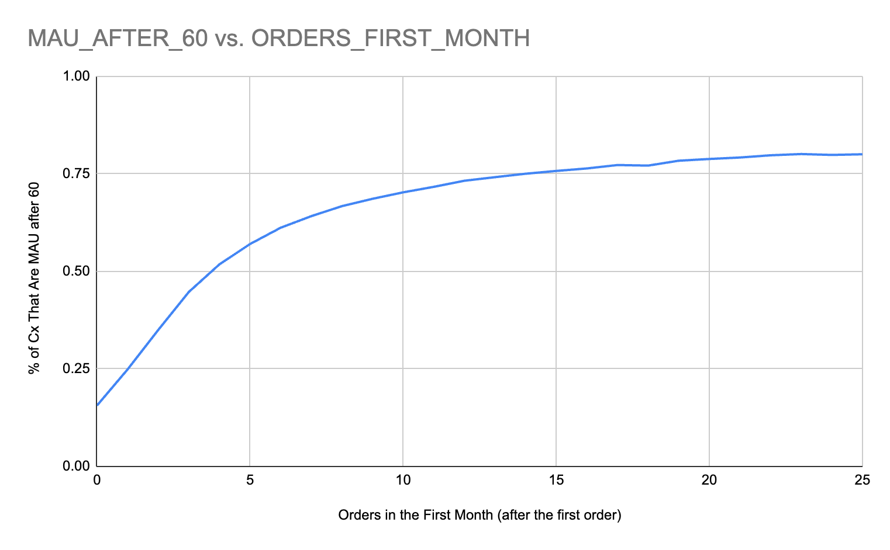

# Road to MAU Deep Dive

DRI: [Sara Nordstrom](mailto:sara.nordstrom@doordash.com)[Xiao Tan](mailto:xiao.tan@doordash.com)

# Tldr and Opportunity

- Research shows that Cx who place a minimum of four orders within a month are more likely to become MAU in the subsequent month.

- The goal of this analysis is to take a deep dive into the behaviors of new Cx after they sign up, and determine the factors that contribute to some Cx placing four and more orders following their initial purchase.

(Note: In this analysis, we define frequent Cx as Cx who have made four or more orders within a month after their initial purchase)

# Top Insights

## Seizing the moment: First month is the golden month to convert Cx to MAU

- **Insights:** The first month after the initial purchase presents the highest opportunity for Doordash to convert Cx into frequent users, the chances decrease sharply in the following month.

- After the initial purchase, 12% of Cx became frequent users (placed at least 4 orders per month) in the following month. In the subsequent second month, the percentage of Cx who became frequent users decreased to 4%, and in the third month, it further declined to 2%.

***Actions**

  - Focus on the first month as a critical window of opportunity to convert Cx to MAU.

  - After Cx’s initial purchase, engage Cx with promotions, notifications, and emails to encourage them to place more orders within the first month.

## Unveiling Hidden Benefits for New Cx

- **Insights:** - DashPass membership plays a crucial role in determining whether Cx will become frequent users.

    - 43% of Cx who subscribed to DashPass within their first month of joining became frequent users in the subsequent month. Only 9% of Cx who were not DP users in their initial month became frequent users in the following month.

  - However, a lot of new Cx are not aware that they get free DashPass benefits from adding partner credit cards.

    - Only 3.7% of new Cx add partner cards as their first payment method, and sign up for membership benefits.

    - New Cx who add partner cards as their first payment method have a higher MAU rate than other new Cx.

| **First payment method added**|**MAU rate(If they will place order in the following month)**|
| --- | --- |
| Partner Card | 85.69% |
| Not Partner Card | 82.20% |

- **Actions:** Surface adding partner card benefits on adding payment page

## Merchant loyalty matters

## Insights

## Cx with higher store/business concentration in the first month are more likely to become frequent users

- One of the most significant drop-off occurs among infrequent users is when Cx land on explore page -> land on store page

- Infrequent users struggle to find the merchants they want to order from.

| <mark>**User segment**</mark> | <mark>**Store concentration**</mark> | <mark>**Business concentration**</mark> |
| --- | --- | --- |
| <mark>Infrequent users </mark> | <mark>33% </mark> | <mark>33% </mark> |
| <mark>Frequent users </mark> | <mark>70% </mark> | <mark>67% </mark> |

<mark>**Funnel Drop-off Rate**</mark><mark> (Sigma -> </mark><mark>[link](https://app.sigmacomputing.com/doordash/workbook/workbook-1OXH58VCXHOxWgpVdJh8DN?:link_source=share)</mark><mark>)
</mark>

| **Cx segment**|**Explore page -> store page**|**Store page -> cart page**|**Cart page -> cart page click continue**|**cart page click continue -> land on checkout page**|**land on checkout page -> click checkout**|**Click checkout -> converted**|
| --- | --- | --- | --- | --- | --- | --- |
| <mark>Frequent users </mark> | <mark>12% </mark> | <mark>11% </mark> | <mark>6.5% </mark> | <mark>0.3% </mark> | <mark>4.5% </mark> | <mark>4.1% </mark> |
| <mark>Infrequent users </mark> | <mark>27% </mark> | <mark>25% </mark> | <mark>20% </mark> | <mark>2% </mark> | <mark>13% </mark> | <mark>25% </mark> |
| <mark>Diff </mark> | <mark>15% </mark> | <mark>14% </mark> | <mark>13.5% </mark> | <mark>1.7% </mark> | <mark>8.5% </mark> | <mark>20.9% </mark> |

## Action

<mark>After new Cx complete their first purchase, , introduce them to loyalty driving Mx or Mx they ordered the first time via in-app carousels
</mark>**Avoid seeking out highly promotion-sensitive customers**-**Insights**

- The higher the percentage of a Cx’s first order that is promotional, the lower the percentage of Cx that became frequent users.

- High promotion usage customers may not be long term users.

***Actions**

  - Highlight promotions only to marginal Cx who wouldn’t convert without them but shift focus to 2nd, 3rd and 4th order promotions rather than just 1st order.

    - Promo punch card example: “your 4th order is 10% off“

## Communicating with the customer is key

- **Insights:** - Users with their notifications on are more likely to become frequent users.

    - 14% of Cx with their notifications on are “frequent users” as compare with 9% of Cx with their notifications off

- **Actions:** - Encourage Cx to enable notifications in the onboarding flow or after they place their first order.

## M&I on the first order might not be the worst thing

- **Insights:** - Those who experience M&I on the first order were**more likely** to become frequent users than those who did not

  - Those who experience Lateness on the first order were **nearly****just as likely** to become frequent users than those who did not

  - Those who experience ND on the first order were **more likely**to become frequent users than those who did not

|**M&I Issue**| Experienced and Became Frequent User | Did Not Experience and Became Frequent User |
| --- | --- | --- |
| M&I | 18% | 13% |
| Lateness | 2.7% | 2.9% |
| ND | 2.3% | 1.8% |

- M&I also has a positive impact on OR for all Cx according to [the Logistic team](https://doordash.atlassian.net/wiki/spaces/DATA/pages/2621669874/Delivery+Quality+Analytics+Marketplace#Key-Relationships):

- **Actions:** - Highlight DoorDash’s M&I policy to New Cx

  - Call out on the checkout page that if anything goes wrong, DoorDash will handle it

- Focus on Lateness on first order rather than M&I and ND

  - Be careful offering Express for new Cx

# Appendix

Snowflake Notebook -> [Link](https://app.snowflake.com/us-west-2/doordash/w161kPSVFIxV#query)

Sigma Dashboard -> [Link](https://app.sigmacomputing.com/doordash/workbook/workbook-1OXH58VCXHOxWgpVdJh8DN?:link_source=share)

Verifying research that Cx who place a minimum of four orders within a month are more likely to become MAU in the subsequent month:

- **4 Orders in the first month is the inflection point when determining if the user will be MAU after 60 and 90 days.:** 63% of users who order 4 or more times in the first month are MAU after 60 days whereas only 21% of users who don’t order 4 or more times in the first month are MAU after 60 days

- This changes to 58% and 42% when we look at 3 or more orders in the first month and 50/50 when we look at 2 or more orders

- If we look at MAU after 90, for 4 or more orders in the first month the mau/not mau split is: 47/53

- For 5 or more it’s 50/50

