# Growth Deep Dive: First Feed Analysis

Ax: [Fiona Fan](mailto:fiona.fan@doordash.com)[Sara Nordstrom](mailto:sara.nordstrom@doordash.com)

PM: [Will Rosato](mailto:will.rosato@doordash.com)

S&O: [Shivani Poddar](mailto:shivani.poddar@doordash.com)

Design: [Cayla Dorsey](mailto:cayla.dorsey@doordash.com)[Chelsea Shi](mailto:chelsea.shi@doordash.com)

Eng: [Carissa Sun](mailto:carissa.sun@doordash.com)

Date:

## User Problem

New and Non-Purchaser (just onboarded) Cx are a leaky bucket with a ~20% retention rate, and the leaking happens as early as the first session. For those who started the first session 28% don’t come back for a second session, and 46% of those active in the first week don’t come back in the following 3 weeks. However, every active user was a new user once. The habituation of a new user to a power user can and should start as early as their first session. In this doc we discuss some levers we can pull early in a consumer’s journey for this habituation.

## Cohort Definition

| | Sample size | If sampled | Cohort definition | Exposure day definition |
| --- | --- | --- | --- | --- |
| active | 1.5M | Yes | Active consumers whose latest order was in July | Latest order date |
| new | 0.8M | No | New consumers whose first order was in July | First order date |
| Non-purchaser (just onboarded) | 1.5M | No | Non purchasers who just onboarded in July | Onboarding date |

The scope of analysis is 28 days after their “exposure day” as defined above. We sampled sessions to be first session, second session, third session, and the latest session for each week up to week 4.

## Insights

### Insight 1. There is weekly cyclicality in consumers’ visit patterns.

There are obvious bumps on day 7, 14, 21, 28 in user’s visit patterns after the initial drop from day 0. These bumps are present for order rate, number of ordering Cx, and FPN pushes (mostly such as “how did you like your order?”) as well.

This pattern is not replicated by Braze sends, the channel where most Doordash backed offers are sent. The pattern for Braze sends are zigzagged due to our defined cadence for notification sends (Figure x) are on day 4, 6, 8 etc. One place we can improve is to send more push to on days leading up to day 7,14,21,28.

For active players the open rate remains flat over their Cx journey. The first three days after the exposure date we have the highest open rate for new and NP Cx. For NP Cx, this elevated open rate comes with a higher level of unsubscribe rate, but for new Cx, this elevated open rate comes without a higher level of unsubscribe rate. This serves as an opportunity to make notification event triggered (visit/order) and shift volume to over index in the first three days especially for new Cx.

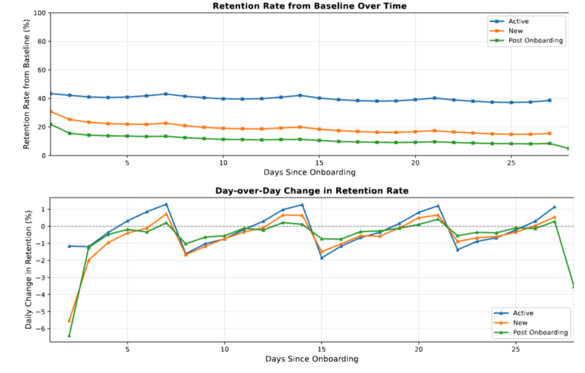

Figure x. Cyclicality in consumer visit patterns.

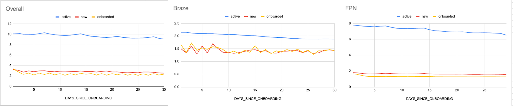

Figure x. Notification sends by Cx journey

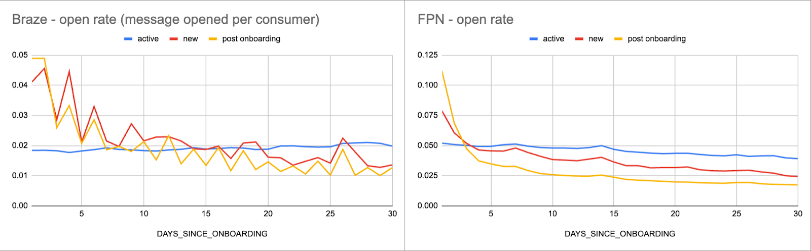

Figure 3. Open rate by Cx journey

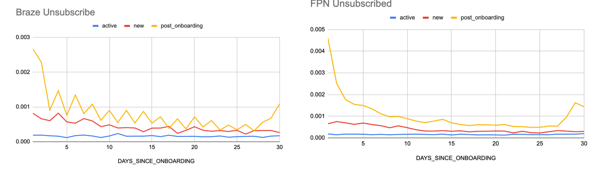

Figure x. Unsubscribe by Cx journey

### Insight 2. Cohort 1111 is a high value cohort.

In our users, 28% of NP vs 10% for new Cx vs 1.7% of active Cx never come back for a second session. 46% of NP vs 25% of new Cx vs 4% of active Cx who are active in the first week don’t come back in subsequent weeks.

The cohort of Cx who come back every week in the 28 days post onboarding (the “1111” cohort) is a high value cohort. For NP Cx, they occupy 16% of population, but 48% of all volumes, a 3X leverage, which is the highest among all cohorts (1.9X for new and 1.3X for active).

Being able to habituate a user into being a “1111” user can be a useful goal.

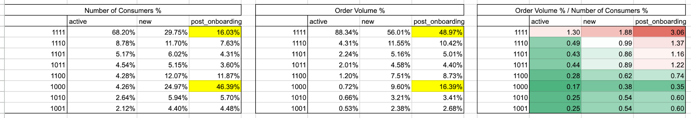

### 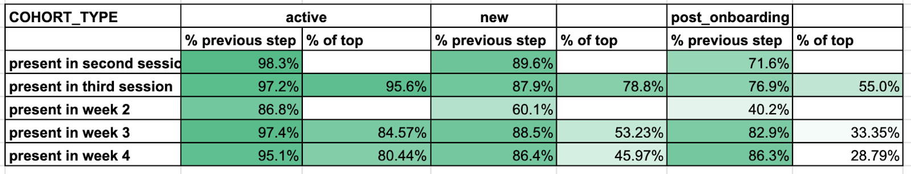

### Insight 3. Week 2/Second session is the charm.

The first step in habituating a new/NP Cx into a “1111” Cx is taking them to the second session, and then the second week. We want to understand how much additional impact does participating in second session and second week helps with week 3 and 4 retention and average order.

Here we perform propensity matching for our best effort to get a causal estimate. We match Cx on first session engagement features and week 1 order features. Then we compare those matched users with a second session/second week participation how their week 3-4 retention looks like and what leverage ratio is (Table x). We see that all ratios are >1. More saliently, we see that second session participation is a huge lever for NP Cx in terms of week 3-4 retention.

Initiatives that push for second session and week 2 participation will significantly help habituate consumers into a high value cohort.

| **Value: multiplier of those with vs without**|**second session**| | |**second week**| | |
| --- | --- | --- | --- | --- | --- | --- |
| |**active**|**new**|**non-purchaser**|**active**|**new**|**non-purchaser**|
|**28d average order**| 1.22 | 1.55 | 1.47 | 1.83 | 1.85 | 1.8 |
|**week 3 retention**| 1.86 | 2.66 | 3.93 | 1.57 | 2.28 | 2.86 |
|**week 3 average order**| 1.22 | 1.74 | 1.79 | 2.66 | 3.5 | 3.44 |
|**week 4 retention**| 1.77 | 2.61 | 3.39 | 1.58 | 2.26 | 2.9 |
|**week 4 average order**| 1.17 | 1.60 | 2.00 | 1.99 | 2.74 | 2.89 |

In addition, if we try to predict whether a player will be active in week 3-4 (XX11), we get AUC around 0.56. However, if we add second session participation as a flag, then the AUC increases for NP to 0.75, and up to 0.66 for new Cx and 0.69 for active. If we add second week participation (the target doesn’t contain second week participation), the AUC increases to ~0.74 for all three cohorts. Both first session engagement features and second session/week binary flag serve as early signals to predict whether one will be a high value Cx, which paves the way for more personalized offer creation and notification targeting.

| Prediction Target | | active | new | non-purchaser |
| --- | --- | --- | --- | --- |
| XX11 cohort | first session features | 0.56 | 0.56 | 0.57 |
| | first session features w/ second week | 0.73 | 0.74 | 0.75 |
| | first session features w/ second session | 0.69 | 0.66 | 0.75 |
| second session return | first session features | 0.68 | 0.67 | 0.67 |

### Insight 4. What happens in first session that makes second session likely to happen?

Just using features in the first session, we are able to achieve a 0.67 AUC score. Some features worth calling out:

|**Feature**|**impact**|**hypothesis**|**Call for action**|
| --- | --- | --- | --- |
| ACTION_HAD_ADDRESS | highly negative for NP, not much impact for active | Having to input address during session is a friction point | Reduce the friction |
| TIMING_EVENTS_FIRST_30S | Highly positive for NP and new, not much impact for active | First 30s is the golden window | Optimize for the first 30s. |
| ACTION_HAD_BACKGROUND | Highly positive for NP and new, not much impact for active | New users would like to exit compare on other platforms and come back, these are high intent users | Bring Google map ratings to Doordash |
| ATTRIBUTION_CNT_BANNER | Highly positive for NP and new, not much impact for active | Banner interaction is important for new users | Rich design for banners, clear call for action. |
| SESSION_DURATION_SECONDS | Highly positive for NP, not much impact for active and new | The more things a brand new user experiences, the more likely they are to come back | Call for interaction within first session |
| ATTRIBUTION_UNIQUE_STORES_CLICKED | Highly positive for NP and new, not much impact for active | The more things a brand new user experiences, the more likely they are to come back | Call for interaction within first session |
| ATTRIBUTION_CNT_TAB_EXPLORE | Highly positive for NP and new, not much impact for active | The more things a brand new user experiences, the more likely they are to come back | Call for interaction within first session |

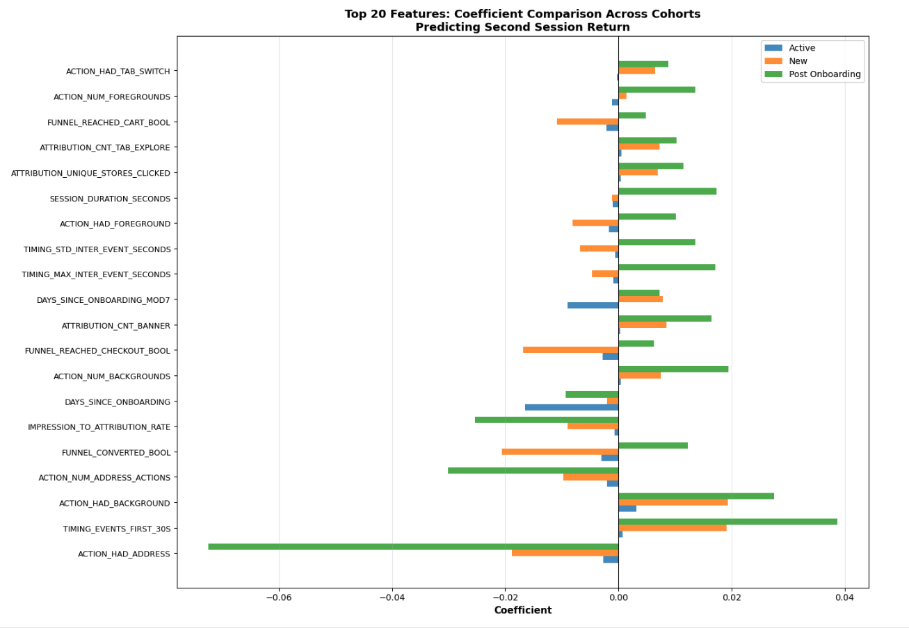

Also, the quality of the first session feed (cold start problem) is also an important lever. For the 1111 cohorts, starting from the first session, the cosine similarity (of store names from impression) to the latest session in week 4 for the same person is stably around 0.77 (sampled 500 users). Those we have data on enjoy the survival bias, which serves as circumstantial evidence that for those who remain, they tend to have a good first feed (similar to what you end up liking).

[placeholder for my first feed vs last feed]

### Insight 5. Funnel Dropoff

Overall observation:

- ~14% of sessions don't have a store impression view. Their medium session length is 5s. Out of them, ~5% lead directly to funnel actions. These sessions have a conversion rate of 10% with average session length of 30s. For most of these sessions, they load the explore page, see the benfit banner, and exit.

- Session lengths are longer the deeper down one is in the funnel. Sessions without funnel last around 32s for active and 53s for NP, and sessions with funnel last 23min for active and 10.8min for NP.

| | active | new | non-purchaser |
| --- | --- | --- | --- |
| % with funnel and impression | 67% | 66% | 60% |
| Median session length for sessions with funnel and impression (seconds) | 1439 | 1505 | 650 |
| Median session length for sessions without funnel | 32 | 38 | 53 |

Table x. Median session length for sessions with/without funnel

From the dashboard, we see the biggest gap between active and new users are

- Explore page -> store page visit

- Store page visit -> add to cart

- Checkout -> place order

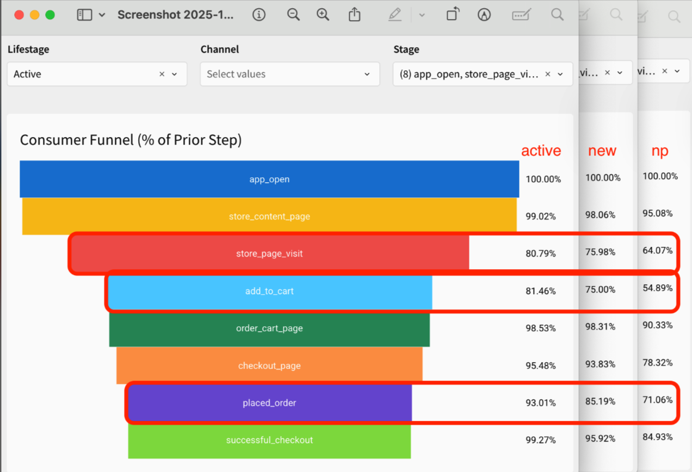

| |**Gap**|**Call for action**|
| --- | --- | --- |
|**explore** **-> store page visit**|**Impression driven**: sessions with store page visits receive 3X more store impressions, lasts ~4.5X longer. NP and new users on average take 8s longer and see 3 more stores than active before a store visit. | Get NP/new users to view one additional store (ex. smooth the way the carousel scrolls) |
| **store page visit -> add to cart**| New/NP users are less hesitant here than explore->store page visit, seeing only one more store than active before adding it to cart. | Prompt to add last viewed item to cart |
|**add to cart -> checkout**| Biggest gap. Users use order carts as a**shortlist**. They would go back to the home page, view more stores, add more items, and reload the order cart. | Design order cart like a shortlist, where people can compare items with ease |

### Insight 6. New/newly onboarded NP Cx see more errors.

New users and newly onboarded non purchasers are ~2X more likely to experience error in their sessions than active users. The most dominant error message shown is “All of your past orders and favorite stores will be here”, which accounts for 45% of all NP’s first session error volume and 39% of new users’.

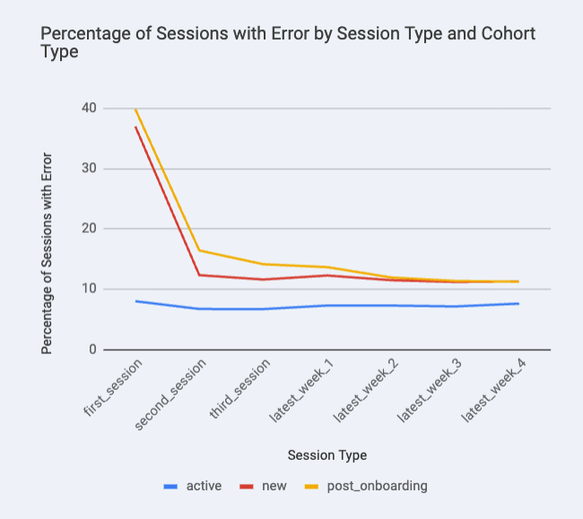

Recently we implemented [a fix](https://docs.google.com/document/d/1JhsP2pSQpUZGjPdzanz5mtX-vXblM_cvaGZ98hqDx4I/edit?tab=t.0#heading=h.x89ycsuv6i5v) for guests’ order cart page errors, leading up to 2.9K MAU and $1.6M 12mo exit GOV. We believe investing in fixing new and NP errors and improving their page view can lead to better user experience and unlock more impact.

## Appendix

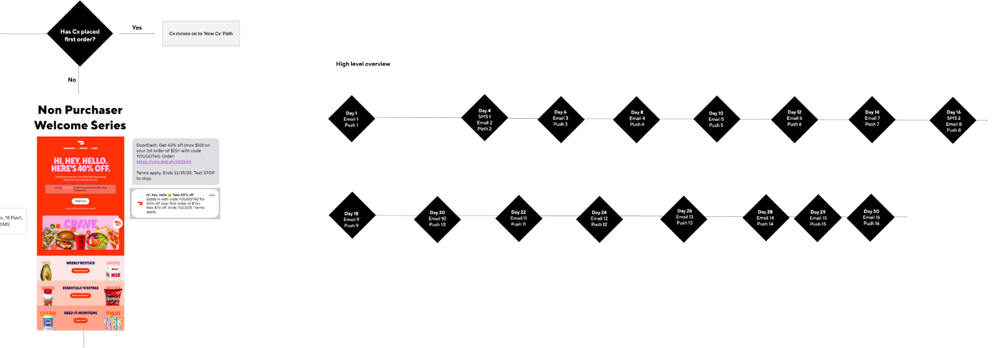

Figure x. Snapshot of [Kristine Fernandez](mailto:kristine.fernandez@doordash.com)’s [Figma](https://www.figma.com/design/Emstk8mZscM9rMc3wyuOnA/USMP-CRM-Lifecycle-Program-Map?node-id=265-1300&p=f&t=UI6ILmsFSKqsGGrK-0) board for NP and new Cx notification journey

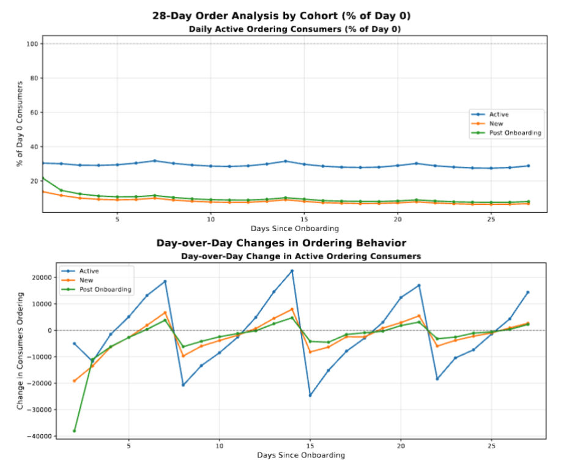

| | | | active | new | post_onboarding |
| --- | --- | --- | --- | --- | --- |
| explore -> store page visit | session with explore only | % consumer | 23.84 | 27.68 | 34.07 |
| | | session legnth avg | 431.45 | 416.47 | 279.32 |
| | | session length median | 43 | 50 | 59 |
| | sessions with explore and store | session legnth avg multiplier | 4.1 | 4.6 | 4.8 |
| | | session length median multiplier | 34.0 | 31.3 | 11.5 |
| | between first explore and first store | avg seconds between | 108.85 | 121.97 | 109.17 |
| | | median seconds between | 24 | 32 | 32 |
| | | avg store impression between | 14.18 | 20.23 | 20.14 |
| | | median store impression between | 7 | 10 | 10 |
| store page visit -> add to cart | session with visit only | % consumer | 18.17 | 23.8 | 36.88 |
| | | session legnth avg | 517.5 | 560.75 | 482.5 |
| | | session length median | 174 | 190 | 209 |
| | sessions with visit and add to cart | session legnth avg multiplier | 3.9 | 4.2 | 3.7 |
| | | session length median multiplier | 10.2 | 10.9 | 6.4 |
| | between first visit and first add to cart | avg seconds between | 218.87 | 261.68 | 249.32 |
| | | median seconds between | 75 | 112 | 109 |
| | | avg store impression between | 13.27 | 18.27 | 17.85 |
| | | median store impression between | 1 | 2 | 2 |
| add to cart -> checkout | session with add to cart only | % consumer | 9.89 | 15.79 | 34.87 |
| | | session legnth avg | 852.41 | 793.02 | 758.04 |
| | | session length median | 415 | 373 | 420 |
| | sessions with checkout and add to cart | session legnth avg multiplier | 2.5 | 3.2 | 2.9 |
| | | session length median multiplier | 4.5 | 6.1 | 4.6 |
| | between first add to cart and first checkout | avg seconds between | 162.47 | 236.44 | 241.93 |
| | | median seconds between | 25 | 60 | 73 |
| | | avg store impression between | 13.87 | 23.12 | 22.66 |
| | | median store impression between | 4 | 6 | 6 |

Table x. Funnel dropoff
