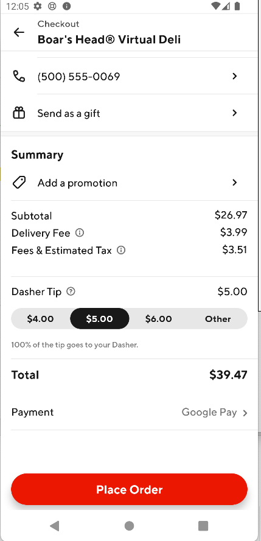

# Experiment Readout: Android Cx DashPass Upsell Payment Fixes (Phase 1)

Analytics DRI: [Sara Nordstrom](mailto:sara.nordstrom@doordash.com)

Working team: [David Zou](mailto:david.zou@doordash.com) (eng), [Zohaib Sibté Hassan](mailto:zohaib.hassan@doordash.com) (EM), [Saur Vasil](mailto:saur.vasil@doordash.com) (PM), [Shakti Mb](mailto:shakti.m@doordash.com)(Design), [Vero Jimenez](mailto:veronica.jimenez@doordash.com) (research)

### TL;DR

# Problem Statement

- Our current DashPass signup experience for New Cx contains 3 main entrypoints:

  - New Cx Signup Upsell

  - Homepage Banner

  - Account Tab Upsell

  - Cart + Checkout Upsells

- Currently, for Android New Cx **who have not setup a payment method,**the Cart and Checkout Upsells**do not currently show.**-*This strongly affects New Cx, as (of course) the bulk of the cohort have not set up payment methods yet.*

# Opportunity

- **Phase 1 (This document):** - Immediately fix the bleeding here by having all New Cx defaulted to GPay as their payment method**specifically**for DP on the Cart and Checkout Upsells**.**This does not affect their default payment method for checkout, but**allows the upsells to show correctly, resolving the immediate problem.**-**Phase 2 (Fast follow, in active development):**- Use the existing infrastructure built by the DP team to allow Cx to signup for a DP trial without a payment method on the Cart and Checkout Upsells (matching the current onboarding flow).**Phase 1****Current Experience:**|**Current Experience**|**Description** |
| --- | --- |
|  **Cart + Checkout**| The cart and checkout DashPass upsells are**hidden**to New Cx who have not setup a payment method. *Example Upsell Shown:*  |

Result Details

**Results Summary**The DashPass Upsell Default Payment fix drove <mark>6000</mark> incremental DP Trial Signups over a 1 week experiment period,**leading to +312k DashPass trial signups.**- DashPass Trial Subscription:**+312k/yr (+19% rel)**

- Check metrics: flat

  - Other quality metrics: flat

| **New Experience**|**Description** |
| --- | --- |
|  **Cart + Checkout**| All entry points now allow for trial signup without fail. Cart and Checkout Banners are now successfully shown. |

[Mode Dashboard](https://app.mode.com/doordash/reports/79d4e8a2ad8d) (The migration from Mode to Curie still in progress, we are working on Curie metrics pack and aim for completion in Q1)

[Curie](https://admin-gateway.doordash.com/decision-systems/experiments/2d755102-9643-4485-96f5-ac4ec2fa698a?analysisId=3dccc56c-3450-429f-8922-81f41bdd5e09)

### Experiment Timeline

### Methodology

#### Overview**Test mechanism:**A/B test**Test platform:**Android only**Country:**Global**Experience:**DoorDash only**Target Population:**Android users who visited the cart or checkout screen and are eligible for free trial DP upsell, regardless of if they have a default payment set**Test duration:**1 week**Control/Treatment Split:**50/50

### Result Details

#### Success Metrics (Treatment vs Control)

|**Metrics**|**Treatment**|**Control**|**% Change**|**Significance**|
| --- | --- | --- | --- | --- |
| DP trial subscription rate | 3.9% | 3.28% | +18.9% | YES |

#### Check Metrics

|**Metrics**|**Treatment**|**Control**|**% Change**|**Significance**|
| --- | --- | --- | --- | --- |
| GoV | <mark>$37.57</mark> | <mark>$37.59</mark> | -.05% | NO |
| Subtotal | <mark>$25.51</mark> | <mark>$25.48</mark> | +.11% | NO |
| Tip | <mark>$4.04</mark> | <mark>$4.04</mark> | 0.0% | NO |
| Order Rate | <mark>1.7957</mark> | <mark>1.7937</mark> | +.11% | NO |
| New Cx CVR | <mark>0.0674</mark> | <mark>0.0685</mark> | -1.6% | NO |**Next steps:**

- Ramp-up plan: Ramping up to 90% treatment + 10% long term holdout to measure potential MAU impact.

- Experiment with the same bug fix on iOS
