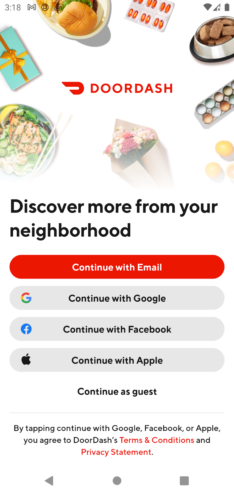
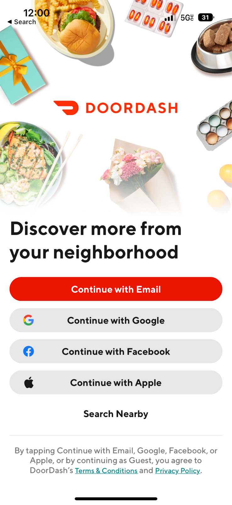
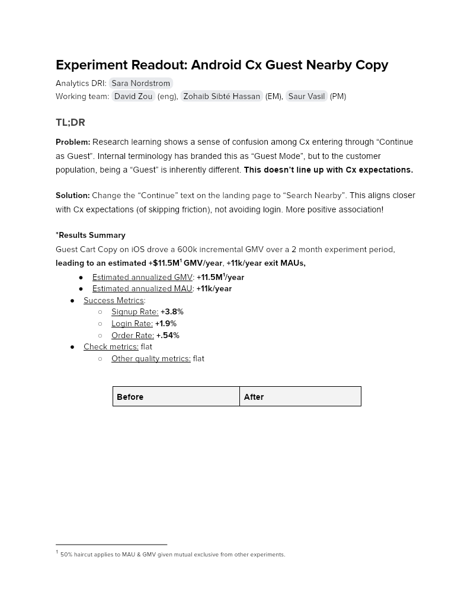

# Experiment Readout: Android Cx Guest Nearby Copy

Analytics DRI: [Sara Nordstrom](mailto:sara.nordstrom@doordash.com)

Working team: [David Zou](mailto:david.zou@doordash.com) (eng), [Zohaib Sibté Hassan](mailto:zohaib.hassan@doordash.com) (EM), [Saur Vasil](mailto:saur.vasil@doordash.com) (PM)

### TL;DR

**Problem:**Research learning shows a sense of confusion among Cx entering through “Continue as Guest”. Internal terminology has branded this as “Guest Mode”, but to the customer population, being a “Guest” is inherently different.**This doesn’t line up with Cx expectations.**

**Solution:**Change the “Continue” text on the landing page to “Search Nearby”. This aligns closer with Cx expectations (of skipping friction), not avoiding login. More positive association!**Results Summary**Guest Cart Copy on iOS drove a 600k incremental GMV over a 2 month experiment period,**leading to an estimated****+$11.5M**[^1]**GMV/year**,**+11k/year exit MAUs,**- Estimated annualized GMV:**+11.5M**1**/year**- Estimated annualized MAU:**+11k/year**

- Success Metrics:

  - Signup Rate: **+3.8%**- Login Rate:**+1.9%**- Order Rate:**+.54%**

- Check metrics: flat

  - Other quality metrics: flat

| **Before**|**After**|
| --- | --- |
|  |  |**Result Details**[Mode Dashboard](https://app.mode.com/doordash/reports/77872394ee01) (The migration from Mode to Curie still in progress, we are working on Curie metrics pack and aim for completion in Q1)

[Curie Dashboard](https://admin-gateway.doordash.com/decision-systems/experiments/ae6c83fa-484a-4e16-87d6-e9f4e123d68e) for quality metrics

[Product Doc](https://docs.google.com/document/d/1XzoYijg9mGJYF7zB7lYWbPPszEz018fdgvuagFESl0M/edit)

### Experiment Timeline

### Methodology

#### Overview**Test mechanism:**A/B test**Test platform:**Android only**Country:**Global (except for Australia)**Experience:**DoorDash only**Target Population:**Android users that visited the landing/login screen**Test duration:**2 months**Control/Treatment Split:**50/50

#### Testing Group & Bucketing

- Treatment (50%): New design of landing page

- Control (50%): Existing design

- **Test Launch date:** 11/18/2022

### Result Details

Impacts breakdown:

- **Signup lift of 3.8%:** - Getting more guests to click the button to “search nearby” and removing friction on the landing page is leading more guests to explore and then go on to signup.* **Login lift of 1.9%**- Being more explicit about what continuing to the next screen means (it means searching nearby restaurants, is also encouraging more people to login on the landing page rather than avoiding it.* **GMV lift of +$11.5M/yr**,

  - Increasing MAU and Order Rate has led to an increase in GMV.

***MAU lift of .48%**driven by an**Order Rate lift of .54%**

  - Getting more users to the login and signup has led to more users ordering which has increased MAU rate

#### Success Metrics (Treatment vs Control)

| **Metrics**|**Treatment**|**Control**|**% Change**|**Significance**|
| --- | --- | --- | --- | --- |
| Login Rate | 77.8% | 76.3% | 1.9% | YES |
| Signup Rate | 23.98% | 23.10% | 3.8% | YES |
| MAU | 38.04% | 37.86% | .48% | YES |
| Order Rate | 2.25 | 2.24 | .54% | YES |
| New Cx Conversion | 15.95% | 15.95% | 0% | NO |

#### Check Metrics

|**Metrics**|**Treatment**|**Control**|**% Change**|**Significance**|
| --- | --- | --- | --- | --- |
| GoV | $34.19 | $34.23 | -.096% | NO |
| Subtotal | $24.22 | $24.24 | -.078% | NO |
| Tip | $3.57 | $3.57 | -.02% | NO |**Next steps:**

- <mark>Ramp-up plan: Ramping up to 90% treatment + 10% long term holdout.
  </mark>
---
## Footnotes

\[^1\]: 50% haircut applies to MAU & GMV given mutual exclusive from other experiments.
