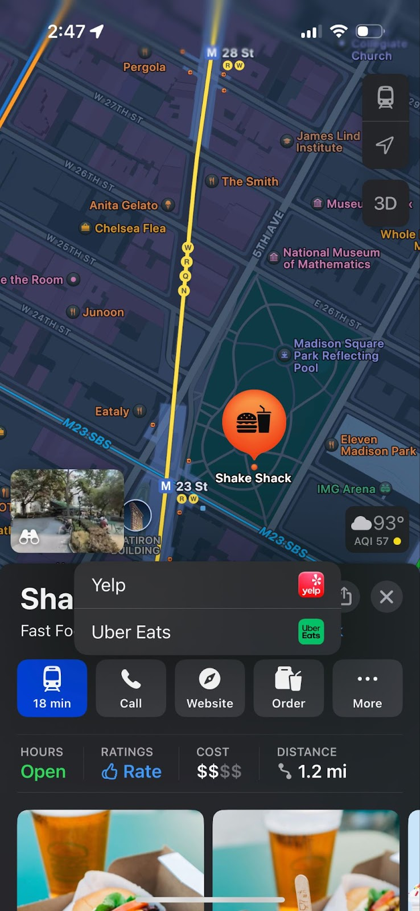
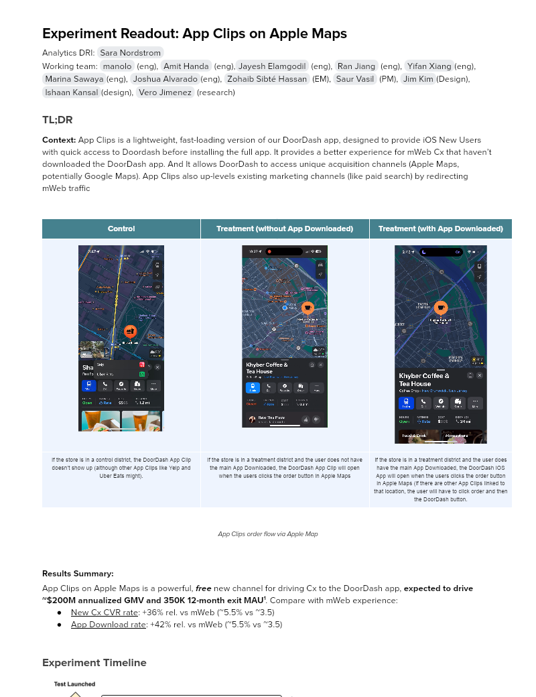
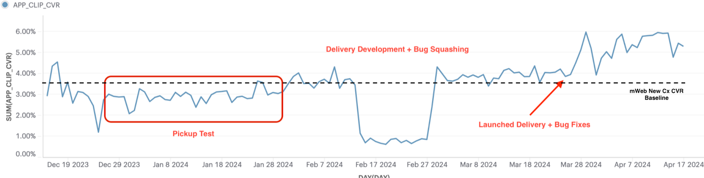
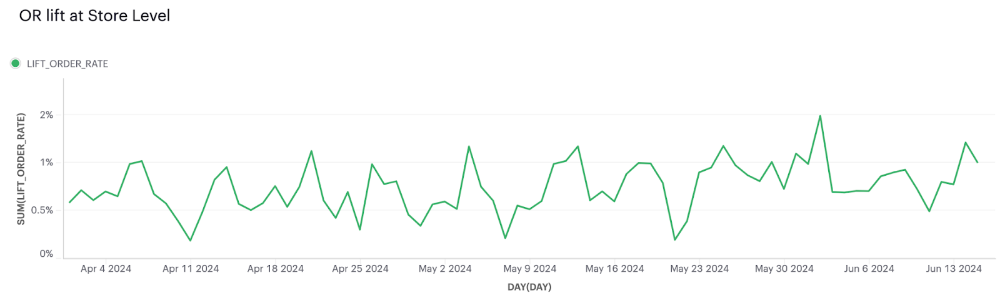

# Experiment Readout: App Clips on Apple Maps

Analytics DRI: [Sara Nordstrom](mailto:sara.nordstrom@doordash.com)

Working team: [manolo](mailto:manolo@doordash.com) (eng), [Amit Handa](mailto:amit.handa@doordash.com) (eng),[Jayesh Elamgodil](mailto:jayesh.elamgodil@doordash.com) (eng), [Ran Jiang](mailto:ran.jiang@doordash.com) (eng), [Yifan Xiang](mailto:yifan.xiang@doordash.com)(eng), [Marina Sawaya](mailto:marina.mukhina@doordash.com)(eng), [Joshua Alvarado](mailto:joshua.alvarado@doordash.com)(eng), [Zohaib Sibté Hassan](mailto:zohaib.hassan@doordash.com) (EM), [Saur Vasil](mailto:saur.vasil@doordash.com) (PM), [Jim Kim](mailto:james.kim@doordash.com)(Design), [Ishaan Kansal](mailto:ishaan.kansal@doordash.com)(design), [Vero Jimenez](mailto:veronica.jimenez@doordash.com) (research)

### TL;DR

**Context:**App Clips is a lightweight, fast-loading version of our DoorDash app, designed to provide iOS New Users with quick access to Doordash before installing the full app. It provides a better experience for mWeb Cx that haven’t downloaded the DoorDash app. And It allows DoorDash to access unique acquisition channels (Apple Maps, potentially Google Maps). App Clips also up-levels existing marketing channels (like paid search) by redirecting mWeb traffic

|**Control**|**Treatment (without App Downloaded)**|**Treatment (with App Downloaded)** |
| --- | --- | --- |
|  |  |  |
| If the store is in a control district, the DoorDash App Clip doesn’t show up (although other App Clips like Yelp and Uber Eats might). | If the store is in a treatment district and the user does not have the main App Downloaded, the DoorDash App Clip will open when the users clicks the order button in Apple Maps | If the store is in a treatment district and the user does have the main App Downloaded, the DoorDash iOS App will open when the users clicks the order button in Apple Maps (if there are other App Clips linked to that location, the user will have to click order and then the DoorDash button. |

*App Clips order flow via Apple Map*

**Results Summary:**App Clips on Apple Maps is a powerful,**free**new channel for driving Cx to the DoorDash app,**expected to drive ~$200M annualized GMV and 350K 12-month exit MAU**[^1]. Compare with mWeb experience:

- New Cx CVR rate: +36% rel. vs mWeb (~5.5% vs ~3.5)

- App Download rate: +42% rel. vs mWeb (~5.5% vs ~3.5)

### Experiment Timeline

### Methodology

#### Overview

**Test mechanism:**AB test is not available as we are unable to segment on a user level which users see the app clip entry point on apple maps and which didn’t (Apple doesn’t support this), therefore, we decided to run a geo test based on district level with diff-in-diff analysis to account for district bias.**Test platform:**iOS**Test Duration:**6 months**Target Population:**iOS apple maps users**Bucket Key:**Store_ID. Which provides us with more power compared to district_ID, at the same time avoiding cross-contamination (all stores in a district are either treatment or control so even if users navigate to other stores, they are still treatment stores).**Control/Treatment Split:**50/50

### Result Details

The App Clip continues to perform better than mWeb on conversion:

We see consistent daily OR lift at the store level:

This graph shows conversion (on the app clip) of users who launch the app clip over time**Note: These are incremental, high-quality Cx.**The App Clip is driving primarily New and Churned Resurrected Cx to come back and order from DoorDash

|**App Clips Cx Breakdown**|**App Clip (overall)**|**Main App (overall)**|
| --- | --- | --- |
| New | 54.6% | 4.93% |
| Active | 8.19% | 63.8% |
| Churned Resurrected | 28.58% | 10.23% |
| Dormant Resurrected | 8.55% | 21.0% |**Next Steps:**- Introduce**Notification Support** to App Clips – enabling all Cx that open an App Clip are able to receive custom notifications, opening up a bounty of targeted use cases.

- Example: A Cx who scans a DashMart ad in NYC can receive specific copy & frequency targeted to that geography and vertical.

* Reach greater parity with mWeb

  - Including support for **Offers**, such that affordability-minded Cx are able to find content before reaching the app.

  - Introducing **New Verticals**browsing and support, showing Cx the catalog of items they can get to their door.* Work with BD/Marketing to integrate App Clips into an increasing number of channels

  - Uplevel existing marketing channels, like Paid Search, Direct Mail, Pause Ads

  - Partner with other products (Google Maps, Yelp) to unlock additional incremental channels.
---
## Footnotes

\[^1\]: 1GMV derived at 90% confidence. This is a store level test – only have GMV data. Therefore, MAU data is translated based on App Clips pick up test GMV and MAU.
