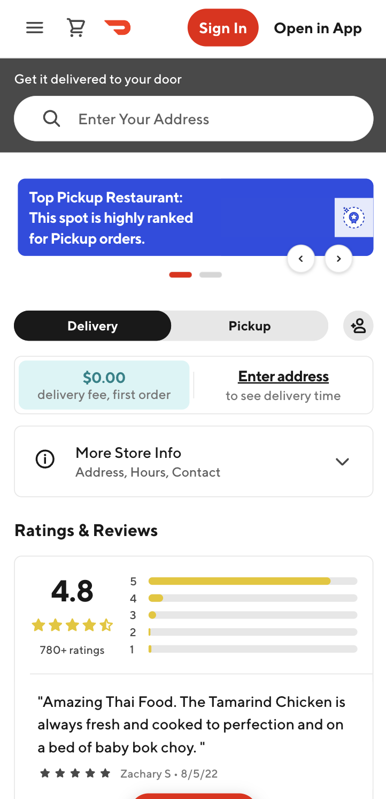
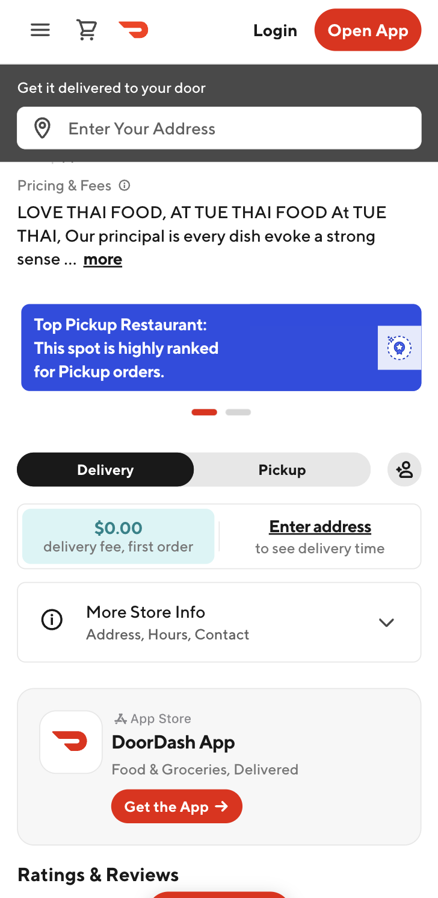
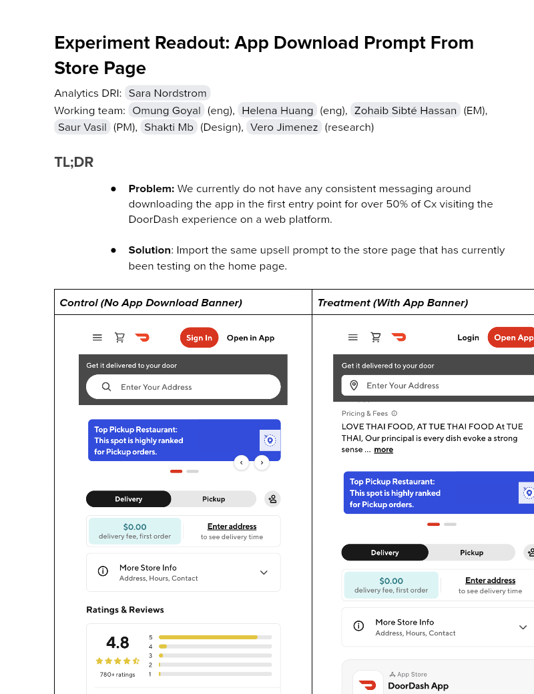

# Experiment Readout: App Download Prompt From Store Page

Analytics DRI: [Sara Nordstrom](mailto:sara.nordstrom@doordash.com)

Working team: [Omung Goyal](mailto:omung.goyal@doordash.com) (eng), [Helena Huang](mailto:helena.huang@doordash.com) (eng), [Zohaib Sibté Hassan](mailto:zohaib.hassan@doordash.com) (EM), [Saur Vasil](mailto:saur.vasil@doordash.com) (PM), [Shakti Mb](mailto:shakti.m@doordash.com) (Design), [Vero Jimenez](mailto:veronica.jimenez@doordash.com) (research)

### TL;DR

- ** Problem: **We currently do not have any consistent messaging around downloading the app in the first entry point for over 50% of Cx visiting the DoorDash experience on a web platform.

-** Solution**: Import the same upsell prompt to the store page that has currently been testing on the home page.

| **Control (No App Download Banner)**|**Treatment (With App Banner)**|
| --- | --- |
|  |  |\*\* Results Summary**The App Download Prompt From Store Page experiment drove 15k incremental orders over a 4 week experiment period,**leading to an estimated +$3.2M**[^1] \*\* GMV at 12 month exit** and +**$543k GMV at Q3 exit;**

- <u>Success Metrics
  </u>

  - Estimated annualized incremental GMV: $3.2M

- Check metrics:

  - Logins: -1.54%

  - GOV: -0.48%

- Additional metrics:

  - App Downloads: +39.76%

    - +39k incremental app downloads during experiment period

[Mode Dashboard](https://app.mode.com/doordash/reports/f326f1fc3e8b)

### Experiment Timeline

### Methodology

#### Overview

\*\* Test mechanism:**A/B test** Test platform:**mWeb** Country:**Global** Experience:**DoorDash only** Target Population:**Guest users on mobile web** Test duration:**4 weeks at 50/50** Control/Treatment Split:\*\*50/50

### Result Details

#### Success Metrics (Treatment vs Control)

|**Metrics**|**Treatment**|**Control**|**% Change**|**Significance**|
| --- | --- | --- | --- | --- |
| Order Rate | <mark>15.69%</mark> | <mark>15.28%</mark> | +<mark>2.64%</mark> | YES |
| MAU | <mark>11.30%</mark> | <mark>11.28%</mark> | +<mark>0.18%</mark> | NO |

#### Check Metrics

|**Metrics**|**Treatment**|**Control**|**% Change**|**Significance**|
| --- | --- | --- | --- | --- |
| Signups | <mark>5.87%</mark> | <mark>5.91%</mark> | <mark>-0.69%</mark> | NO |
| Logins | <mark>14.32%</mark> | <mark>14.54%</mark> | <mark>-1.54%</mark> | YES |
| New Cx Rate | <mark>4.11%</mark> | <mark>4.12%</mark> | <mark>-0.26%</mark> | NO |
| GoV | <mark>$40.50</mark> | <mark>$40.69</mark> | <mark>-0.48%</mark> | YES |

#### Additional Metrics

|**Metrics**|**Treatment**|**Control**|**% Change**|**Significance**|
| --- | --- | --- | --- | --- |
| SUMA | <mark>0.83%</mark> | <mark>0.82%</mark> | +<mark>1.26%</mark> | NO |
| App Downloads | <mark>3.65%</mark> | <mark>2.61%</mark> | +<mark>39.76%</mark> | YES |

Impacts breakdown:** Experiment Context**: This experiment implemented adjust links to take users from mweb to the app, which capture both the mweb device id (the experiment bucket key) and the app device id. Through these links we are able to attribute user behavior in the app to the devices in the treatment group in the experiment. There are 2 shortcomings with this experiment design. First, we only have tracking for treatment devices who go to the app but inevitably some control devices will also go to the app through other methods besides this button and we won’t have any tracking on that. Second, we only ran this experiment for around 2 weeks and during that period drove many incremental users to the app, but due to the short experiment period, we aren’t capturing the long term benefits to a user of the app over mweb. To account for this, we came up with the following methodology:

** Method**: After investigating we found that 53% of users who sign up on mweb eventually make their way to the app, so we took a 50% haircut on our results to account for the control users that converted on the app that we have no way of tracking. We also found that New Cx on the App vs. mWeb have significantly higher 12 month order rate and 12 month retention, so we added multipliers to our annualized numbers to account for the long term benefits of the app.

Original numbers:

- Q3 exit

  - Incremental GMV from orders: $543k

- Annualized

  - Incremental GMV from orders: $3.5M

App vs. Web multipliers:

| | **App New Cx**|**Web New Cx**|**Increase**|
| --- | --- | --- | --- |
|**12 month order rate**| 12.0 | 6.6 | +82% |
|**12 month retention**| 16.9% | 9.8% | +72% |

53% of web signups that go on to place orders on the app. We will therefore take an additional 50% haircut.

Updated Numbers:

- Annualized: **+3.2M GMV**

- Incremental GMV from orders: 3.5M*1.82*.5= $3.2M

Note on the average GOV/order decrease:

- The decrease in GMV per order is not surprising. If we look at average GOV per order by platform for the last year we see the following:

| **Platform**|**Avg GOV**|
| --- | --- |
| mobile-web | $38.08 |
| desktop | $42.07 |
| android | $35.71 |
| ios | $35.11 |

Note on login decrease:

- The decrease in logins is accounted for by control users being redirected to the App and already being logged in (we see more treatment users viewing the explore page than treatment users logging in on or signing up on the mobile app).** Next steps: **

- Ramp-up plan: Rollout to 100% and pursue other areas where we can drive mobile web users to the app

- Run future “App Downloads and Redirection” experiments as switchback tests to avoid the need to make the assumptions made above
---
## Footnotes

\[^1\]: This is with a 50% haircut
