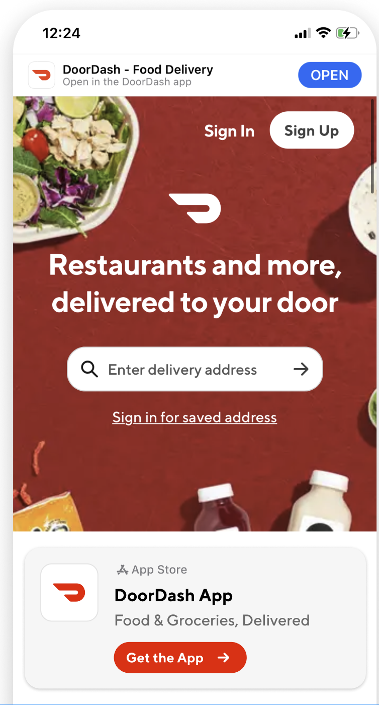
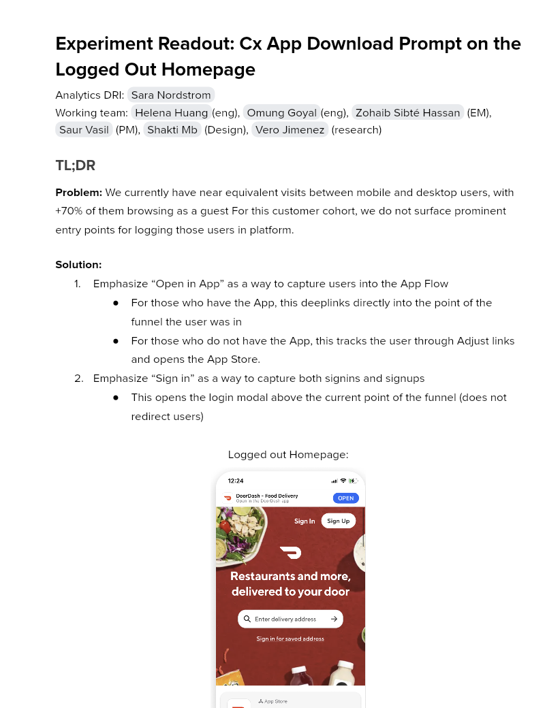

# Experiment Readout: Cx App Download Prompt on the Logged Out Homepage

Analytics DRI: [Sara Nordstrom](mailto:sara.nordstrom@doordash.com)

Working team: [Helena Huang](mailto:helena.huang@doordash.com)(eng), [Omung Goyal](mailto:omung.goyal@doordash.com)(eng), [Zohaib Sibté Hassan](mailto:zohaib.hassan@doordash.com) (EM), [Saur Vasil](mailto:saur.vasil@doordash.com) (PM), [Shakti Mb](mailto:shakti.m@doordash.com) (Design), [Vero Jimenez](mailto:veronica.jimenez@doordash.com) (research)

### TL;DR

**Problem:**We currently have near equivalent visits between mobile and desktop users, with +70% of them browsing as a guest For this customer cohort, we do not surface prominent entry points for logging those users in platform.**Solution:**- Emphasize “Open in App” as a way to capture users into the App Flow

- For those who have the App, this deeplinks directly into the point of the funnel the user was in

- For those who do not have the App, this tracks the user through Adjust links and opens the App Store.

- Emphasize “Sign in” as a way to capture both signins and signups

- This opens the login modal above the current point of the funnel (does not redirect users)

Logged out Homepage:

**Results Summary**The Cx App Download Prompt Experiment drove 10k incremental orders and 3k incremental MAU over a 4 week experiment period,**leading to an estimated annualized +$5.4M**[^1]**GMV/year and 6.6k incremental MAU and 4.8k incremental Q3 exit MAU and $1.2M incremental Q3 GMV**

- <u>Success Metrics
  </u>

  - Estimated annualized incremental GMV: **$5.4M/year**- Estimated annualized incremental MAU:**$6.6k/year**- Check metrics: Avg GOV per order -0.33%*

- Additional metrics:

  - App Downloads: +22.96%

[Mode Dashboard](https://app.mode.com/doordash/reports/8944ec2bf63a)

### Experiment Timeline

### Methodology

#### Overview

**Test mechanism:**A/B test**Test platform:**mWeb**Country:**Global**Experience:**DoorDash only**Target Population:**Any cx who visits logged out home page on DoorDash.com on mobile web**Test duration:**4 weeks at 50/50**Control/Treatment Split:**50/50

### Result Details

#### Success Metrics (Treatment vs Control)

|**Metrics**|**Treatment**|**Control**|**% Change**|**Significance**|
| --- | --- | --- | --- | --- |
| Order Rate | <mark>22.29%</mark> | <mark>21.83%</mark> | +<mark>2.08%</mark> | YES |
| MAU | <mark>3.38%</mark> | <mark>3.28%</mark> | +<mark>2.99%</mark> | YES |

#### Check Metrics

|**Metrics**|**Treatment**|**Control**|**% Change**|**Significance**|
| --- | --- | --- | --- | --- |
| Signups | 8.79% | 8.71% | +1.01% | YES |
| New Cx Rate | 4.07% | 4.06% | +0.19% | NO |
| GoV | $37.57 | $37.70 | -0.33% | YES |

#### Additional Metrics

|**Metrics**|**Treatment**|**Control**|**% Change**|**Significance**|
| --- | --- | --- | --- | --- |
| SUMA | 1.20% | 1.17% | +3.03% | NO |
| App Downloads | 2.41% | 1.96% | +22.96% | YES |

Impacts breakdown:**Experiment Context**: This experiment implemented adjust links to take users from mweb to the app, which capture both the mweb device id (the experiment bucket key) and the app device id. Through these links we are able to attribute user behavior in the app to the devices in the treatment group in the experiment. There are 2 shortcomings with this experiment design. First, we only have tracking for treatment devices who go to the app but inevitably some control devices will also go to the app through other methods besides this button and we won’t have any tracking on that. Second, we only ran this experiment for around 4 weeks and during that period drove many incremental users to the app, but due to the short experiment period, we aren’t capturing the long term benefits to a user of the app over mweb. To account for this, we came up with the following methodology:**Method**: After investigating we found that 53% of users who sign up on mweb eventually make their way to the app, so we took a 50% haircut on our results to account for the control users that converted on the app that we have no way of tracking. We also found that New Cx on the App vs. mWeb have significantly higher 12 month order rate and 12 month retention, so we added multipliers to our annualized numbers to account for the long term benefits of the app.

Original numbers:

- Q3 exit

  - Incremental GMV from orders: $690k

  - Incremental MAU: 4.8k

    - Incremental GMV from MAU: $505k

- Annualized

  - Incremental GMV from orders: 2.2M

  - Incremental MAU: 7.6k

    - Incremental GMV from MAU: $3.9M

App vs. Web multipliers:

| | **App New Cx**|**Web New Cx**|**Increase**|
| --- | --- | --- | --- |
|**12 month order rate**| 12.0 | 6.6 | +82% |
|**12 month retention**| 16.9% | 9.8% | +72% |

53% of web signups that go on to place orders on the app. We will therefore take an additional 50% haircut.

Updated Numbers:

- Final Annualized:**+5.4M GMV and +6.6k MAU**- Incremental GMV from orders: 2.2M*1.82*.5= $2M

- Incremental MAU: 7.6k*1.72*.5=6.6k

  - Incremental GMV from MAU: $3.9M*1.72*.5= $3.4M

Note on the average GOV/order decrease:

- The decrease in GMV per order is not surprising. If we look at average GOV per order by platform for the last year we see the following:

| **Platform**|**Avg GOV**|
| --- | --- |
| mobile-web | $38.08 |
| desktop | $42.07 |
| android | $35.71 |
| ios | $35.11 |**Next steps:**

- Ramp-up plan: Rollout to 100% and pursue other areas where we can drive mobile web users to the app

- Run future “App Downloads and Redirection” experiments as switchback tests to avoid the need to make the assumptions made above
---
## Footnotes

\[^1\]: This is with a 50% haircut
