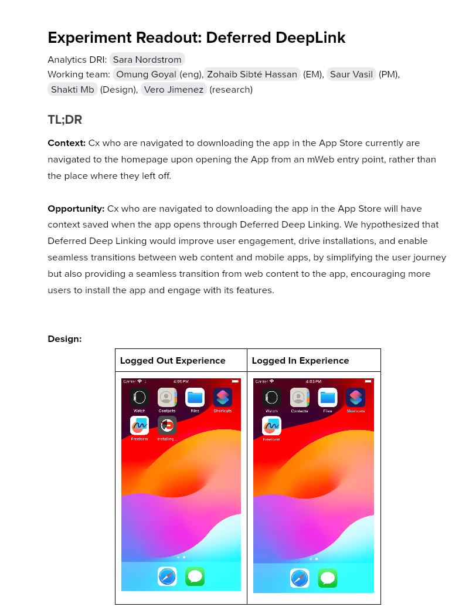

# Experiment Readout: Deferred DeepLink

Analytics DRI: [Sara Nordstrom](mailto:sara.nordstrom@doordash.com)

Working team: [Omung Goyal](mailto:omung.goyal@doordash.com)(eng),[Zohaib Sibté Hassan](mailto:zohaib.hassan@doordash.com) (EM), [Saur Vasil](mailto:saur.vasil@doordash.com) (PM), [Shakti Mb](mailto:shakti.m@doordash.com) (Design), [Vero Jimenez](mailto:veronica.jimenez@doordash.com) (research)

### TL;DR

**Context:**Cx who are navigated to downloading the app in the App Store currently are navigated to the homepage upon opening the App from an mWeb entry point, rather than the place where they left off.**Opportunity:**Cx who are navigated to downloading the app in the App Store will have context saved when the app opens through Deferred Deep Linking. We hypothesized that Deferred Deep Linking would improve user engagement, drive installations, and enable seamless transitions between web content and mobile apps, by simplifying the user journey but also providing a seamless transition from web content to the app, encouraging more users to install the app and engage with its features.**Design:**|**Logged Out Experience**|**Logged In Experience**|
| --- | --- |
|  |  |**Results Summary**The Deferred Deeplink Experiment drove an increase of GOV/order of $.09 which led to +$450k incremental GMV over the experiment period,**leading to an estimated annualized +$1.8M**[^1]**GMV/year.**[Mode Dashboard](https://app.mode.com/doordash/reports/d078129e34c8)

### Experiment Timeline

### Methodology

#### Overview**Test mechanism:**A/B test**Test platform:**mWeb**Country:**Global**Experience:**DoorDash only**Target Population:**mWeb users who navigate to the App through one of our entry points**Test duration:**3 Months at 50/50**Control/Treatment Split:**50/50

### Result Details

#### Success Metrics

|**Metrics**|**Control**|**Treatment**|**% Change**|**Significance**|
| --- | --- | --- | --- | --- |
| GOV | $41.24 | $41.33 | +0.21% | YES |
| Order Rate | 27.80% | 27.77% | -0.10% | NO |

#### Check Metrics

|**Metrics**|**Control**|**Treatment**|**% Change**|**Significance**|
| --- | --- | --- | --- | --- |
| Signup Rate | 3.89% | 3.89% | +.14% | NO |
| New Cx Rate | 1.60% | 1.59% | -.35% | NO |**Next steps:**

- Ramp-up plan: Rollout to 100% (while respecting holdout)
---
## Footnotes

\[^1\]: This is with a 50% haircut
