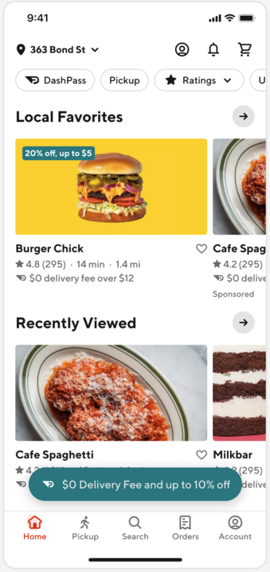
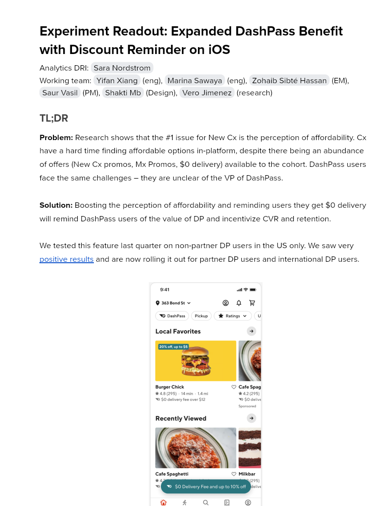

# Experiment Readout: Expanded DashPass Benefit with Discount Reminder on iOS

Analytics DRI: [Sara Nordstrom](mailto:sara.nordstrom@doordash.com)

Working team: [Yifan Xiang](mailto:yifan.xiang@doordash.com) (eng), [Marina Sawaya](mailto:marina.mukhina@doordash.com) (eng), [Zohaib Sibté Hassan](mailto:zohaib.hassan@doordash.com) (EM), [Saur Vasil](mailto:saur.vasil@doordash.com) (PM), [Shakti Mb](mailto:shakti.m@doordash.com) (Design), [Vero Jimenez](mailto:veronica.jimenez@doordash.com) (research)

### TL;DR

**Problem:**Research shows that the #1 issue for New Cx is the perception of affordability. Cx have a hard time finding affordable options in-platform, despite there being an abundance of offers (New Cx promos, Mx Promos, $0 delivery) available to the cohort. DashPass users face the same challenges – they are unclear of the VP of DashPass.**Solution:**Boosting the perception of affordability and reminding users they get $0 delivery will remind DashPass users of the value of DP and incentivize CVR and retention.

We tested this feature last quarter on non-partner DP users in the US only. We saw very[positive results](https://docs.google.com/document/d/1rRBm1kiFunQaMwEFQQCTog4fjKGKnQTHlbqZ7tPZ7fg/edit#heading=h.wa7bm2c0ccta) and are now rolling it out for partner DP users and international DP users.

**Results Summary:**The Expanded DashPass Benefit with Discount Reminder Experiment on iOS drove 2.5k incremental MAU over a 1 week experiment period,**leading to an estimated +20.8k incremental MAU/year and +$29.8M**[^1]**GMV/year and +2.5k exit Q4 MAU and +$531k exit Q4 GMV**- Estimated annualized GMV:**$29.8M/year**- Estimated annualized MAU:**$20.8k/year**- Estimated Q3 exit GMV:**+$531k**- Estimated Q3 exit MAU:**+$2.5k**

- Check metrics:

  - DP Paid Balance: Flat

  - VP: Flat

[Curie Dashboard](https://admin-gateway.doordash.com/decision-systems/experiments/a058a9a6-a2b7-4dd3-ae30-c102b64c59c5?analysisId=f4cb12a9-4b50-426b-b019-c1d82aca6bd5)

### Experiment Timeline

### Methodology

#### Overview

**Test mechanism:**A/B test**Test platform:**iOS**Country:**Global**Experience:**DoorDash only**Target Population:**iOS DP users (partner and intl)**Test duration:**1 week at 50/50**Control/Treatment Split:**50/50

### Result Details

Impacts breakdown:

- **MAU lift of +20.8k incremental MAU/year and GMV lift of +$29.8M GMV/year:** - An increased MAU rate of +0.1108% led to an overall MAU increase. DP users were more aware of their benefit which led to more DP users placing orders.

#### Success Metrics (Treatment vs Control)

| **Metrics**|**Treatment**|**Control**|**% Change**|**Significance**|
| --- | --- | --- | --- | --- |
| MAU | <mark>84.23%</mark> | <mark>84.11%</mark> | +0.1108% | YES |
| 7 day Order Rate | 1.8620 | 1.8657 | +0.0288% | NO |

#### Check Metrics

|**Metrics**|**Treatment**|**Control**|**% Change**|**Significance**|
| --- | --- | --- | --- | --- |
| VP | $2.72 | $2.72 | -.13% | NO |
| GoV | <mark>$37.57</mark> | <mark>$37.61</mark> | -.118% | NO |
| DP Paid Balance | <mark>0.389088 </mark> | <mark>0.389172 </mark> | -0.0464% | NO |
| DP Signup | <mark>0.015929 </mark> | <mark>0.015832 </mark> | +0.6167% | NO |**Next steps:**

- Ramp-up plan: roll this out to 100% on iOS

- Continue testing this feature on Android
---
## Footnotes

\[^1\]: This is with a 50% haircut
