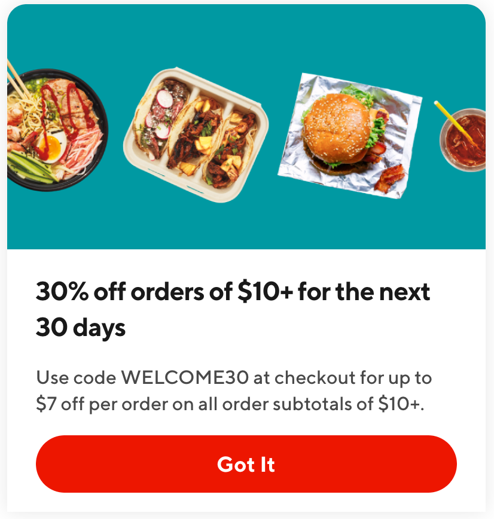
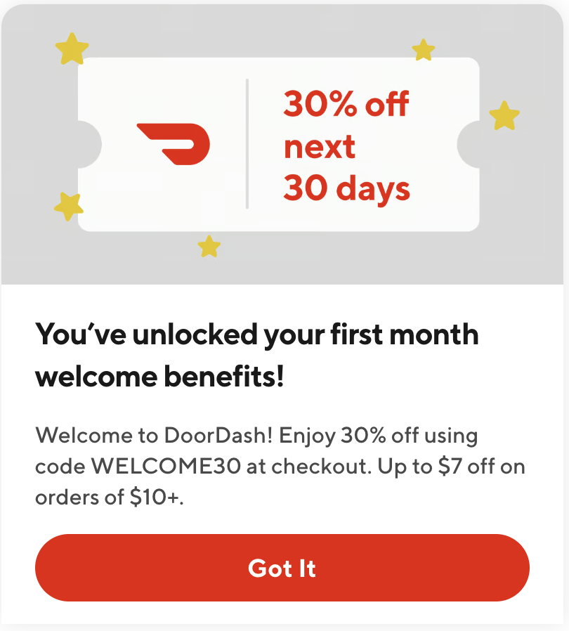

[Experiment Results] Announcement Upleveling On-App Entry of FMX Users expected to drive $3.8M 12 Month GMV, +4.7K 12 Month Exit MAU (+1.5K Q3 2023 Exit MAU)

**Analytics DRI**: [Xiao Tan](mailto:xiao.tan@doordash.com)**Working team**: [Saur Vasil](mailto:saur.vasil@doordash.com)(PM) [Ryann Hanley](mailto:ryann.hanley@doordash.com) [Tolani Fadel](mailto:tolani.fadel@doordash.com)(S&O) [Kailin Hu](mailto:kailin.hu@doordash.com)(Promotions Strategy) [Justin Castillo](mailto:justin.castillo@doordash.com)(Retention) [Sara Nordstrom](mailto:sara.nordstrom@doordash.com)(Analytics) [Vero Jimenez](mailto:veronica.jimenez@doordash.com)(Research)[Shakti Mb](mailto:shakti.m@doordash.com)(Design)**Last Updated**: 07/14/2023

# TL;DR

**Background**

*AS a new Cx, I don’t know what promotion I am eligible for.*

- On the second visit of the DoorDash platform for post-1st order New Cx, we have already done the necessary fraud checks to determine eligibility for upcoming New Cx Promotions (like FMX/Adaptive FMX).

- However, we **do not**highlight this upcoming benefit to New Cx on app entry (in an announcement) in a clear and consistent manner across all promotion types.**Solution**Pull from campaign manager to fetch benefits for Cx and surface the matched qualified New Cx promotion on**first app entry after their first order.**|**Control**|**Treatment**|
  | --- | --- |
  |  |  |**Results**<u>Success Metric and Input Metrics
  </u>

- **MAU rate:** :

- +0.22% relative lift (stat sig), **leading to an estimated +1.5K Q3 2023 Exit MAU, +$364.3K Q3 2023 GMV, +4.7K 12 Month Exit MAU, and + $3.8M GMV per year.**-**Order rate:**- +1.08% relative lift (stat sig)* **Daily conversion rate:**

  - +0.48% relative lift (stat sig)

<u>Check Metrics:
</u>

- Cx app quality latency (See details from Curie [here](https://admin-gateway.doordash.com/decision-systems/experiments/f8a2c32d-f062-4676-87bf-f1d6157e6fe7?analysisId=b55358d6-b9f5-4567-ad4c-faedeea2c925))

  - <mark>No detrimental stat sig impact</mark>

- Cx order quality metrics (See details from Curie [here](https://admin-gateway.doordash.com/decision-systems/experiments/f8a2c32d-f062-4676-87bf-f1d6157e6fe7?analysisId=ec0c95b9-da91-466b-98b5-720a647d9645))

  - Average VP per order drops with stat-sig in the treatment group due to a higher promotion redemption rate.

  - The overall VP impact of the experiment is -$48,188, with 7,323 incremental orders.

<u>Campaign Performance Metrics:
</u>

- **PCIO (In-campaign) : $5.75**-**CPIO (30D) : $7.99**\*50% haircut applies to MAU & GMV given mutual exclusive from other experiments

**Next steps**- We keep a 5% DV level long term holdout group to monitor the long term behaviors.

- We have shown that increasing the awareness of new Cx about the promotions they are eligible for leads to an increasing MAU and Order Rate. As our next steps, we will continue reiterating benefits and savings on the order cart and the processing order screen.

# Result Details

Curie: [link](https://admin-gateway.doordash.com/decision-systems/experiments/f8a2c32d-f062-4676-87bf-f1d6157e6fe7?analysisId=dd3b1401-0ffe-4c37-b9f1-df8b84126bae)

#### Success Metrics

|**Metric Name**|**Treatment**|**Control**|**Absolute Change (UB, LB)**|**Relative Change (LB, UB)**|**P-Value**|
| --- | --- | --- | --- | --- | --- |
| is_mau | 0.8358 | 0.339 | +0.0019 [+0.0003, +0.0034] | +0.2219% [+0.0390%, +0.4048%] | 0.1743 (Yes) |

#### Input Metric

|**Metric Name**|**Treatment**|**Control**|**Absolute Change (UB, LB)**|**Relative Change (LB, UB)**|**P-Value** |
| --- | --- | --- | --- | --- | --- |
| Order Rate | 1.5093 | 1.4932 | +0.0161 [+0.0038, +0.0284] | +1.0771% [+0.2540%, +1.9002%] | 0.0103 (Yes) |
| Daily Conversion Rate | 0.3825 | 0.3844 | +0.0019 [+0.0000,+0.0036] | +0.4846% [+0.0257%,+0.9436%] | 0.0385 (Yes) |

#### Check Metrics

- Cx app quality latency: <mark>No detrimental stat sig impact</mark>. (See details from Curie [here](https://admin-gateway.doordash.com/decision-systems/experiments/f8a2c32d-f062-4676-87bf-f1d6157e6fe7?analysisId=b55358d6-b9f5-4567-ad4c-faedeea2c925))

- Cx order quality metrics

  - Average VP per order drops with stat-sig in the treatment group due to a higher promotion redemption rate.

| **Metric Name**|**Treatment**|**Control**|**Absolute Change (UB, LB)**|**Relative Change (LB, UB)**|**P-Value**|
| --- | --- | --- | --- | --- | --- |
| vp_core | 0.7352 | 0.8116 | -0.0725 [-0.1190,-0.0260] | -8.9345% [-14.6641%, -3.2049%] | 0.0022 (Yes) |

#### Campaign Performance Metrics

|**Group**|**# Targeted Cx**|**Total Promo Spend**|**# Redemptions**|**PCIO** **(In-campaign)**|**CPIO** **(In-campaign)** |
| --- | --- | --- | --- | --- | --- |
| Control Group | 455,445 | $795,334 | 130,119 | | |
| Treatment Group | 455,321 | $838,355 | 137,222 | $5.75 | $6.58 |

# Methodology

Test mechanism: A/B

Test platform: all platforms including mobile and web

Test Duration: 35 days

Target population: New Cx who are eligible for Adaptive FMX

Control/Treatment split: 50/50

# Timeline

The experiment data was measured between 05/22/2023 - 06/26/2023

# Appendix

[Brief](https://docs.google.com/document/d/1E_BpuRL1izUV7Udn5PDzC7UyH4iF-P-fyN0Pp2w9geU/edit?usp=sharing)

[Curie](https://admin-gateway.doordash.com/decision-systems/experiments/f8a2c32d-f062-4676-87bf-f1d6157e6fe7?analysisId=dd3b1401-0ffe-4c37-b9f1-df8b84126bae)

[MAU and GMV projection template](https://docs.google.com/spreadsheets/d/1hSTCkZAT6T2RjY6R3fZv7u4-bpdr81TMFDXu7FlBQW0/edit?usp=sharing)

[PCIO Calculation](https://app.snowflake.com/doordash/doordash/w2pCs4gyG0UV#query)
