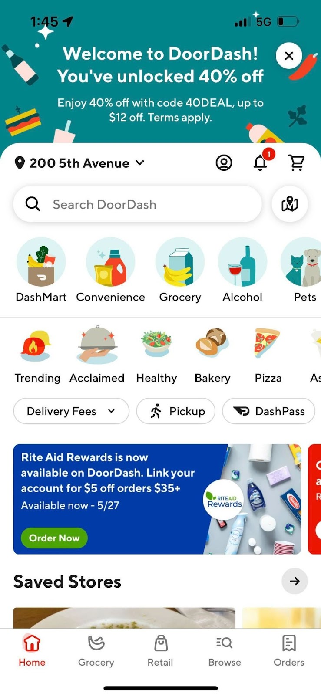

[Experiment Results] NPWS Immersive New Cx Header expected to drive $10.6M 12 Month GMV, +20.3K 12 Month Exit MAU (+6.9K Q2 2023 Exit MAU)

**Analytics DRI**: [Xiao Tan](mailto:xiao.tan@doordash.com)**Working team**: [Shuang Wang](mailto:shuang.wang@doordash.com)[Asawari Kanitkar](mailto:asawari.kanitkar@doordash.com)[Preston Nowakowski](mailto:preston.nowakowski@doordash.com)(Eng) [Saur Vasil](mailto:saur.vasil@doordash.com)[Tina Rong](mailto:tina.rong@doordash.com)(PM) [Kristin Mendez](mailto:kristin.mendez@doordash.com)(Retention)[Sara Nordstrom](mailto:sara.nordstrom@doordash.com)(Analytics)[Tolani Fadel](mailto:tolani.fadel@doordash.com)[Ryann Hanley](mailto:ryann.hanley@doordash.com)(S&O)[Shakti Mb](mailto:shakti.m@doordash.com)(Design)**Special Thanks:**[Tony Caletti](mailto:tony.caletti@doordash.com) [Curtis Lan](mailto:curtis.lan@doordash.com)(Analytics)[Vero Jimenez](mailto:veronica.jimenez@doordash.com)(Research)**Last Updated**: 06/21/2023

# TL;DR

**Background**

*AS a new Cx, I don’t know what promotion I am eligible for.*

We have proven through Cx research, data analytics, and marketing promotional Cx behavior that **New Cx do not necessarily understand the New Cx benefits they have**. This lack of understanding of their benefits leads to poor recall, leading to:

- Poor New Cx CVR for the promos Cx have

- Diminished opportunities for retention for New Cx

**Solution**An immediate solution to this problem is utilizing a clear, prominent, and engaging promotional surface top of the funnel to ensure New Cx are aware of the benefits they have.

- This will appear as a persistent, full immersive header for the duration of the promotion while New Cx are eligible for NPWS**for their first order,**and will be**not shown for second order.**- While this promotion is shown, we will downrank the banner for NPWS and FDF promotion. This will uprank lower position ads banners, providing a boost to that ad platform.

- This**must check**eligibility for NPWS and go through the appropriate fraud checks.

|**Treatment**|
| --- |
|  |**Results**<u>Success Metric and Input Metrics
</u>

- **MAU rate:** :

- +1.60% relative lift (stat sig), **leading to an estimated +6.9K Q2 2023 Exit MAU, +$446.0K Q2 2023 GMV, +20.3K 12 Month Exit MAU, and + $10.6M GMV per year.**-**Order rate:**- +1.66% relative lift (stat sig)* **Daily conversion rate:**

  - +1.16% relative lift (stat sig)

<u>Check Metrics:
</u>

- Cx app quality latency (See details from Curie [here](https://admin-gateway.doordash.com/decision-systems/experiments/129a971e-a3f9-4272-8d29-9a2cab915e67?analysisId=78bccf2c-62f9-4c31-a9c8-e38baaee9b4d))

  - No negative stat sig change

- Cx order quality metrics (See details from Curie [here](https://admin-gateway.doordash.com/decision-systems/experiments/129a971e-a3f9-4272-8d29-9a2cab915e67?analysisId=eef8f3c6-d8e3-4162-8766-4a2c8acc51b9))

  - Average VP per order drops with stat-sig in the treatment group due to a higher promotion redemption rate.

  - The overall VP impact of the experiment is -$95,923, with 7,964 incremental orders.

<u>Campaign Performance Metrics:
</u>

- PCIO (In-campaign) : $15.31

- iCPA (In-campaign) : $31.49

*50% haircut applies to MAU & GMV given mutual exclusive from other experiments**Next steps**- We added the feature to the Growth Platform long term holdout group to monitor the long term behaviors.

- We have shown that increasing the awareness of new Cx about the promotions they are eligible for leads to an increasing MAU and Order Rate. As our next steps, we will continue emphasizing the welcome promotions (FDF, Adaptive FMX) to new Cx. See details [here](https://docs.google.com/document/d/1t39zzxt0BefKFi4EZr65Col8EgdhT5DzZ9L7NyzdivU/edit?usp=sharing).

# Result Details

Curie: [link](https://admin-gateway.doordash.com/decision-systems/experiments/129a971e-a3f9-4272-8d29-9a2cab915e67?analysisId=b3e2ef99-c36a-4551-8297-232fdab0558e)

#### Success Metrics

|**Metric Name**|**Treatment**|**Control**|**Absolute Change (UB, LB)**|**Relative Change (LB, UB)**|**P-Value**|
| --- | --- | --- | --- | --- | --- |
| is_mau | 0.4500 | 0.4429 | +0.0071 [+0.0052, +0.0090] | +1.5963% [+1.1693%, +2.0232%] | 0.0000 (Yes) |

#### Input Metric

|**Metric Name**|**Treatment**|**Control**|**Absolute Change (UB, LB)**|**Relative Change (LB, UB)**|**P-Value** |
| --- | --- | --- | --- | --- | --- |
| Order Rate | 0.8664 | 0.8522 | +0.0142 [+0.0080, +0.0203] | +1.663% [+0.9435%, +2.3825%] | 0.0000 (Yes) |
| Daily Conversion Rate | 0.3484 | 0.3444 | +0.0040 [+0.0024,+0.0056] | +1.1644% [+0.7016%,+1.6273%] | 0.0000 (Yes) |

#### Check Metrics

- Cx app quality latency: No negative stat sig change. (See details from Curie [here](https://admin-gateway.doordash.com/decision-systems/experiments/129a971e-a3f9-4272-8d29-9a2cab915e67?analysisId=78bccf2c-62f9-4c31-a9c8-e38baaee9b4d))

- Cx order quality metrics

  - Average VP per order drops with stat-sig in the treatment group due to a higher promotion redemption rate.

| **Metric Name**|**Treatment**|**Control**|**Absolute Change (UB, LB)**|**Relative Change (LB, UB)**|**P-Value**|
| --- | --- | --- | --- | --- | --- |
| vp_core | -0.9081 | -0.7320 | -0.1767 [-0.2510,-0.1024] | -24.1416% [-34.2919%, -13.9913%] | 0.0000 (Yes) |

#### Campaign Performance Metrics

|**Group**|**# Targeted Cx**|**Total Promo Spend**|**# Redemptions**|**PCIO** **(In-campaign)**|**iCPA** **(In-campaign)** |
| --- | --- | --- | --- | --- | --- |
| Control Group | 530,641 | $352,865 | 40,988 | | |
| Treatment Group | 531,153 | $471,392 | 54,322 | $15.31 | $31.49 |

# Methodology

Test mechanism: A/B

Test platform: all platforms including mobile and web

Test Duration: 23 days

Target population: New Cx who are eligible for NPWS for their first order

Control/Treatment split: 50/50

# Timeline

The experiment data was measured between 05/23/2023 - 06/15/2023

# Appendix

[Brief](https://docs.google.com/document/d/1EKTef7sA6gasn-rqJ4iYEyWwHTjoDVBnNVd3j-VgWgg/edit?usp=sharing)

[Curie](https://admin-gateway.doordash.com/decision-systems/experiments/129a971e-a3f9-4272-8d29-9a2cab915e67?analysisId=b3e2ef99-c36a-4551-8297-232fdab0558e)

[MAU and GMV projection template, iCPA Calculation](https://docs.google.com/spreadsheets/d/1uVe1PknCtRW0HVs_lOZxow7bWnLvUBw2uFI5mRlkvfg/edit?usp=sharing)

[PCIO Calculation](https://app.snowflake.com/us-west-2/doordash/w56w1iRfTDj2#query)
