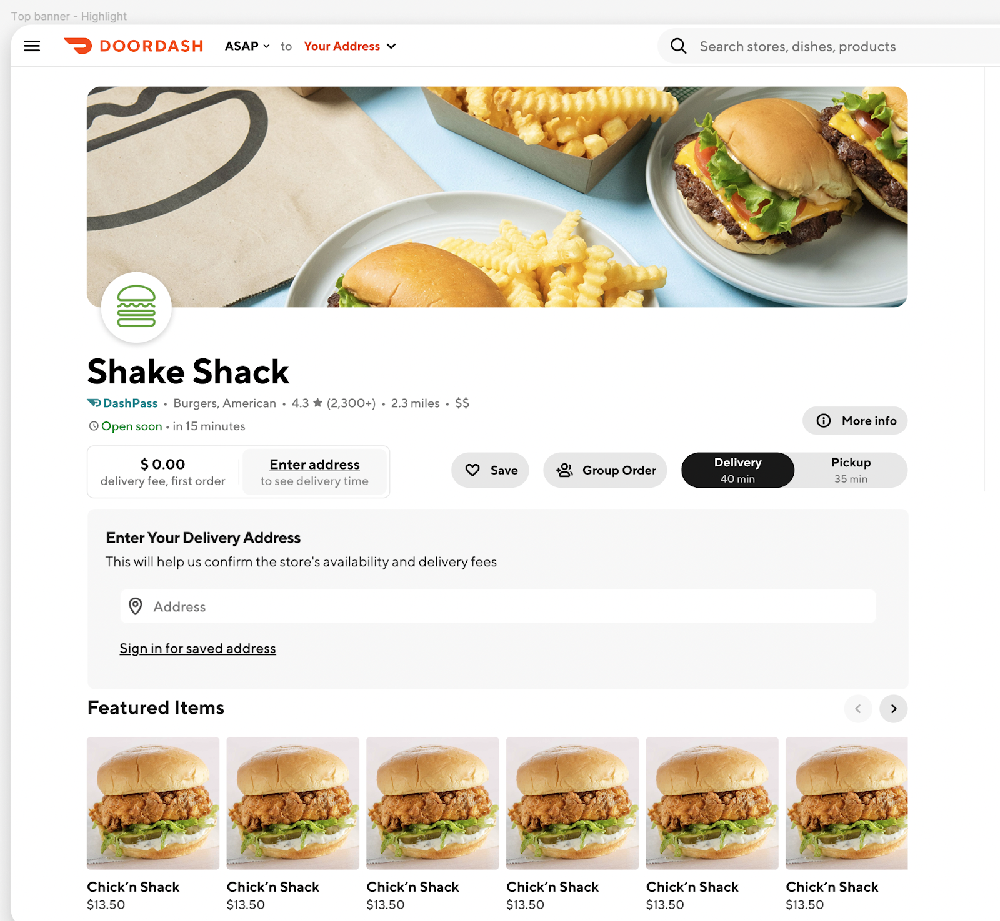

# Experiment Readout: Sticky Address Banner

Analytics DRI: [Sara Nordstrom](mailto:sara.nordstrom@doordash.com)

Working team: [Omung Goyal](mailto:omung.goyal@doordash.com) (eng), [Zohaib Sibté Hassan](mailto:zohaib.hassan@doordash.com) (EM), [Saur Vasil](mailto:saur.vasil@doordash.com) (PM), [Shakti Mb](mailto:shakti.m@doordash.com) (Design), [Vero Jimenez](mailto:veronica.jimenez@doordash.com) (research)

### TL;DR

**Problem:**

- Our current “enter address” messaging to new Cx is underperforming. Entering an address is crucial for ensuring a successful first-purchase experience on DoorDash – however, it is not given prominence that matches that importance in the current design.

- As a result, users may see

  - Stores that are not actually available in their area (when browsing on a store page)

  - A feed that is not personalized to the user’s location.

- In addition, the current address implementation pushes content vertically below the fold – a pattern we know to be negative.

**Solution:**- Introducing a more persistent, but less vertically obtrusive address banner for Desktop and mWeb that prioritizes address collection and login on web platforms.

- Behavior: Component should scroll with user on page. On mWeb, we create a scroll component that is slightly slimmer than the full height.

|**Control**|  |
| --- | --- |
|**Experiment (Web)**|  |
|**Experiment (mWeb)**|  |**Results Summary**The Sticky Address Banner Experiment drove 5.2k incremental MAU, 3.1k incremental New Cx and 1.1k incremental orders over a 2 week experiment period,**leading to an estimated +42k incremental MAU and +$23M**[^1]**GMV at 12 month exit**and**+15k MAU and**+**$1.8M GMV at Q3 exit**[Mode Dashboard](https://app.mode.com/doordash/reports/cc4c0084bed4)

### Experiment Timeline

### Methodology

#### Overview**Test mechanism:**A/B test**Test platform:**mWeb and Desktop**Country:**Global**Experience:**DoorDash only**Target Population:**mWeb and Desktop users on the logged out store page**Test duration:**2 weeks at 50/50**Control/Treatment Split:** 50/50

### Result Details

Impacts breakdown:

- A lift in MAU rate, both from incremental new Cx and active Cx led to an estimated +42k incremental MAU and +$23M GMV at 12 month exit and +15k MAU and +$1.8M GMV at Q3 exit

- Estimated annualized GMV: $23M/year

- Estimated annualized MAU: 42k/year

- Estimated Q3 exit GMV: $1.8M

- Estimated Q3 exit MAU: 15k

- Check metrics: flat

  - Other quality metrics:

    - flat

#### Success Metrics (Treatment vs Control)

| **Metrics**|**Treatment**|**Control**|**% Change**|**Significance**|
| --- | --- | --- | --- | --- |
| Order Rate | 7.08% | 6.82% | +3.82% | YES |
| MAU | <mark>6.13%</mark> | <mark>5.92%</mark> | +<mark>3.58%</mark> | YES |

#### Check Metrics

|**Metrics**|**Treatment**|**Control**|**% Change**|**Significance**|
| --- | --- | --- | --- | --- |
| New Cx CVR | <mark>1.88%</mark> | <mark>1.75%</mark> | +<mark>7.21%</mark> | YES |
| GoV | <mark>$48.35</mark> | <mark>$47.89</mark> | +<mark>0.97%</mark> | YES |
| Address Confirmation Rate | <mark>8.39%</mark> | <mark>3.96%</mark> | <mark>+</mark><mark>111.71%</mark> | YES |
| Login Rate | <mark>9.40%</mark> | <mark>9.45%</mark> | <mark>-0.55%</mark> | NO |
| Signup Rate | <mark>2.74%</mark> | <mark>2.70%</mark> | <mark>+</mark><mark>1.40%</mark> | NO |
| ND Rate | <mark>0.42% </mark> | <mark>0.44% </mark> | <mark>-4.66%</mark> | NO |**Next steps:**

- Ramp-up plan: Rollout to 100%
---
## Footnotes

\[^1\]: This is with a 50% haircut
