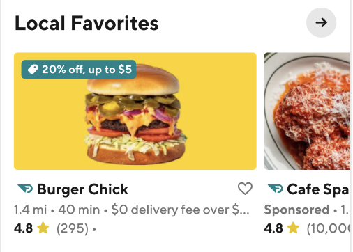
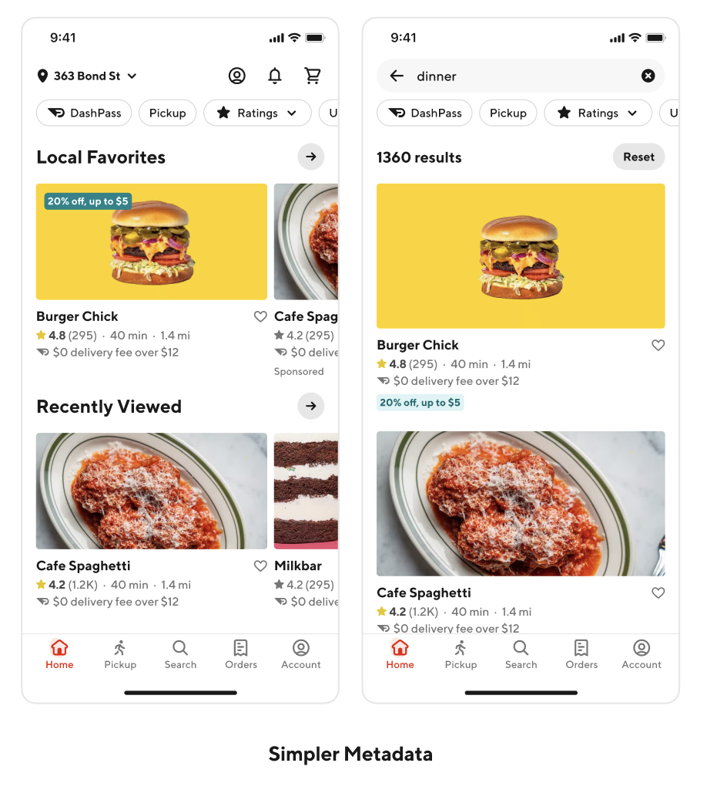
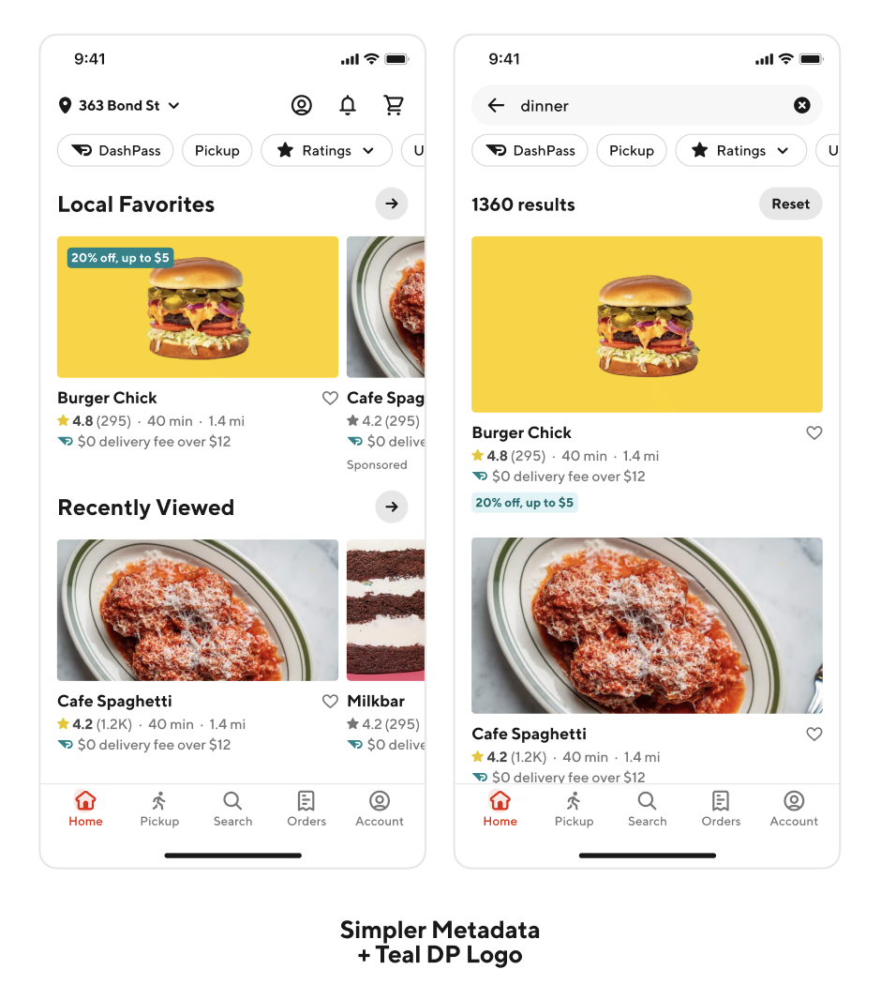
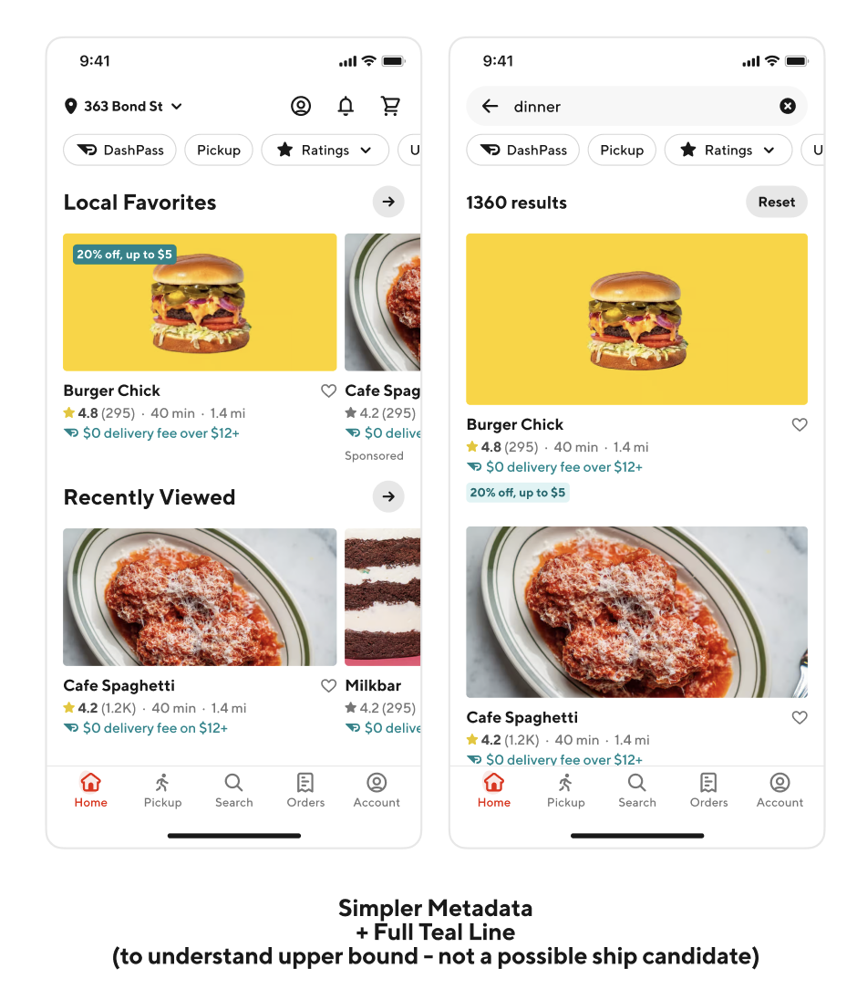
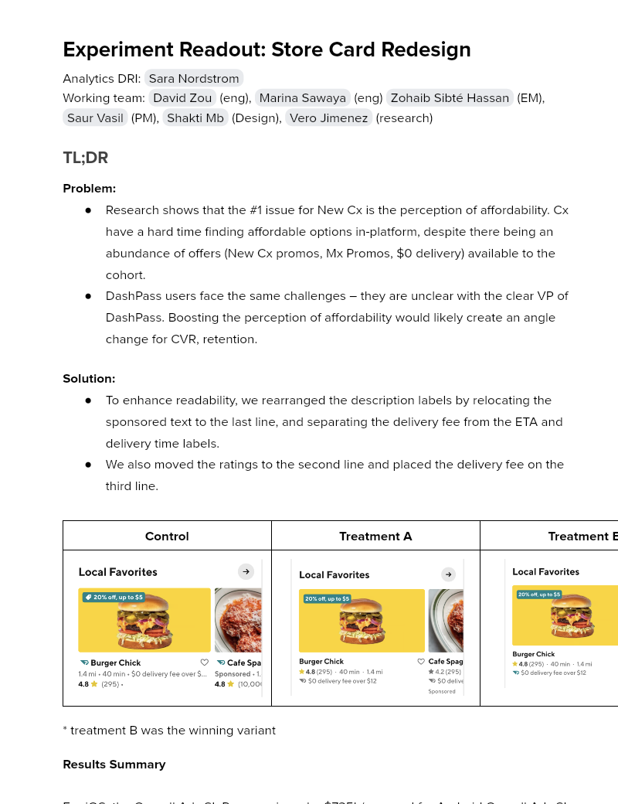

# Experiment Readout: Store Card Redesign

Analytics DRI: [Sara Nordstrom](mailto:sara.nordstrom@doordash.com)

Working team: [David Zou](mailto:david.zou@doordash.com) (eng), [Marina Sawaya](mailto:marina.mukhina@doordash.com) (eng) [Zohaib Sibté Hassan](mailto:zohaib.hassan@doordash.com) (EM), [Saur Vasil](mailto:saur.vasil@doordash.com) (PM), [Shakti Mb](mailto:shakti.m@doordash.com) (Design), [Vero Jimenez](mailto:veronica.jimenez@doordash.com) (research)

### TL;DR

**Problem:**- Research shows that the #1 issue for New Cx is the perception of affordability. Cx have a hard time finding affordable options in-platform, despite there being an abundance of offers (New Cx promos, Mx Promos, $0 delivery) available to the cohort.

- DashPass users face the same challenges – they are unclear with the clear VP of DashPass. Boosting the perception of affordability would likely create an angle change for CVR, retention.**Solution:**- To enhance readability, we rearranged the description labels by relocating the sponsored text to the last line, and separating the delivery fee from the ETA and delivery time labels.

- We also moved the ratings to the second line and placed the delivery fee on the third line.

|**Control**|**Treatment A**|**Treatment B**|**Treatment C**|**Treatment D** |
| --- | --- | --- | --- | --- |
|  |  |  |  |  |

- treatment B was the winning variant

**Results Summary**For iOS, the Overall Ads SL Revenue is up by $735k/year and for Android Overall Ads SL Revenue is up by $756k/year.**This is a combined Ads SL Revenue impact on $1.49M.**This is excluding PAD submarkets (53% exclusion).

[iOS Curie Dashboard](https://admin-gateway.doordash.com/decision-systems/experiments/acb110d6-54f0-4ee4-8c57-095589571cef?analysisId=35cb271f-68b3-46ee-9871-2064b451923c&metricNameFilter=dsmp_order_rate_7d%2Cvp_core%2Ccore_quality_hqdr%2Ccx_app_latency_plp_ios_action%2Ccx_app_quality_crash_rate_ios%2Ccx_mto%2Ccx_app_latency_plp_ios_screen%2Cdsmp_same_day_conversion%2Cfirst_contact_resolution_rate%2Cdsmp_gov%2Cads_promotion_ads_revenue%2Cads_sl_conversion_rate%2Cads_sl_revenue%2Cads_sl_impressions%2Cads_sl_cpa%2Cdsmp_order_rate%2Cnux_new_cx_rate)

[Android Curie Dashboard](https://admin-gateway.doordash.com/decision-systems/experiments/fd7f4558-b701-44df-aca1-842e70e1ff98?analysisId=229df8cf-f960-4ada-a6b7-527a1a12f0e2)

### Experiment Timeline

Ios

Android

### Methodology

#### Overview**Test mechanism:**A/B test**Test platform:**iOS and Android**Country:**Global (excluding PAD submarkets)**Experience:**DoorDash only**Target Population:**iOS and Android users who visit the explore page**Control/Treatment Split:**20/20/20/20/20

### Result Details

Impacts breakdown:

For iOS, the Overall SL Revenue is up by $735k/year (+1.219%) and for Android Overall SL Revenue is up by $756k/year (+1.492%). This is due to an increase in Ads conversion due to reformatting the sponsored text and making it smaller.

For iOS:**Overall SL Revenue is up by $735k/year**- Overall SL Conversion Rate (CVR) is up by +2.992%

- Overall SL Revenue is up by +1.219%

- Overall Promotion Revenue is up by +0.828%

For Android:**Overall SL Revenue is up by $756k/year**- Overall SL Conversion Rate (CVR) is up by +2.458%

- Overall SL Revenue is up by +1.492%

- Overall Promotion Revenue is up by +1.256%

#### Success Metrics (Treatment vs Control)

iOS

|**Metrics**|**Treatment B**|**Control**|**% Change**|**Significance**|
| --- | --- | --- | --- | --- |
| Order Rate | 1.321 | 1.320 | -0.032% | NO |
| Ads SL Revenue | 28.83 | 28.49 | +1.219% | YES |

Android

|**Metrics**|**Treatment B**|**Control**|**% Change**|**Significance**|
| --- | --- | --- | --- | --- |
| Order Rate | 2.8011 | 2.8063 | +0.025% | NO |
| Ads SL Revenue | 56.1309 | 55.3056 | +1.4923% | YES |

#### Check Metrics

iOS

|**Metrics**|**Treatment B**|**Control**|**% Change**|**Significance**|
| --- | --- | --- | --- | --- |
| New Cx CVR | 0.0354 | 0.0352 | +0.528% | NO |
| GoV | $35.43 | $35.45 | -0.0134% | NO |
| Ads SL Conversion Rate | 0.0094 | 0.0091 | +2.9924% | YES |
| Ads SL CPA | 416.16 | 415.39 | +0.187% | NO |
| Cx App Latency PLP iOS Action | 0.255 | 0.255 | +0.053% | NO |
| Cx App Latency PLP iOS Screen | 0.057 | 0.057 | +0.012% | NO |

Android

|**Metrics**|**Treatment B**|**Control**|**% Change**|**Significance**|
| --- | --- | --- | --- | --- |
| New Cx CVR | 0.0619 | 0.0622 | -0.616% | NO |
| GoV | $35.77 | $35.77 | +0.029% | NO |
| Ads SL Conversion Rate | 0.0090 | 0.0088 | +2.4582% | YES |
| Ads SL CPA | 399.72 | 398.29 | +0.3579% | YES |
| Cx App Latency PLP Android Action | 0.0270 | 0.0270 | -0.1613% | NO |
| Cx App Latency PLP Android Screen | 0.0555 | 0.0552 | -0.6677% | NO |**Next steps:**

- Ramp-up plan: Rollout treatment B to 100%

- Test the feature on Web (testing now)

- Integration with PAD Markets + Strikethough
