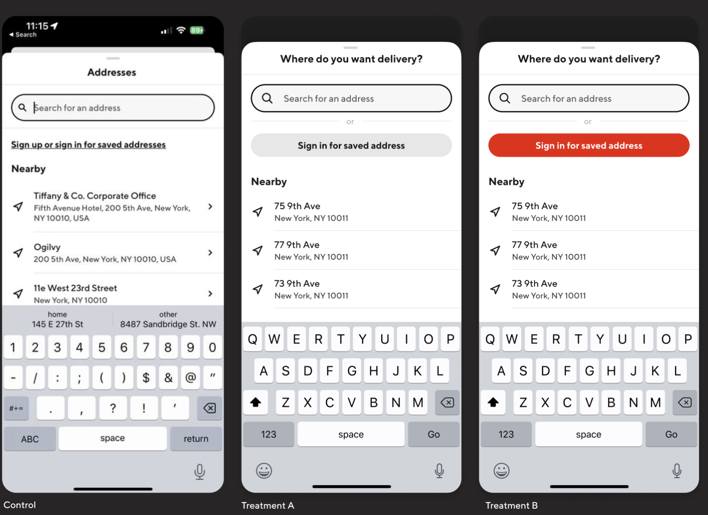
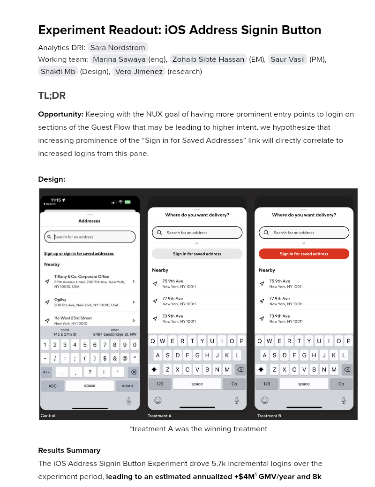

# Experiment Readout: iOS Address Signin Button

Analytics DRI: [Sara Nordstrom](mailto:sara.nordstrom@doordash.com)

Working team: [Marina Sawaya](mailto:marina.mukhina@doordash.com)(eng), [Zohaib Sibté Hassan](mailto:zohaib.hassan@doordash.com) (EM), [Saur Vasil](mailto:saur.vasil@doordash.com) (PM), [Shakti Mb](mailto:shakti.m@doordash.com) (Design), [Vero Jimenez](mailto:veronica.jimenez@doordash.com) (research)

### TL;DR

**Opportunity:**Keeping with the NUX goal of having more prominent entry points to login on sections of the Guest Flow that may be leading to higher intent, we hypothesize that increasing prominence of the “Sign in for Saved Addresses” link will directly correlate to increased logins from this pane.**Design:***treatment A was the winning treatment

**Results Summary**The iOS Address Signin Button Experiment drove 5.7k incremental logins over the experiment period,**leading to an estimated annualized +$4M**[^1]**GMV/year and 8k incremental MAU/year**

- <u>Success Metrics
  </u>

  - Estimated annualized incremental GMV: **$4M/year**- Estimated annualized incremental MAU:**$8k/year**- Estimated Q4 exit GMV:**$105k**- Estimated Q4 MAU:**1.8k**

- Check metrics: Avg GOV per order -0.015%

- Additional metrics:

  - SUMA: -0.62%

[Curie Dashboard](https://admin-gateway.doordash.com/decision-systems/experiments/4fb03216-f088-4190-8e48-e9889d2d5b71?analysisId=c4eb515d-d4f2-49c7-b822-1bf9949dd459)

### Experiment Timeline

### Methodology

#### Overview

**Test mechanism:**A/B test**Test platform:**iOS**Country:**Global**Experience:**DoorDash only**Target Population:**Guest users who entered the address onboarding screen**Test duration:**4 weeks at 33/33/34**Control/Treatment Split:**33/33/34

### Result Details

#### Success Metrics

|**Metrics**|**Control**|**Treatment A**|**% Change**|**Significance**|**Treatment B**|**% Change**|**Significance**|
| --- | --- | --- | --- | --- | --- | --- | --- |
| Login Rate | 8.85% | 8.89% | +0.4188% | YES | 8.91% | +0.5787% | YES |
| Order Rate | 2.881 | 2.883 | -0.0692% | NO | 2.883 | +0.0655% | NO |

#### Check Metrics

|**Metrics**|**Control**|**Treatment A**|**% Change**|**Significance**|**Treatment B**|**% Change**|**Significance**|
| --- | --- | --- | --- | --- | --- | --- | --- |
| Signup Rate | 8.527% | 8.501% | -0.3146% | NO | 8.514% | -0.1744% | NO |
| New Cx Rate | 6.83% | 6.824% | -0.098% | NO | 6.819% | -0.16% | NO |
| GoV | $34.56 | $34.54 | -0.0147% | NO | $34.56 | 0.0093% | NO |

#### Additional Metrics

|**Metrics**|**Control**|**Treatment A**|**% Change**|**Significance**|**Treatment B**|**% Change**|**Significance**|
| --- | --- | --- | --- | --- | --- | --- | --- |
| SUMA | 2.344% | 2.33% | -0.6185% | NO | 2.328% | -0.6740% | NO |**Next steps:**

- Ramp-up plan: Rollout to 100%

- Continue testing this feature on Android
---
## Footnotes

\[^1\]: This is with a 50% haircut
