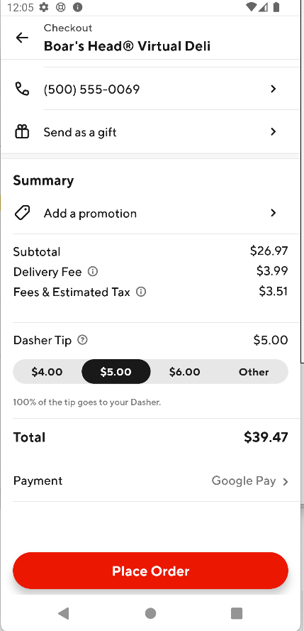
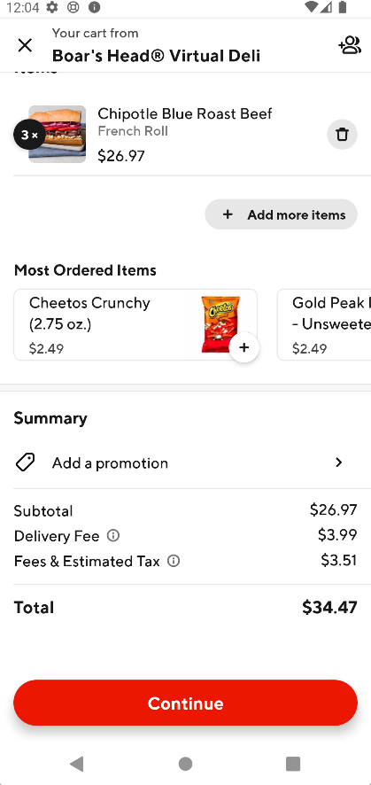
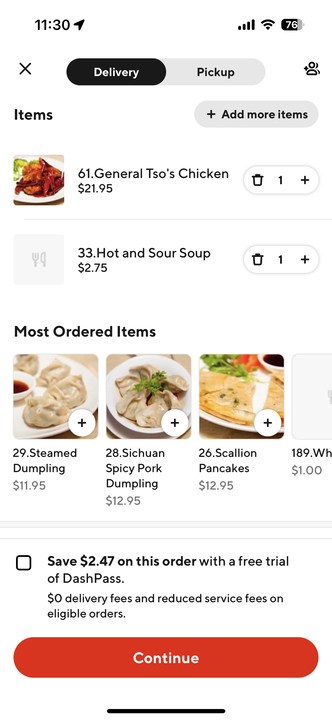
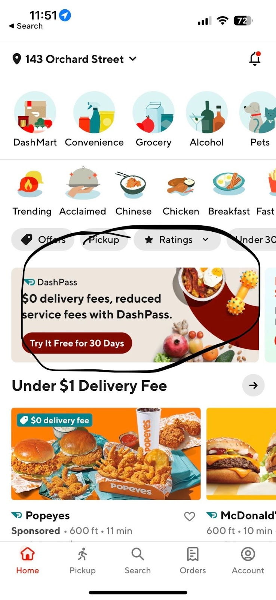
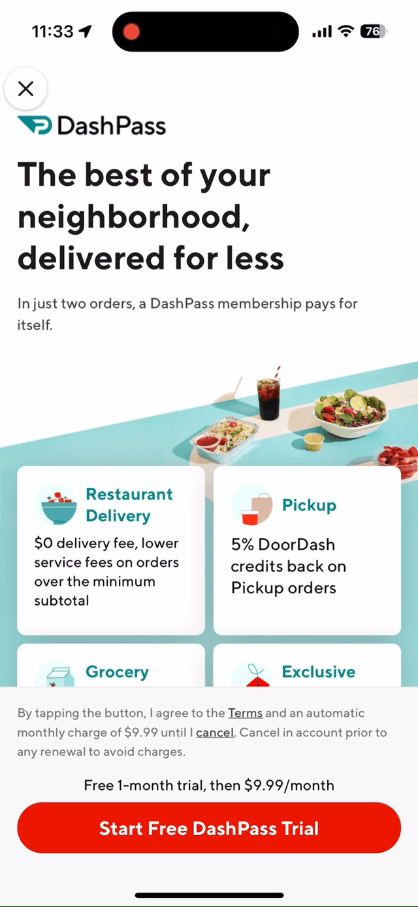
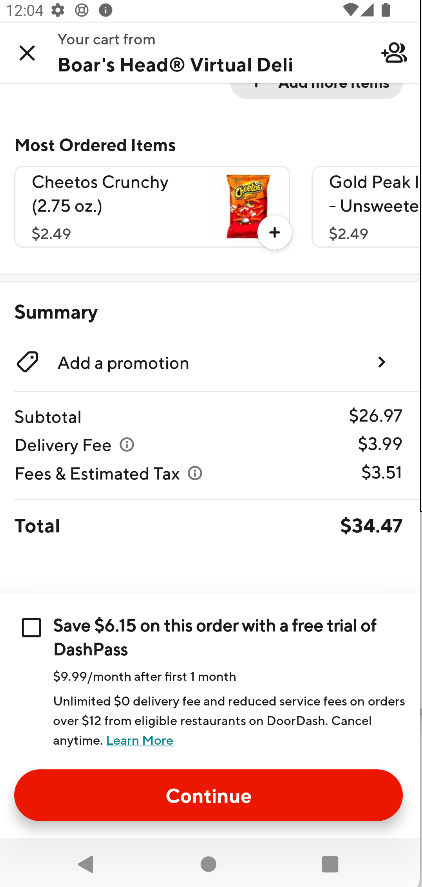
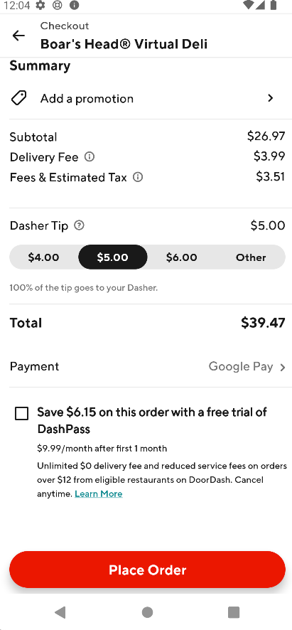
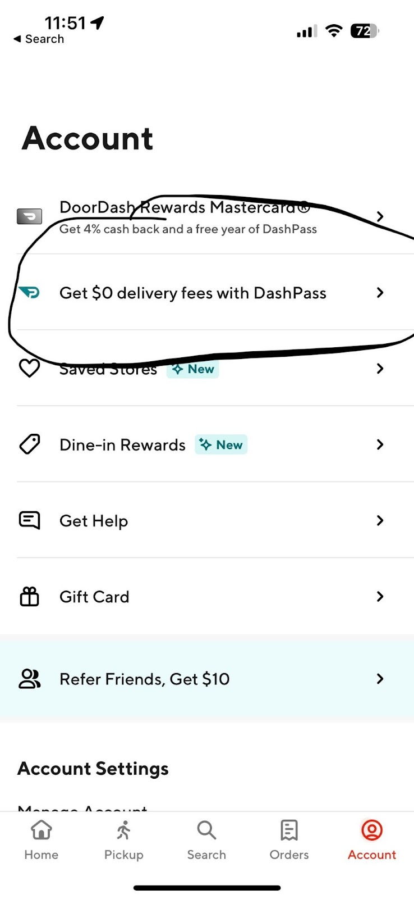
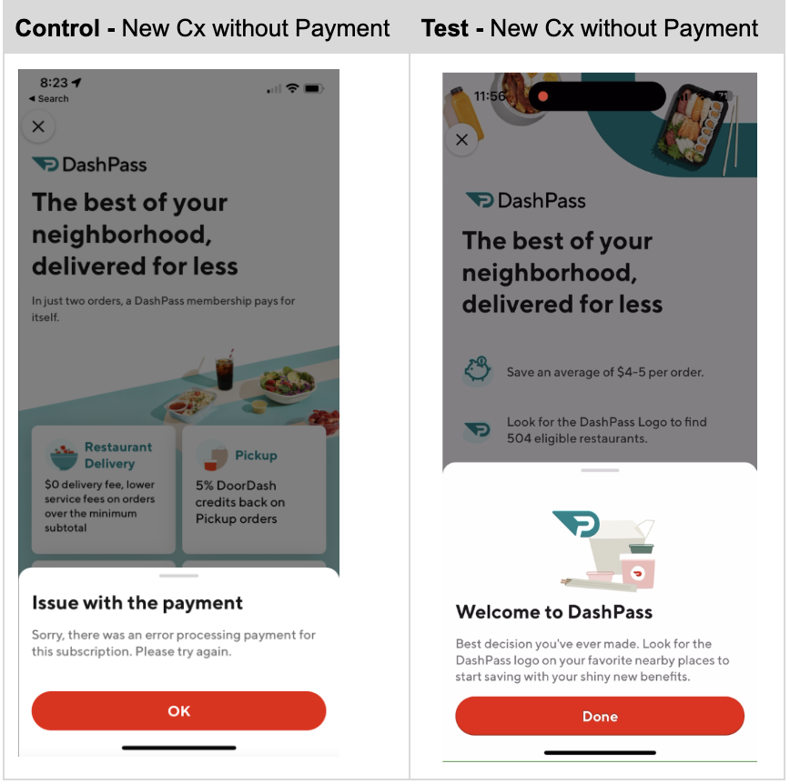
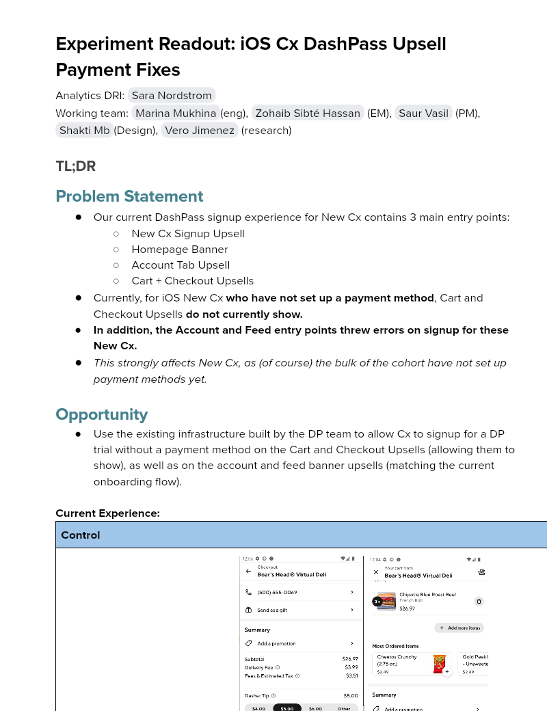

# Experiment Readout: iOS Cx DashPass Upsell Payment Fixes

Analytics DRI: [Sara Nordstrom](mailto:sara.nordstrom@doordash.com)

Working team: [Marina Mukhina](mailto:marina.mukhina@doordash.com)(eng), [Zohaib Sibté Hassan](mailto:zohaib.hassan@doordash.com) (EM), [Saur Vasil](mailto:saur.vasil@doordash.com) (PM), [Shakti Mb](mailto:shakti.m@doordash.com)(Design), [Vero Jimenez](mailto:veronica.jimenez@doordash.com) (research)

### TL;DR

# Problem Statement

- Our current DashPass signup experience for New Cx contains 3 main entry points:

  - New Cx Signup Upsell

  - Homepage Banner

  - Account Tab Upsell

  - Cart + Checkout Upsells

- Currently, for iOS New Cx **who have not set up a payment method**, Cart and Checkout Upsells**do not currently show.**-**In addition, the Account and Feed entry points threw errors on signup for these New Cx.**-*This strongly affects New Cx, as (of course) the bulk of the cohort have not set up payment methods yet.*

# Opportunity

- Use the existing infrastructure built by the DP team to allow Cx to signup for a DP trial without a payment method on the Cart and Checkout Upsells (allowing them to show), as well as on the account and feed banner upsells (matching the current onboarding flow).

**Current Experience:**|**Control**|**Description** |
| --- | --- |
|  **Cart + Checkout (No Upsell)**| The cart and checkout DashPass upsells are**hidden**to New Cx who have not setup a payment method. *Example Upsell Shown:*  |
|  **Feed Banner + Account → Payment Error**| All DP entry points (Except for Onboarding) show payment error for New Cx (w/o payment selected) Feed Banner Account Page Upsell |**Results Summary**The DashPass Upsell Default Payment fix drove <mark>22,000</mark> incremental DP Trial Signups over a 1 week experiment period,**leading to +1.1M DashPass trial signups.**- DashPass Trial Starts:**+1.1M/yr (+15% rel)**

- Check metrics: flat

  - Other quality metrics: flat

| **New Experience**|**Description** |
| --- | --- |
|  **Cart + Checkout** | All entry points now allow for trial signup without fail. Cart and Checkout Banners are now successfully shown. |
|  **Feed Banner + Account → Successful Signup**| All DP entry points now allow for seamless DP Signup (without selected payment method) Feed Banner Account Page Upsell |

[Mode Dashboard](https://app.mode.com/doordash/reports/7657ca4751f3) (The migration from Mode to Curie still in progress, we are working on Curie metrics pack and aim for completion in Q2)

[Curie Dashboard](https://admin-gateway.doordash.com/decision-systems/experiments/e1d0223b-52df-4edd-895d-8c9a71bfaaf3?analysisId=008755f8-489f-46ae-a80c-6988ccd27144)

### Experiment Timeline

### Methodology

#### Overview**Test mechanism:**A/B test**Test platform:**iOS only**Country:**Global**Experience:**DoorDash only**Target Population:**iOS users who visited the cart or checkout screen and are eligible for free trial DP upsell, regardless of if they have a default payment set**Test duration:**1 week at 50/50 and 1 week at 90/10**Control/Treatment Split:**50/50

### Result Details

#### Success Metrics (Treatment vs Control)

|**Metrics**|**Treatment**|**Control**|**% Change**|**Significance**|
| --- | --- | --- | --- | --- |
| DP trial subscription rate | 3.1% | 2.7% | +15.2% | YES |

#### Check Metrics

|**Metrics**|**Treatment**|**Control**|**% Change**|**Significance**|
| --- | --- | --- | --- | --- |
| GoV | <mark>$33.98</mark> | <mark>$33.98</mark> | -0.0059% | NO |
| Subtotal | <mark>$24.26</mark> | <mark>$24.26</mark> | +0.0029% | NO |
| Tip | <mark>$3.36</mark> | <mark>$3.35</mark> | +0.158% | NO |
| Order Rate | <mark>1.6543</mark> | <mark>1.6546</mark> | -0.018% | NO |
| New Cx CVR | <mark>0.04849</mark> | <mark>0.04863</mark> | +0.29% | NO |**Next steps:**

- Ramp-up plan: Ramping up to 90% treatment + 10% long term holdout to measure potential MAU impact.
