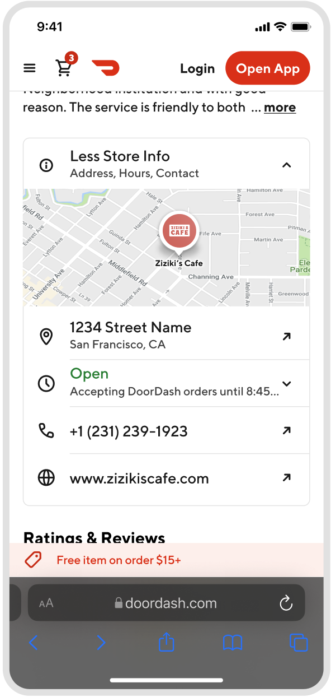
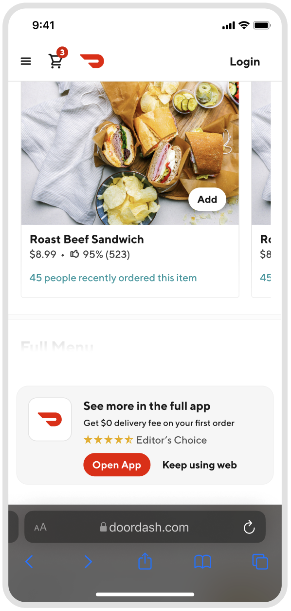
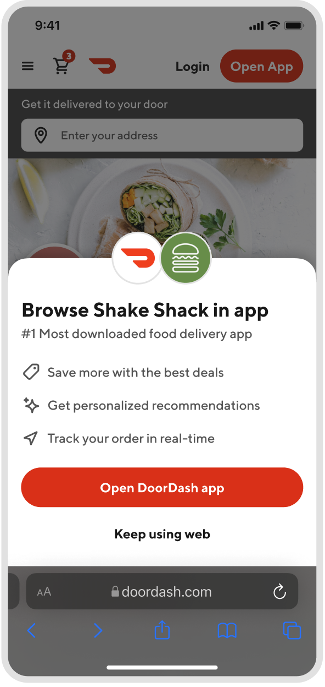
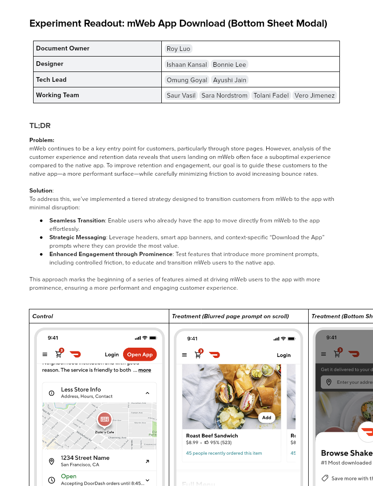

# Experiment Readout: mWeb App Download (Bottom Sheet Modal)

| **Document Owner**| [Roy Luo](mailto:roy.luo@doordash.com) |
| --- | --- |
|**Designer**| [Ishaan Kansal](mailto:ishaan.kansal@doordash.com) [Bonnie Lee](mailto:bonnie.lee@doordash.com) |
|**Tech Lead**| [Omung Goyal](mailto:omung.goyal@doordash.com) [Ayushi Jain](mailto:ayushi.jain@doordash.com) |
|**Working Team**| [Saur Vasil](mailto:saur.vasil@doordash.com) [Sara Nordstrom](mailto:sara.nordstrom@doordash.com) [Tolani Fadel](mailto:tolani.fadel@doordash.com) [Vero Jimenez](mailto:veronica.jimenez@doordash.com) |

### TL;DR**Problem:**mWeb continues to be a key entry point for customers, particularly through store pages. However, analysis of the customer experience and retention data reveals that users landing on mWeb often face a suboptimal experience compared to the native app. To improve retention and engagement, our goal is to guide these customers to the native app—a more performant surface—while carefully minimizing friction to avoid increasing bounce rates.**Solution**:

To address this, we’ve implemented a tiered strategy designed to transition customers from mWeb to the app with minimal disruption:

- **Seamless Transition:** : Enable users who already have the app to move directly from mWeb to the app effortlessly.

- **Strategic Messaging:** : Leverage headers, smart app banners, and context-specific “Download the App” prompts where they can provide the most value.

- **Enhanced Engagement through Prominence:** : Test features that introduce more prominent prompts, including controlled friction, to educate and transition mWeb users to the native app.

This approach marks the beginning of a series of features aimed at driving mWeb users to the app with more prominence, ensuring a more performant and engaging customer experience.

| **Control**|**Treatment (Blurred page prompt on scroll)**|**Treatment (Bottom Sheet Modal)**|
| --- | --- | --- |
|  |  |  |**Results Summary**The App Download Bottom Sheet Modal On Store Page experiment showed a massive lift in OR and MAU rate in the**Bottom Sheet group vs control group**. Observed to drive**121k**incremental orders over a**3 week**experiment period,**leading to an estimated +$114.6M**[^1]**GMV at 12 month exit,**+**$3.6M GMV at Q4 exit; And +92.1k MAU at 12 month exit, +14.7k MAU at Q4 exit.**

- <u>Success Metrics
  </u>

  - Estimated annualized incremental GMV: $114.6M

  - Estimated annualized incremental MAU: 92.1k

- Check metrics:

  - Logins: -6.4%

- Additional metrics:

  - App Downloads: +51.35%

    - +52k incremental app downloads during experiment period

[Mode Dashboard](https://app.mode.com/doordash/reports/79127a0de054/runs/0d97b9fc36e5)

### Experiment Timeline

### Methodology

#### Overview

**Test mechanism:**A/B test**Test platform:**mWeb**Country:**Global**Experience:**DoorDash only**Target Population:**mWeb users on store page**Test duration:**3 weeks at 34/33/33**Control/Treatment 1/Treatment 2 Split:**34/33/33

### Result Details

#### Success Metrics (Treatment vs Control)

|**Metrics**|**Treatment (blurred page prompt)**|**Treatment (bottom sheet)**|**Control**|
| --- | --- | --- | --- |
| Order Rate | 43.66% | 45.52% | 42.40% |
| Rel OR Lift |**+3.21%**|**+7.80%**| |
| MAU Rate | 24.21% | 24.93% | 23.92% |
| Rel MAU Lift |**+1.22%**|**+4.22%** | |

- **Green: statistically significant**|**Grey: Not statistically significant**#### Check Metrics

|**Metrics**|**Treatment (blurred page prompt)**|**Treatment (bottom sheet)**|**Control**|
| --- | --- | --- | --- |
| Signups Rate | 4.17% | 4.27% | 4.33% |
| Rel Signup Rate Lift |**-1.56%**|**-3.80%**| |
| Logins Rate | 20.45% | 20.98% | 22.41% |
| Rel Logins Rate Lift |**-6.38%**|**-8.75%**| |
| New Cx Rate | 3.46% | 3.51% | 3.52% |
| Rel New Cx Rate lift |**-1.67%**|**-0.36%**| |
| GoV | 38.08 | 38.11 | 38.05 |
| Rel GoV Change |**+0.09%**|**+0.15%** | |

- **Green: statistically significant**|**Grey: Not statistically significant**#### Additional Metrics

|**Metrics**|**Treatment (blurred page prompt)**|**Treatment (bottom sheet)**|**Control**|
| --- | --- | --- | --- |
| SUMA Rate | 0.21% | 0.22% | 0.22% |
| Rel SUMA Rate Change |**-1.15%**|**-0.74%**| |
| App Download Rate | 3.12% | 3.50% | 2.31%% |
| Rel App Download Lift |**+35.08%**|**+51.35%** | |

- **Green: statistically significant**|**Grey: Not statistically significant**Impacts breakdown:**Experiment Context**: This experiment implemented a bottom sheet modal to take users from mweb to the app, which captures both the mweb device id (the experiment bucket key) and the app device id. Through these links we are able to attribute user behavior in the app to the devices in the treatment group in the experiment. However, there are some important shortcomings to note with this design. Firstly, we have no clear tracking mechanism for whether the user lands on the app through other methods, as some Cx enters the app regardless of the bottom sheet prompt. Secondly, we ran this experiment for a 3 week period, and were unable to fully capture the long term benefits of app users over mweb. Thirdly, this experiment is the first time we have tried to force the Cx to make an action before proceeding to next steps, making the impact more significant than previous experiments that were layered. To account for this, we came up with the following methodology:**Method**: We took an additional 50% haircut on top of the standard 50% haircut on our results to account for the following and we want to air on the side of caution:

- Some active logged in **control** users could just be closing mweb and going to the app (that they have already downloaded) on their own which would make our mau impact smaller than what we are observing (we will run a test specifically on logged in Cx to validate this hypothesis).

- We have no insight into the long term retention of these users. Hence, we would like to set up a long term holdout at 90/10 through the new year to fully understand the long term retention metrics.

OR Numbers:

- Q4 exit

  - Incremental GMV from orders: $1.5M

- Annualized

  - Incremental GMV from orders: $20.1M

MAU distribution:

| **MAU Type**|**New**|**Active**|**Res - Dormant**|**Res - Churned** |
| --- | --- | --- | --- | --- |
| MAU Distribution | 17.68% | 43.51% | 15.76% | 23.05% |

MAU Numbers:

- Q4 exit

  - Incremental MAU: 14.7k

  - Incremental GMV from MAU: $2.1M

- Annualized

  - Incremental MAU: 92.1k

  - Incremental GMV from orders: $94.5M

Note on login decrease:

- The decrease in logins is accounted for by control users being redirected to the App and already being logged in (we see more treatment users viewing the explore page than treatment users logging in on or signing up on the mobile app).

**Next steps:**

- Ramp-up plan: Rollout to 100% and pursue other areas where we can drive mobile web users to the app. Since this is the first time we tried to add a requirement for Cx to make an action before interacting with DoorDash, we should look for similar strategies in the future.

- Keep a long term hold out set, to fully calculate and understand the long term impact of app Cx vs non app Cx.

- Keep tracking how MAU historically behaves in terms of retention and OR, to better estimate future impact numbers.
---
## Footnotes

\[^1\]: This is with a 75% haircut
