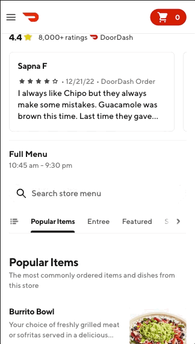
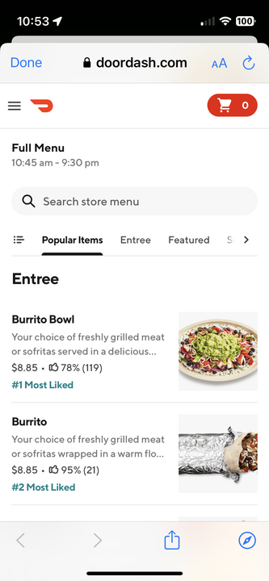
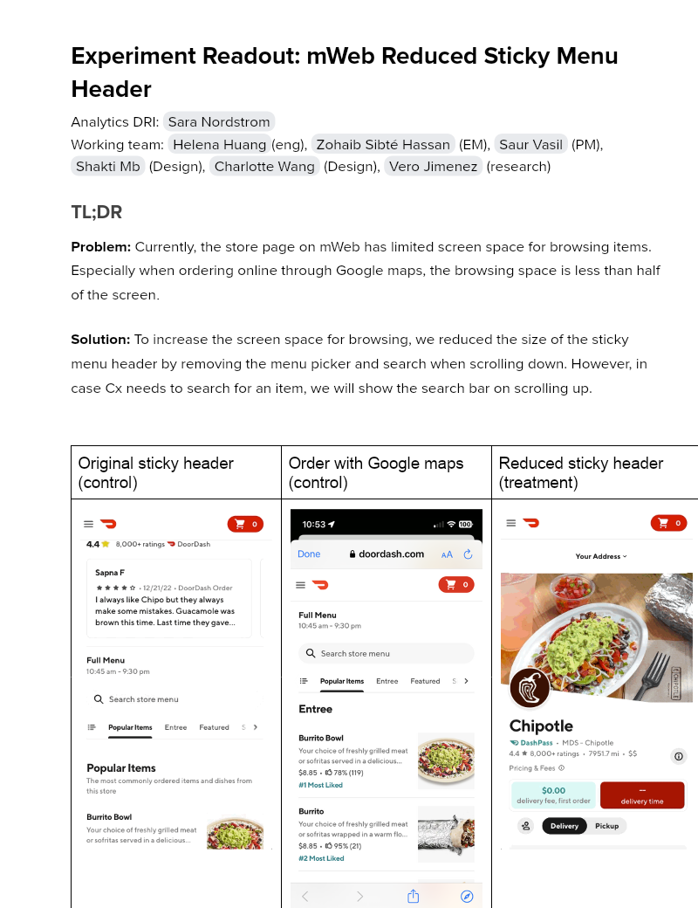

# Experiment Readout: mWeb Reduced Sticky Menu Header

Analytics DRI: [Sara Nordstrom](mailto:sara.nordstrom@doordash.com)

Working team: [Helena Huang](mailto:helena.huang@doordash.com)(eng), [Zohaib Sibté Hassan](mailto:zohaib.hassan@doordash.com) (EM), [Saur Vasil](mailto:saur.vasil@doordash.com) (PM), [Shakti Mb](mailto:shakti.m@doordash.com) (Design), [Charlotte Wang](mailto:qiang.wang@doordash.com) (Design), [Vero Jimenez](mailto:veronica.jimenez@doordash.com) (research)

### TL;DR

**Problem:**Currently, the store page on mWeb has limited screen space for browsing items. Especially when ordering online through Google maps, the browsing space is less than half of the screen.**Solution:**To increase the screen space for browsing, we reduced the size of the sticky menu header by removing the menu picker and search when scrolling down. However, in case Cx needs to search for an item, we will show the search bar on scrolling up.

| Original sticky header (control) | Order with Google maps (control) | Reduced sticky header (treatment) |
| --- | --- | --- |
|  |  |  |**Results Summary**The mWeb Reduced Sticky Menu Header Experiment drove $<mark>335k</mark> incremental GMV over a 3 week experiment period,**leading to an estimated +$2.9M**[^1]**GMV/year**- Estimated annualized GMV:**$2.9M/year**

- Check metrics: flat

  - Other quality metrics:

    - flat

[Mode Dashboard](https://app.mode.com/doordash/reports/98d6d83c52b2)

[Curie Dashboard](https://admin-gateway.doordash.com/decision-systems/experiments/04cc09e1-92fb-42fa-8284-d57f64356978?analysisId=480d7e4a-d1f4-4f66-bb6f-4b107f0c0067)

### Experiment Timeline

### Methodology

#### Overview

**Test mechanism:**A/B test**Test platform:**mWeb**Country:**Global**Experience:**DoorDash only**Target Population:**mWeb users**Test duration:**3 weeks at 50/50**Control/Treatment Split:**50/50

### Result Details

Impacts breakdown:

- **GMV lift of +2.9M/yr:** ,

- An increase in cart size drove an increase in avg. subtotal per order which drove an increase in avg. gov per order

#### Success Metrics (Treatment vs Control)

| **Metrics**|**Treatment**|**Control**|**% Change**|**Significance**|
| --- | --- | --- | --- | --- |
| Order Rate | 0.39 | 0.39 | +0.1% | NO |
| New Cx CVR | 4.44% | 4.44% | -.01% | NO |
| GoV | $37.85 | $37.74 | +0.29% | YES |

#### Check Metrics

|**Metrics**|**Treatment**|**Control**|**% Change**|**Significance**|
| --- | --- | --- | --- | --- |
| Subtotal | $26.58 | $26.49 | +0.36% | YES |
| Cart Size | 3.1512 | 3.1367 | +.46% | YES |
| VP | $2.90 | $2.90 | -0.17% | NO |
| Search Conversion Web | 12.14% | 12.14% | -0.043% | NO |
| Store Search Usage at Daily Level | 14.5% | 14.4% | +0.7276% | NO |**Next steps:**

- Ramp-up plan: Rollout to 100% and monitor through device global LTH
---
## Footnotes

\[^1\]: This is with a 50% haircut
