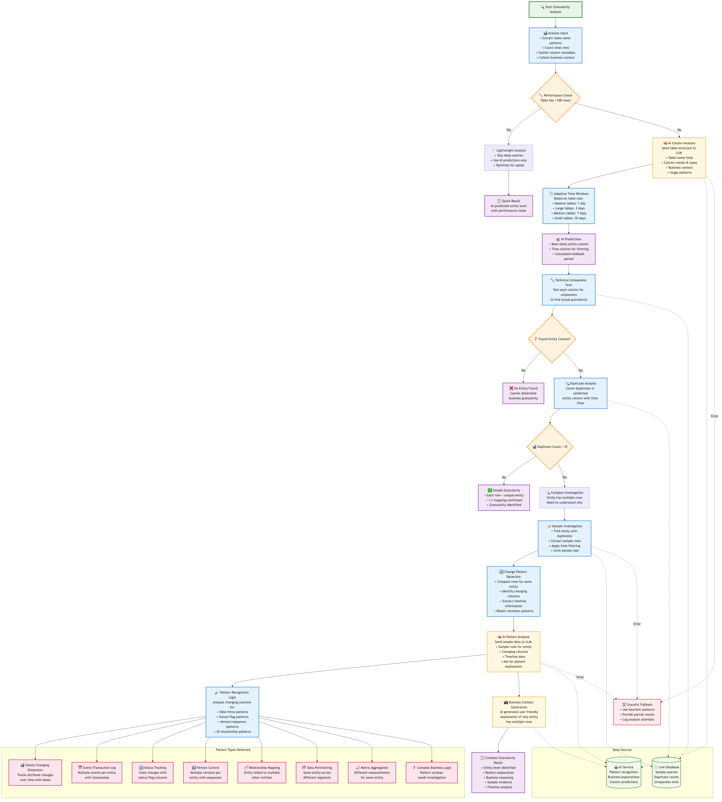

# Table Context Agent 🤖

The Table Context Agent is an intelligent system that automatically generates comprehensive documentation for Snowflake tables by combining metadata analysis, AI-powered insights, and external documentation search.

## Overview

The Table Context Agent transforms simple table names into rich, comprehensive documentation that includes:

- **Business Context**: AI-generated explanations of table purpose and usage
- **Technical Metadata**: Detailed schema information, row counts, and data types  
- **Usage Patterns**: Real query examples from production usage
- **Granularity Analysis**: Smart detection of data granularity and entity patterns
- **Join Relationships**: Common table joins and relationship patterns
- **External Documentation**: Integration with Confluence for existing docs

## Architecture

### Table Context Agent Flow


The agent follows a comprehensive 6-step process:

1. **Table Resolution** - Resolves partial table names to fully qualified names using Tyler's usage analytics
2. **Documentation Search** - Searches Confluence for existing documentation
3. **Metadata Collection** - Gathers comprehensive table and column metadata from Snowflake
4. **Granularity Analysis** - Uses AI to determine data granularity and entity patterns
5. **AI Enhancement** - Generates business context and explanations using GPT-4o-mini
6. **Report Generation** - Renders everything into structured markdown documentation

### Granularity Analysis Flow



The granularity analysis engine intelligently determines what each row in a table represents through:

- **Performance-Aware Processing** - Lightweight analysis for massive tables (>10B rows)
- **AI-Powered Column Prediction** - Uses LLM to predict likely entity and time columns
- **Smart Time Windows** - Adaptive lookback periods based on table size
- **Pattern Recognition** - Detects common patterns like SCDs, event logs, status tracking
- **Business Context Generation** - AI explains why entities have multiple rows

## Components

### Core Modules

#### `agent.py` - Main Orchestrator
- **`main()`** - Entry point that coordinates the entire analysis process
- **`PortkeyLLM`** - Wrapper around DoorDash's GenAI Gateway for GPT-4o-mini access
- **`TableIdentifier`** - Data class for managing table references

#### `tyler_sources.py` - Metadata Collection
- **`resolve_table_name()`** - Resolves partial table names using usage analytics
- **`fetch_table_overview()`** - Gets basic table information (row count, size, etc.)
- **`fetch_columns_metadata_with_usage()`** - Detailed column analysis with usage patterns
- **`fetch_most_common_joins()`** - Identifies frequent join patterns
- **`fetch_sample_queries_from_most_used_user()`** - Real production query examples

#### `snowflake_explorer.py` - Granularity Analysis Engine
- **`enhanced_granularity_analysis()`** - Main granularity detection algorithm
- **`_predict_granularity_columns()`** - AI-powered column prediction
- **`_detect_pattern_from_columns()`** - Pattern recognition for complex cases
- **`_deep_dive_duplicates()`** - Sample-based duplicate analysis

#### `confluence_client.py` - External Documentation
- **`ConfluenceSearcher`** - Integration with Confluence API
- **CQL Search** - Confluence Query Language search for existing docs

#### `renderer.py` - Report Generation
- **`build_enhanced_markdown_content()`** - Structured markdown generation
- **`render_markdown()`** - Template rendering with rich formatting

## Usage

### Command Line Interface

```bash
# Generate documentation for a table
python local_tools/table_context_agent/agent.py dimension_deliveries

# Content-only mode (no file writing)
python local_tools/table_context_agent/agent.py dimension_deliveries --print-only

# Verbose output for debugging
python local_tools/table_context_agent/agent.py dimension_deliveries --verbose

# Custom sample size for granularity analysis
python local_tools/table_context_agent/agent.py dimension_deliveries --sample-row-limit 20
```

### MCP Server Integration

The agent is integrated into the MCP server via the `describe_table` tool:

```python
# Via MCP server
result = describe_table(
    table_name="dimension_deliveries",
    output_format="markdown",
    sample_row_limit=10,
    verbose=False
)
```

### Python API

```python
from local_tools.table_context_agent.agent import main

# Generate table documentation
result = main(
    table="proddb.public.dimension_deliveries",
    print_only=True,  # Return content without writing files
    sample_row_limit=10,
    verbose=False
)

print(result)  # Rich markdown documentation
```

## Configuration

### Environment Variables

```bash
# Snowflake Connection (Required)
SNOWFLAKE_USER=your.username
SNOWFLAKE_PAT=your_personal_access_token
SNOWFLAKE_ACCOUNT=your_account
SNOWFLAKE_DATABASE=proddb
SNOWFLAKE_SCHEMA=public
SNOWFLAKE_WAREHOUSE=ADHOC
SNOWFLAKE_ROLE=read_only_users

# AI/LLM Integration (Required)
PORTKEY_API_KEY=your_portkey_api_key
PORTKEY_OPENAI_VIRTUAL_KEY=your_virtual_key
PORTKEY_BASE_URL=https://your-gateway.com/v1
PORTKEY_MODEL=gpt-4o-mini

# Confluence Integration (Optional)
CONFLUENCE_BASE_URL=https://your-org.atlassian.net/wiki
CONFLUENCE_USERNAME=your.email@company.com
CONFLUENCE_API_TOKEN=your_confluence_token
```

### Dependencies

All dependencies are managed in the main `pyproject.toml`:

```toml
# Core dependencies
"snowflake-connector-python[pandas]>=3.6.0"
"portkey-ai>=1.3.0"
"atlassian-python-api>=3.0.0"
"pandas>=2.2.0"
"python-dotenv>=0.19.0"
```

## Generated Documentation Structure

The agent produces comprehensive markdown documentation with the following sections:

### 1. Table Overview
- Fully qualified table name
- Row count (human-readable format: 1.2M, 15.6B, etc.)
- Data freshness and update patterns
- Tyler's usage analytics integration

### 2. Business Context
- AI-generated table purpose and business value
- Use case scenarios and target audiences
- Integration with broader data ecosystem

### 3. Schema Information
- Complete column listing with data types
- Column descriptions and business meanings
- Usage frequency for each column
- Nullable/constraint information

### 4. Granularity Analysis
- **Entity Level Detection**: What each row represents
- **Pattern Recognition**: SCD, events, metrics, relationships
- **Business Reasoning**: Why entities have multiple rows
- **Sample Evidence**: Concrete examples with explanations

### 5. Common Use Cases
- Production query examples from real usage
- Common join patterns and relationships
- Typical analytical scenarios
- Performance considerations

### 6. Data Quality Notes
- Known limitations or data issues
- Freshness and reliability information
- Usage recommendations and best practices

### 7. Related Tables
- Common join targets and relationships
- Upstream and downstream dependencies
- Related fact/dimension tables

## Granularity Detection Patterns

The agent can detect and explain various data patterns:

### Simple Patterns
- **Unique Entities** - Each row represents a unique entity (1:1 mapping)
- **Dimension Tables** - Static reference data with unique keys

### Complex Patterns  
- **Slowly Changing Dimensions (SCD)** - Historical attribute tracking
- **Event/Transaction Logs** - Multiple timestamped events per entity
- **Status Tracking** - State changes with status columns
- **Version Control** - Multiple versions per entity with sequences
- **Relationship Mapping** - Many-to-many relationship tables
- **Data Partitioning** - Same entity across different segments
- **Metric Aggregation** - Different measurements for same entity

## Performance Considerations

### Smart Processing
- **Adaptive Time Windows** - Shorter lookback for massive tables
- **Sample-Based Analysis** - Limits deep queries for performance
- **AI-First Approach** - Uses predictions to guide expensive operations
- **Graceful Degradation** - Provides partial results when full analysis fails

### Scale Handling
- **Massive Tables (>10B rows)** - Lightweight analysis with AI predictions
- **Large Tables (1B-10B rows)** - 1-day lookback for recent patterns
- **Medium Tables (1M-1B rows)** - 7-day analysis window  
- **Small Tables (<1M rows)** - Full 30-day comprehensive analysis

## Integration Points

### Tyler's Analytics Platform
- **sf_table_usage** - Query usage analytics and patterns
- **sf_tables_full** - Complete table metadata and statistics
- Production query examples from real usage

### DoorDash GenAI Gateway
- **Portkey Integration** - Managed access to GPT-4o-mini
- **Structured Prompts** - Optimized prompts for table analysis
- **Error Handling** - Graceful fallback when AI is unavailable

### Confluence Documentation
- **CQL Search** - Existing documentation discovery
- **Link Generation** - Direct links to relevant wiki pages
- **Context Enrichment** - Supplement technical analysis with business docs

## Error Handling & Fallbacks

### Graceful Degradation
```python
# AI unavailable → Use heuristic analysis
# Large table → Skip expensive operations  
# Missing permissions → Provide partial analysis
# Network issues → Use cached metadata
```

### Comprehensive Logging
- **Verbose Mode** - Detailed SQL queries and AI interactions
- **Performance Metrics** - Timing information for each step
- **Error Context** - Full stack traces with business context

## Advanced Features

### AI-Powered Insights
- **Column Purpose Prediction** - Semantic understanding of column roles
- **Pattern Recognition** - Identifies complex business logic patterns
- **Business Context Generation** - Translates technical patterns to business language

### Smart Query Optimization
- **Usage-Driven Sampling** - Focus on actively used data patterns
- **Time-Aware Filtering** - Relevant lookback periods per table size
- **Join Pattern Analysis** - Real relationship discovery from production queries

### Rich Markdown Output
- **Structured Sections** - Consistent, scannable documentation format
- **Code Examples** - Actual production queries with syntax highlighting
- **Visual Hierarchy** - Clear headings and bullet points for readability

## Troubleshooting

### Common Issues

#### Snowflake Connection
```bash
# Test connection
python -c "from utils.snowflake_connection import SnowflakeHook; hook = SnowflakeHook(); hook.connect(); print('✅ Connected')"

# Check credentials
env | grep SNOWFLAKE
```

#### AI/LLM Integration  
```bash
# Test Portkey connection
python -c "from local_tools.table_context_agent.agent import PortkeyLLM; llm = PortkeyLLM(); print('✅ AI Ready')"

# Verify environment
env | grep PORTKEY
```

#### Performance Issues
```bash
# Use smaller sample sizes for large tables
python agent.py huge_table --sample-row-limit 5

# Skip AI analysis for pure metadata
# (Future feature - currently AI is core to the analysis)
```

### Debug Mode

```bash
# Full verbose output
python agent.py dimension_deliveries --verbose

# Print-only mode for testing
python agent.py dimension_deliveries --print-only --verbose
```

## Future Enhancements

### Planned Features
- [ ] **Incremental Analysis** - Cache results and detect schema changes
- [ ] **Multi-Table Analysis** - Joint analysis of related table groups  
- [ ] **Data Quality Scoring** - Automated quality assessment and recommendations
- [ ] **Usage Trend Analysis** - Query pattern changes over time
- [ ] **Column Lineage Tracking** - Upstream data source identification

### Performance Improvements
- [ ] **Parallel Processing** - Concurrent metadata and AI analysis
- [ ] **Smart Caching** - Redis/local cache for expensive operations
- [ ] **Batch Analysis** - Process multiple tables efficiently
- [ ] **Streaming Results** - Progressive documentation generation

### Enhanced AI Integration  
- [ ] **Custom Fine-Tuning** - Domain-specific model training
- [ ] **Multi-Model Support** - Alternative LLM backends
- [ ] **Confidence Scoring** - AI prediction reliability metrics
- [ ] **Human Feedback Loop** - Learn from user corrections

---

**Built with 🧠 for intelligent data catalog automation**
